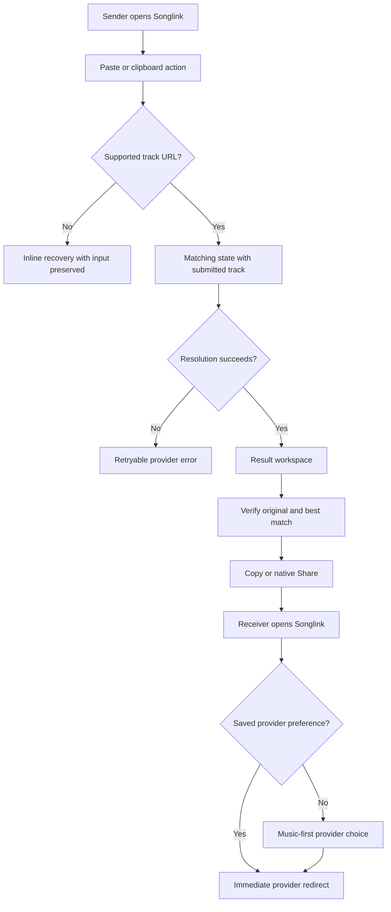

# Songlink MVP UX - Plan

## Goal Capsule

- **Objective:** Make creating and sharing a Songlink feel like one confident task: paste a song, verify the cross-platform result, and share it.
- **Product authority:** The settled receiver behavior in `CLAUDE.md` remains authoritative; this contract replaces the current sender form and result treatment.
- **Open blockers:** None. PostHog project configuration can be supplied during implementation.

---

## Product Contract

### Summary

Reinvent the web MVP around a paste-first creation flow and a dedicated result workspace that shows the submitted song, its guessed cross-platform match, and explicit sharing actions. Preserve the receiver's one-time provider choice while adding privacy-conscious PostHog funnel tracking for the product team.

### Problem Frame

The current sender experience behaves like a generic URL form and reduces success to a small status message. It does not make the resolved song feel tangible, show what counterpart was selected, or give the sender enough confidence before sharing. The receiver flow is functionally low-touch but should present the song rather than the product when a provider choice is required.

### Key Decisions

- **Paste, verify, share:** Treat creation as one continuous task rather than a form submission followed by an inline message.
- **Dedicated result workspace:** A resolved link earns its own state with artwork, metadata, match disclosure, and sharing controls.
- **Explicit sharing:** Do not copy automatically. The sender chooses Copy or the platform-native Share action after verifying the result.
- **Best match is visible:** Show the submitted track as the original and disclose the guessed counterpart as the best match, even when their titles differ.
- **Album-first utility design:** Use a restrained neutral system whose ambient color comes from album artwork rather than product decoration.
- **PostHog is internal analytics:** Use PostHog to understand the MVP funnel, not as the source of truth for future user-facing per-link analytics.

### Actors

- A1. **Sender:** Pastes a Spotify or Apple Music track and wants a trustworthy link they can share immediately.
- A2. **First-time receiver:** Opens a Songlink without a saved provider preference and chooses where to listen.
- A3. **Returning receiver:** Opens a Songlink with a saved preference and expects an immediate redirect.
- A4. **Product team:** Uses aggregate PostHog events to understand conversion, failures, and provider behavior.

### Requirements

**Song capture and resolution**

- R1. The sender can enter a Spotify or Apple Music track URL through a prominent paste surface, normal text paste, or a clipboard action when the browser permits it.
- R2. A valid pasted URL begins resolution without requiring a separate submit decision.
- R3. The matching state keeps the submitted track visible and communicates that Songlink is finding the counterpart without presenting fake precision or fake progress.
- R4. Invalid links and provider failures produce distinct, actionable recovery states without discarding the sender's input.

**Result workspace**

- R5. Successful resolution transitions to a dedicated result state rather than appending a small message beneath the input.
- R6. The result displays album artwork, title, artist, and source provider for the submitted track.
- R7. The result displays the destination provider's selected track metadata and labels it as the best match when Songlink inferred it.
- R8. The primary result action copies the share URL and confirms success; supported devices also receive a platform-native Share action.
- R9. The result provides a clear New link action that returns to an empty paste state.
- R10. The MVP may acknowledge a wrong match but does not provide manual candidate selection or correction.

**Receiver experience**

- R11. A first-time receiver sees a music-first page with artwork, song metadata, and two equally weighted provider actions.
- R12. The provider choice explanation states that the selection is remembered on the current device without adding product onboarding.
- R13. A returning receiver continues to redirect immediately to the saved provider without rendering an intermediate page.

**Design system and accessibility**

- R14. The interface uses neutral ink, paper, surface, line, and muted-text tokens with album-derived ambient color as the only contextual accent.
- R15. Typography uses a compact utility scale for labels and an editorial display scale for song and task hierarchy.
- R16. Layout uses an 8-pixel spacing rhythm, 14- to 24-pixel component radii, and controls at least 48 pixels tall.
- R17. Light and dark themes maintain readable contrast, visible keyboard focus, reduced-motion support, and responsive layouts without horizontal overflow.
- R18. Motion is limited to meaningful transitions between ready, matching, and result states.

**Product analytics**

- R19. PostHog captures anonymous funnel events for paste initiated, resolution succeeded, resolution failed, link copied, link shared, receiver opened, and provider selected.
- R20. Analytics properties may include provider, outcome, timing, match type, and an anonymous link identifier but must not include the original submitted URL or personal identifiers.
- R21. Bot and unfurl traffic is distinguishable from human receiver activity so previews do not inflate engagement.

### Experience Flow

### Key Flows

- F1. **Create and share a link**
  - **Trigger:** A1 arrives with a Spotify or Apple Music track URL.
  - **Steps:** Paste the URL, observe matching, verify both tracks, then copy or share the resulting Songlink.
  - **Outcome:** A1 leaves with a shareable URL and understands what each provider will open.
  - **Covered by:** R1-R10, R14-R18.
- F2. **Open a shared song**
  - **Trigger:** A2 or A3 opens a Songlink.
  - **Steps:** A3 redirects immediately; A2 sees the song, chooses a provider once, and redirects in the same action.
  - **Outcome:** The receiver reaches music with no account or avoidable intermediate interaction.
  - **Covered by:** R11-R13.
- F3. **Measure the MVP funnel**
  - **Trigger:** A human or preview bot interacts with creation or redirect surfaces.
  - **Steps:** Songlink records the relevant anonymous event and classifies human versus unfurl activity.
  - **Outcome:** A4 can identify drop-off, provider mix, latency, and error patterns without collecting submitted URLs.
  - **Covered by:** R19-R21.

### Acceptance Examples

- AE1. **Paste begins matching**
  - **Covers:** R1-R4.
  - **Given:** The sender has a supported Spotify track URL.
  - **When:** They paste it anywhere on the ready screen.
  - **Then:** Songlink moves into a matching state without requiring another submit action and preserves the source track context.
- AE2. **Best match is disclosed**
  - **Covers:** R5-R7.
  - **Given:** Spotify's original is "Cataracts" and the highest-ranked Apple result is "Cataracts (Instrumental)."
  - **When:** Resolution completes.
  - **Then:** The result workspace identifies the Spotify track as Original and the Apple track as Best match before sharing is offered.
- AE3. **Sharing is explicit**
  - **Covers:** R8-R9.
  - **Given:** A result is ready.
  - **When:** The sender selects Copy share link.
  - **Then:** The URL is copied, the action confirms success, and the current result remains visible until New link is chosen.
- AE4. **First receiver choice is one tap**
  - **Covers:** R11-R13.
  - **Given:** A receiver has no provider cookie.
  - **When:** They choose Apple Music.
  - **Then:** Songlink saves that preference and redirects to the selected Apple track in the same action.
- AE5. **Returning receiver bypasses UI**
  - **Covers:** R13.
  - **Given:** A receiver previously selected Spotify.
  - **When:** They open another Songlink.
  - **Then:** They receive an immediate Spotify redirect without seeing a Songlink page.
- AE6. **Analytics excludes sensitive input**
  - **Covers:** R19-R21.
  - **Given:** A sender resolves and copies a link.
  - **When:** PostHog receives the funnel events.
  - **Then:** The events contain outcome and provider context but not the original Spotify or Apple Music URL.

### Success Criteria

- A sender can move from a pasted URL to a copied or shared Songlink with no decision between paste and verification.
- The result makes the original and guessed counterpart understandable without opening either provider.
- A first-time receiver reaches a provider in one explicit action and a returning receiver in none.
- The creation and receiver funnels are visible in PostHog without raw submitted URLs or bot-inflated engagement.
- The ready, matching, result, receiver, error, light-theme, dark-theme, desktop, and mobile states remain legible and operable.

### Scope Boundaries

**Deferred for later**

- iOS app, Share Extension, Shortcuts, and native link history.
- User-facing per-link analytics and a first-party event store.
- Accounts, cross-device history, and link recovery.
- Manual match correction or alternative-track selection.
- Albums, playlists, and providers beyond Spotify and Apple Music.

**Outside this MVP**

- Social profiles, public creator pages, and engagement feeds.
- Music playback inside Songlink.
- Product onboarding between a receiver and their music provider.

### Dependencies and Assumptions

- Public Spotify embed metadata and iTunes Search continue to provide enough metadata for the existing ranked matcher.
- The deployment provides a PostHog project key and host configuration.
- Clipboard and native sharing capabilities vary by browser, so the URL must always remain visibly selectable as a fallback.
- Artwork is presented in the UI and through existing link unfurls; copying raw artwork to the clipboard is not required.
