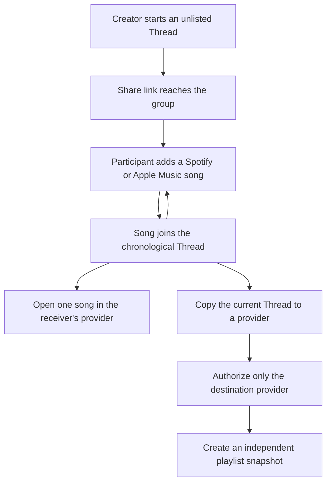

# Pass the Aux Roadmap - Plan

## Goal Capsule

- **Objective:** Evolve listen.cx from a one-song sharing utility into the lightest way for friends to build a cross-provider playlist together.
- **Product authority:** Creating, contributing, sharing, and opening songs remain account-free. Provider authorization appears only when someone copies a thread into their own music library.
- **MVP:** An unlisted chronological Thread with repeat contribution, individual song handoff, creator moderation, and copy-anytime playlist snapshots.
- **Open blockers:** Native handoff still needs its iOS/macOS staging matrix. Apple Music export needs live MusicKit credentials and browser proof. Spotify export is limited to an allowlisted staging cohort until its quota and policy gates clear.

---

## Product Contract

### Summary

Introduce Threads as unlisted collaborative song lists. Anyone with the link can add songs, open each song through their preferred provider, or copy the current ordered list into Spotify or Apple Music as a point-in-time playlist snapshot.

### Problem Frame

Friends already trade songs in group chats and assemble playlists around shared moments, but provider boundaries fragment the result. Existing collaborative playlists solve editing only for people inside the same provider. listen.cx can make the shared list portable without making accounts or provider connections prerequisites for participation.

### Key Decisions

- **Freeform Threads replace the five-role relay.** (session-settled: user-directed — chosen over Opener/Build/Peak/Curveball/Closer: the first version should make collaborative playlist building obvious before adding ritual.) Contributions appear chronologically and a participant may add more than one song.
- **Export copies the current Thread.** (session-settled: user-directed — chosen over finish-before-export and continuous synchronization: a snapshot delivers provider-native playback without long-lived connections or a completion ceremony.) Later Thread changes do not alter an exported playlist.
- **The creator keeps narrow moderation powers.** (session-settled: user-directed — chosen over removal-only or no creator controls: the creator needs to fix mistakes, stop abuse, and close contribution without an account.) The management capability is separate from the shared Thread link.
- **Both provider adapters belong in staging.** (session-settled: user-directed — chosen over Apple-only dogfood or blocking on public parity: the product should prove both paths while Spotify remains limited to its allowlisted cohort.) Public Spotify export stays gated on provider quota and policy clearance.
- **Provider authorization stays at the edge.** Contribution, sharing, per-song listening, and Thread viewing never require a listen.cx or provider account. Only the person requesting export authorizes the destination provider.
- **Character follows demonstrated utility.** Visual characterization and music intelligence remain separate follow-ons. They must improve contribution or make the finished Thread more useful, not become generic scoring.

### Roadmap and Plan Set

| Track | Deliverable | Decision | Trigger or dependency | Backing plan |
|---|---|---|---|---|
| Foundation | Threads MVP | Build and dogfood unlisted chronological Threads with repeat contribution, creator moderation, per-song handoff, and copy-anytime snapshots to both providers in staging. | Native handoff matrix, provider credentials, and staging abuse bounds. | [`2026-07-13-002-feat-private-pass-the-aux-threads-plan.md`](2026-07-13-002-feat-private-pass-the-aux-threads-plan.md) |
| MVP capability | Provider playlist export | Treat every export as an independent snapshot. Prove Apple Music and the allowlisted Spotify path without retaining connected-provider identity. | Apple MusicKit browser proof; Spotify allowlist, quota, and policy gates. | [`2026-07-13-004-feat-provider-playlist-export-plan.md`](2026-07-13-004-feat-provider-playlist-export-plan.md) |
| Follow-on | Thread character | Re-scope deterministic visual character around the freeform Thread after contribution and export behavior is understood. | Threads show repeat contribution and export demand. | [`2026-07-13-003-feat-declared-thread-character-plan.md`](2026-07-13-003-feat-declared-thread-character-plan.md) |
| Future horizon | Durable ownership and public Threads | Add ownership, publishing, joinability, discovery, and granular permissions only after the unlisted collaboration model proves useful. | Separate identity, moderation, privacy, legal, and abuse decisions. | [`2026-07-13-005-feat-public-thread-ownership-publishing-plan.md`](2026-07-13-005-feat-public-thread-ownership-publishing-plan.md) |
| Research gate | Music intelligence | Revisit embeddings only when a lawful provider-independent signal passes rights, coverage, cost, and human-fit gates. | A contract-backed enrichment source and a stable non-embedding baseline. | [`2026-07-13-006-research-embedding-music-intelligence-decision.md`](2026-07-13-006-research-embedding-music-intelligence-decision.md) |

### Actors

- A1. **Creator:** Starts an unlisted Thread, shares it, and retains its private management capability.
- A2. **Participant:** Uses the shared link to add songs, listen, and copy snapshots without a listen.cx account.

### Requirements

**Thread collaboration**

- R1. A1 can create an unlisted Thread with a title and receive separate share and management capabilities without creating an account.
- R2. A2 can view the Thread as a chronological list and add multiple Spotify or Apple Music tracks through one prominent contribution action.
- R3. Each accepted contribution resolves once into the existing provider-neutral song representation and exposes Open in my provider plus Copy song link using its canonical listen.cx URL.
- R4. A1 can remove a contribution or irreversibly close further contribution after confirmation without removing existing listening or export access.
- R5. Anonymous creation and contribution use bounded Thread size, input validation, and abuse controls rather than person-level identity.

**Snapshot export**

- R6. A2 can copy the Thread's current ordered eligible songs to a supported provider whether contribution is open or closed, provided at least one song is eligible.
- R7. Every export is an independent point-in-time snapshot and never promises to update an existing provider playlist.
- R8. Export requests provider authorization only after A2 chooses a destination, and export failure never blocks the Thread or its individual song handoffs.
- R9. Staging exposes Apple Music export after MusicKit proof and Spotify export only to its allowlisted cohort; production exposes each provider only after its own operational and policy gates clear.

**Later roadmap**

- R10. Characterization, publishing, discovery, and music intelligence remain separable from the MVP's account-free collaboration and listening paths.

### Key Flows

- F1. **Build a Thread**
  - **Trigger:** A1 wants a group to assemble a playlist across provider boundaries.
  - **Actors:** A1, A2.
  - **Steps:** A1 starts and shares a Thread. Any A2 with the link adds one or more provider track links, which appear in acceptance order.
  - **Outcome:** The group has one portable chronological list rather than provider-specific fragments.
  - **Covered by:** R1-R5.
- F2. **Open an individual song**
  - **Trigger:** A2 wants one contribution now.
  - **Actors:** A2.
  - **Steps:** A2 either opens the song through the existing receiver-side provider handoff or copies its canonical listen.cx URL.
  - **Outcome:** Every contribution remains independently playable and shareable without export or authorization.
  - **Covered by:** R3, R8.
- F3. **Copy the current Thread**
  - **Trigger:** A2 wants provider-native playlist playback.
  - **Actors:** A2.
  - **Steps:** A2 chooses Apple Music or Spotify, reviews current coverage, authorizes that provider, and creates a playlist from the current ordered snapshot.
  - **Outcome:** A2 owns a native playlist copy while the source Thread may continue changing independently.
  - **Covered by:** R6-R9.

### Acceptance Examples

- AE1. **One participant adds repeatedly**
  - **Covers:** R2-R3.
  - **Given:** An open Thread already contains songs from several people.
  - **When:** The same participant adds two more valid track links.
  - **Then:** Both contributions resolve and appear in acceptance order without a one-song-per-browser restriction.
- AE2. **A snapshot stays a snapshot**
  - **Covers:** R6-R8.
  - **Given:** An open Thread contains four songs.
  - **When:** A participant exports it and another participant later adds a fifth song.
  - **Then:** The Thread shows five songs while the earlier provider playlist remains the four-song copy it created.
- AE3. **Listening does not depend on export**
  - **Covers:** R3, R8.
  - **Given:** A participant has never authorized a provider for export.
  - **When:** They open any song from the Thread.
  - **Then:** The existing preference and direct-handoff flow remains available.
- AE4. **The creator stops contribution**
  - **Covers:** R4.
  - **Given:** The creator has the private management capability.
  - **When:** They remove an unsuitable contribution and close the Thread.
  - **Then:** Invite holders cannot add more songs, while remaining songs and snapshot export stay available.

### Success Criteria

**Thread Core gate**

- Among the first 10 seeded dogfood Threads, at least five receive a second-browser contribution without facilitator help.
- At least 80% of observed participants complete create-to-share or open-to-add without instruction.
- A staging Thread preserves chronological order across concurrent and repeat contribution, exposes Open and Copy song link per row, and exercises handoff to both receiver providers.

**Snapshot Export gate**

- Apple Music and an allowlisted Spotify tester each create a correctly ordered playlist snapshot from the current Thread.
- Each adapter passes the mixed-origin coverage and correctness gate in the export plan before it is considered staging-ready.
- Thread creation, repeat contribution, individual song actions, and failed export complete without listen.cx account creation or persistent provider identity.

Dogfood instrumentation measures Thread creation, first and second contribution, repeat contribution, export start, and export outcome without storing raw provider links, capability values, or cross-Thread identity.

### Scope Boundaries

**Deferred for later**

- Contributor names, attribution, reactions, comments, voting, notifications, public profiles, discovery, and granular permissions.
- Declared or inferred Thread character, embedding-based analysis, prompts, recommendations, and visual effects.
- Reopening a closed Thread, creator recovery after losing the management capability, invite revocation, and durable identity.

**Outside this MVP**

- Fixed musical roles, one-contribution-per-browser rules, points, leaderboards, or completion rituals.
- Continuous playlist synchronization, updating an existing exported playlist, background provider writes, or long-lived connected-provider accounts.
- In-app or synchronized playback and making authentication a condition of contribution or listening.

### Dependencies and Assumptions

- The current per-song resolver and receiver-side provider preference remain the provider-neutral foundation.
- Native Apple Music and Spotify handoff must pass the staging iOS/macOS device matrix.
- Apple Music export requires a Music User Token and real MusicKit browser verification.
- Spotify playlist creation requires OAuth. Development mode is limited to five allowlisted users, and public rollout remains gated on quota and policy clearance.
- The exact initial Thread song cap and rate limits are planning decisions constrained by dogfood cost and abuse risk. The MVP has no automatic contribution or view expiry; the creator closes contribution and Threads remain viewable.

### Sources and Research

- Existing product and route contract: `AGENTS.md`, `src/app.ts`, `src/db.ts`, and `src/resolve.ts`.
- Thread and export detail: `docs/plans/2026-07-13-002-feat-private-pass-the-aux-threads-plan.md` and `docs/plans/2026-07-13-004-feat-provider-playlist-export-plan.md`.
- Spotify playlist creation and addition: <https://developer.spotify.com/documentation/web-api/reference/create-playlist> and <https://developer.spotify.com/documentation/web-api/reference/add-items-to-playlist>.
- Spotify quota and policy gates: <https://developer.spotify.com/documentation/web-api/concepts/quota-modes> and <https://developer.spotify.com/policy>.
- Apple Music playlist creation and user authorization: <https://developer.apple.com/documentation/applemusicapi/create-a-new-library-playlist> and <https://developer.apple.com/documentation/applemusicapi/user-authentication-for-musickit>.
