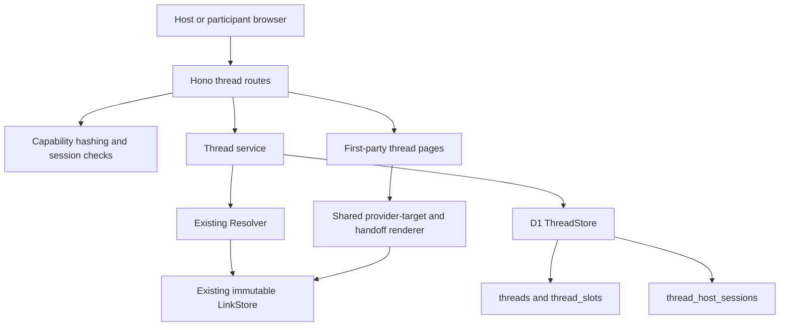
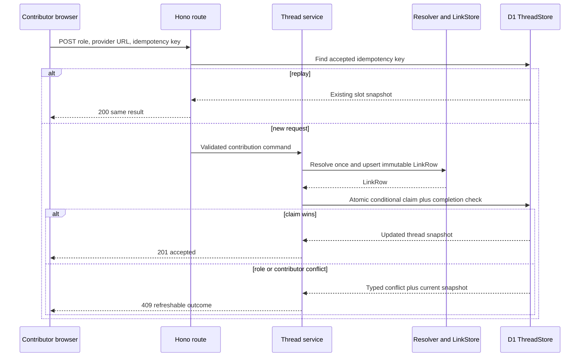
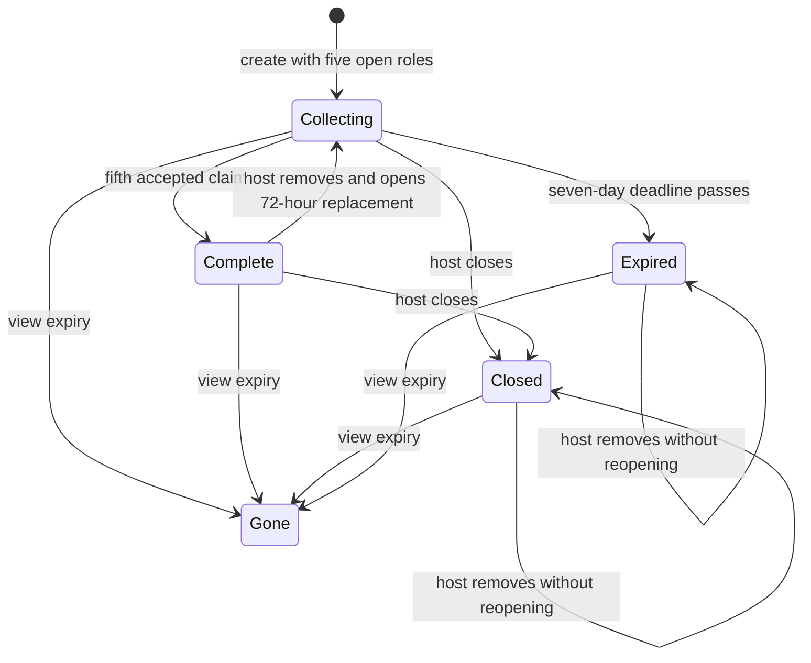

# Private Pass the Aux Threads - Plan

## Goal Capsule

- **Objective:** Let a host create one unlisted five-song relay in a small group chat, let each anonymous participant fill one purposeful position with a Spotify or Apple Music track, and let the group hear the finished sequence through each listener's existing provider preference.
- **Product authority:** The receiver-side, account-free, cross-provider playback decisions in `AGENTS.md` and R1-R6, F1-F2, and AE1 in the origin plan override implementation convenience.
- **Execution profile:** Deep, security-sensitive feature work spanning D1 schema, capability authorization, resolver orchestration, Hono routes, server-rendered pages, concurrency, and staging observability.
- **Mutation boundary:** Invite holders may view and contribute; only a separate host capability may close or moderate. Neither capability establishes identity or ownership outside this thread.
- **Stop conditions:** Do not enable the feature in production until the staging dogfood gate is reviewed. Stop implementation if preserving host-secret fragments, atomic slot claims, or existing provider handoff behavior would require a product-scope change.
- **Tail ownership:** Implementation includes migration, unit and Worker-runtime tests, local verification, staging-ready instrumentation, and a documented production gate. Deployment and production enablement require separate authorization.

---

## Product Contract

### Summary

The first Pass the Aux feature is an asynchronous relay for an existing small group chat. A host names the mix and optionally adds a prompt, then shares one unlisted invite. Five people, including the host if desired, each fill at most one of five ordered roles: Opener, Build, Peak, Curveball, and Closer. The group chat remains the conversation and notification surface; listen.cx supplies the finite cross-provider artifact.

This is a deliberate wedge, not a claim that five tracks or these role names are universally optimal. The shape is fixed for the first dogfood cohort so completion, abandonment, role comprehension, and provider handoff can be measured without configuration noise.

### Problem Frame

Generic collaborative playlists already support shared editing, but they bind the group to one provider, tend toward open-ended collections, and carry account, identity, and permission machinery. The listen.cx opportunity is narrower: turn the link-sharing behavior already happening in a group chat into a short object the group can finish and play across providers.

Party and trip variants are poor first wedges. Spotify's party and car experiences center a live queue, a playback host, speaker controls, and provider membership. Implementing those moments well would require synchronized playback or native-provider control, both outside listen.cx's identity. A group-chat relay can be asynchronous, uses sharing links as its coordination primitive, and leaves playback with each receiver.

### Actors

- A1. **Host:** Creates the thread, shares the invite, retains the management recovery link, and may also contribute through the ordinary invite.
- A2. **Contributor:** Possesses the invite and uses one browser to fill one open role without an account.
- A3. **Listener:** Possesses the invite and opens any filled song through the browser's existing Spotify or Apple Music preference.

### Requirements

**Thread shape and lifecycle**

- R1. A1 can create an unlisted thread with a required title, optional prompt, five fixed ordered roles, a seven-day contribution window, and no account.
- R2. The public thread presents Opener, Build, Peak, Curveball, and Closer in order, with one resolved track or one open state per role.
- R6. Filling the fifth role makes the thread complete and contributor-read-only; the same invite remains a shareable finished mix until its view-expiry boundary.

**Contribution and playback**

- R3. A2 can fill one open role with one Spotify or Apple Music track, without creating an account or supplying a display name.
- R4. A contribution resolves once through the existing Resolver and LinkStore seams, then playback uses the existing saved provider preference, choice escape hatch, exact counterpart, and search fallback behavior.

**Host control**

- R5. A separate, unguessable host capability can establish a scoped management session, close contributions, or remove a track; the public invite never confers those actions.

### Key Flows

- F1. **Pass a thread along**
  - **Trigger:** A1 has a small group chat and a prompt worth answering with songs.
  - **Actors:** A1, A2.
  - **Steps:** A1 creates the thread, copies the public invite, retains the separate management link, and shares the invite in the chat. Each A2 chooses one open role and submits a provider track link. The fifth accepted contribution completes the sequence.
  - **Outcome:** The chat produces a bounded, ordered mix instead of an unstructured link dump.
  - **Covered by:** R1-R6.
- F2. **Listen across providers**
  - **Trigger:** A3 opens a filled role from the thread.
  - **Actors:** A3.
  - **Steps:** The role-specific playback route loads the immutable LinkRow, respects the receiver's `pref` cookie or `?choose=1`, and renders the existing direct handoff or provider-search fallback.
  - **Outcome:** Every accepted song remains individually useful to both supported provider audiences.
  - **Covered by:** R4, R6.

### Acceptance Examples

- AE1. **A contribution completes a real slot**
  - **Covers:** R2-R4.
  - **Given:** A collecting thread has an unfilled Peak role and the contributor browser has no active contribution in that thread.
  - **When:** A2 submits a valid Apple Music track with a fresh idempotency key.
  - **Then:** Peak atomically displays the resolved LinkRow, replaying the same request does not resolve or insert again, and a Spotify-preferring A3 can open its resolved Spotify counterpart or the existing search fallback.
- AE2. **Two contributors race for one role**
  - **Covers:** R2-R3.
  - **Given:** Curveball is open.
  - **When:** Two distinct contributor sessions submit valid tracks concurrently.
  - **Then:** Exactly one conditional slot claim commits, the loser receives a refreshable conflict response, no accepted contribution is overwritten, and the thread count advances once.
- AE3. **The host moderates without widening invite authority**
  - **Covers:** R5-R6.
  - **Given:** A completed thread contains an unsuitable track and the host has a valid management session.
  - **When:** The host removes that role.
  - **Then:** The role reopens, the thread returns to collecting for a 72-hour replacement window, ordinary invite holders still cannot remove or close, and the immutable LinkRow is not deleted.

### Success Criteria

- At least half of dogfood threads receive a second distinct contributor session within 48 hours.
- At least 30% of dogfood threads fill all five roles within seven days.
- At least half of completed dogfood threads record one role playback, with at least one completed thread exercised through each provider.
- Slot-conflict, invalid-link, and provider-failure outcomes are observable without capability tokens, provider URLs, prompts, cookies, IP addresses, or user-agent strings in application events.
- Existing one-song create, unfurl, provider choice, returning handoff, and `?choose=1` tests remain green.

### Scope Boundaries

**In this plan**

- One fixed group-chat template, five fixed roles, one active contribution per browser, account-free bearer capabilities, host close/remove, ordered finished-mix page, and individual cross-provider playback.
- Lazy lifecycle enforcement on reads and writes, structured staging events, and a feature gate that is enabled in staging and disabled in production by default.

**Deferred to follow-up work**

- Choosing a different slot count or role set after dogfood evidence.
- Capability rotation, thread deletion, physical purging after expiry, invite revocation, host recovery after losing the management link, and durable abuse tooling beyond the bounded MVP controls.
- Notifications, reminders, attribution, contributor display names, comments, reactions, voting, points, and presence.
- Native playlist export, public discovery, accounts, granular permissions, and embedding-based interpretation.

**Outside this product's identity**

- Synchronized or in-app playback.
- Making provider or listen.cx account creation a condition of contribution or listening.
- Treating the thread as a live party queue, car head-unit controller, or endless collaborative playlist.

### Product Decisions and Alternatives

#### Chosen wedge: asynchronous small-group-chat relay

The external evidence is directional rather than conclusive. Spotify and Apple both make share links or messages central to inviting collaborators, and Spotify Blend bounds a group at ten. Collaborative-playlist research reports platform access, overlong content, control, and engagement as recurring problems and notes that only a few participants in that sample asked for synchronous playback. These findings make a short asynchronous relay compatible with listen.cx's strengths. They do not prove demand for this exact ritual; staging conversion is the deciding evidence.

#### Feasibility and origin-blocker resolution

This recommendation resolves the origin plan's “Which initial social moment?” pre-planning blocker strongly enough to implement without another product choice. The group-chat wedge uses capabilities the current stack already has—shareable HTTPS routes, credential-free per-track resolution, immutable LinkRows, provider-preference handoff, D1, and server-rendered pages—and requires no synchronized playback, provider authorization, account identity, or external notification system. The unresolved question is product validation, not technical feasibility: if staging threads do not reach a second contributor or completion, use the stated checkpoint to change prompt or length instead of blocking the first implementation.

#### Rejected for the first release: party

Spotify Jam is a direct substitute for the party variant: it is a real-time queue with a Premium host, speaker playback, guest controls, ordering, and moderation. A listen.cx party product without synchronized playback would be a weaker queue; adding synchronized playback would contradict the product boundary. Party remains a future occasion prompt for an asynchronous thread, not the initial product mode.

#### Rejected for the first release: trip

Spotify exposes Jam in Android Auto and CarPlay with passengers joining a car-speaker queue. A useful road-trip artifact also tends to demand more than five tracks and pre-trip editing over a longer period. Trip therefore weakens the finite five-position hypothesis and invites car playback scope. It may become a later longer template if the core group-chat relay completes reliably.

#### Rejected for the first release: configurable templates

Allowing three, five, or ten roles would obscure whether abandonment comes from the ritual, the length, or the chosen template. The first cohort uses one shape; role-level abandonment and time-to-completion determine the next experiment.

### Dependencies and Assumptions

- The existing Resolver and immutable LinkStore remain the only provider-resolution path. A thread stores `links.slug` references rather than duplicating provider metadata.
- The provider-native handoff risk recorded in `AGENTS.md` remains unresolved. This plan preserves and regression-tests current behavior but does not claim live iOS/macOS proof.
- Possession of the public invite means permission to view and attempt one contribution. The invite can be forwarded and preview services necessarily receive it; “private” means unlisted bearer access, not recipient-bound confidentiality.
- One contribution per browser is friction, not identity. Clearing cookies or using another browser bypasses it. Five slots, the seven-day write window, supported-link prevalidation, body limits, and staging-only rollout bound exposure; a production abuse review remains a release gate.
- Five roles, seven days to contribute, a 72-hour replacement window, and 180 days of view/play availability are hypotheses to evaluate, not externally established constants.

---

## Planning Contract

### Key Technical Decisions

- KTD1. **Use separate invite and host capabilities.** The public invite grants view, play, and one contribution attempt per browser. A 256-bit host secret is created once, stored only as a SHA-256 digest, and returned in the URL fragment of the management recovery link. Invite possession never implies management authority.
- KTD2. **Exchange the host fragment for a scoped session.** The management page reads the fragment in first-party JavaScript, posts it in a bounded request body, removes it from browser history, and receives a random HttpOnly, Secure, SameSite=Strict session cookie scoped to that thread's management path. D1 stores only the session digest and expiry. GET requests have no side effects.
- KTD3. **Use at least 128 bits of entropy for every bearer token.** Invite, contributor-session, idempotency, and host-session values use Worker Web Crypto randomness; the host recovery secret uses 256 bits. The existing seven-character song slug remains unchanged but is not reused as a private capability.
- KTD4. **Hash tokens at the route boundary.** `ThreadStore` accepts digests rather than raw invite, host, contributor, or session tokens. Application logs use the nonsecret internal thread ID and never capability-bearing paths or values.
- KTD5. **Represent the five roles as persisted slots.** Thread creation atomically inserts one thread and five ordered `thread_slots` rows. A slot holds a nullable immutable `links.slug`, idempotency key, contributor digest, and contribution timestamp. The fixed rows make empty positions and ordering explicit and leave room for later templates without changing contribution semantics.
- KTD6. **Serialize slot claim and completion in one D1 batch.** A conditional slot update succeeds only while the thread is collecting, unexpired, the slot is empty, and the contributor digest has no active slot. The same transaction sets the thread complete when no empty slots remain. Result metadata distinguishes accepted, replayed, already-contributed, unavailable-role, and closed/expired outcomes.
- KTD7. **Check idempotency before resolving.** A client-generated key is unique within a thread. A replay returns the already-attached slot without another provider call. A new request prevalidates the provider URL, resolves once, upserts the LinkRow, then attempts the atomic claim. A legitimate race may leave an unreferenced immutable LinkRow; it must never overwrite the winning slot.
- KTD8. **Keep lifecycle explicit and lazily enforced.** States are `collecting`, `complete`, `closed`, and `expired`. The fifth slot moves collecting to complete. Host close is terminal for writes. Expiry is materialized on the next read or write after the contribution deadline. Host removal from complete returns to collecting and extends the deadline to at least 72 hours; removal from closed or expired does not reopen. View/play returns 410 after the 180-day boundary.
- KTD9. **Reuse provider handoff by LinkRow, not by redirecting through the song slug.** A thread role playback route loads its LinkRow and calls the same provider-target and handoff rendering logic as `GET /:slug`. It supports `pref`, `?to=`, and `?choose=1` without provider API calls on read.
- KTD10. **Keep capability pages first-party and non-indexable.** Thread pages send `Referrer-Policy: no-referrer`, `Cache-Control: private, no-store`, `X-Robots-Tag: noindex, nofollow`, frame restrictions, and a restrictive CSP. They load no third-party fonts or scripts. Artwork remains an HTTPS image with the document's no-referrer policy. Unfurl bots receive OG HTML but never set contributor cookies or cause lifecycle mutations.
- KTD11. **Instrument outcomes, not people or secrets.** Structured events contain event name, nonsecret internal thread ID, state, role, provider category, timing bucket, and outcome code. They exclude title, prompt, song URL, capability token, cookie, IP, raw referrer, and user agent. Client share/copy signals are best-effort and explicitly approximate.
- KTD12. **Gate the route family by environment.** `PASS_THE_AUX_ENABLED` is true in staging and false or absent in production. Disabled routes return the ordinary not-found surface so the implementation can land without exposing an unfinished production feature.

### Capability and Permission Model

| Credential | Transport and storage | Grants | Expiry and limits |
|---|---|---|---|
| Invite token | 128-bit-or-greater value in `/aux/:invite`; SHA-256 digest in D1 | View thread, play filled roles, attempt contribution | View/play for 180 days; contributions only while collecting and before deadline; forwardable |
| Contributor session | Random cookie scoped to `/aux/:invite`; digest on an accepted slot | One active contribution in one browser | Seven-day thread window; advisory because a new browser bypasses it |
| Host recovery secret | 256-bit value in management URL fragment; digest on thread | Exchange for host session | Valid through thread view expiry; cannot be recovered or rotated in MVP |
| Host session | Random HttpOnly, Secure, SameSite=Strict cookie scoped to `/aux/:invite/manage`; digest in D1 | Read management view, close, remove | 30 days, bounded by thread management expiry; re-claimable with recovery secret |
| Idempotency key | Random request field; stored on accepted slot | Replay one contribution result | Unique per thread; no authority beyond replay detection |

The invite is intentionally discloseable to the group. Link previews disclose it to the chosen chat's unfurl service. The host secret is never placed in a path or query, so it is not sent in the initial HTTP request, referrer, or ordinary request URL logs. Capability pages do not link to untrusted destinations; provider navigation uses no-referrer behavior.

### Data Model

`migrations/0002_pass_the_aux_threads.sql` adds three tables without altering `links`:

- `threads`: nonsecret internal ID; unique invite digest; title; optional prompt; state constraint; slot count; host-secret digest; contribution deadline; view expiry; created, updated, completed, closed, and expired timestamps.
- `thread_slots`: `(thread_id, position)` primary key; constrained role; nullable `link_slug` foreign key to `links`; nullable idempotency key and contributor digest; contributed timestamp. Partial unique indexes enforce one active contributor digest and one accepted idempotency key per thread.
- `thread_host_sessions`: session digest primary key; thread ID foreign key; created and expiry timestamps. An index supports expiry checks by thread.

No thread operation mutates or deletes a LinkRow. Removal nulls the slot reference and contribution fields. Physical purge and tombstone/audit history are deferred; structured moderation events cover staging learning but are not a durable audit log.

### Route Contract

| Method and path | Capability | Outcome |
|---|---|---|
| `GET /aux/new` | None; feature gate | Account-free title/prompt form |
| `POST /aux` | None; feature gate | Create thread; return invite URL and fragment-bearing management URL once |
| `GET /aux/:invite` | Invite | Render collecting, complete, closed, or expired thread; bots get OG HTML without state mutation |
| `POST /aux/:invite/contributions` | Invite + contributor cookie | Prevalidate, resolve once, atomically fill one role, return updated snapshot or typed failure |
| `GET /aux/:invite/play/:position` | Invite | Render existing provider choice/handoff for that slot's LinkRow |
| `GET /aux/:invite/manage` | Invite; host session for dashboard | Render fragment exchange shell or management dashboard |
| `POST /aux/:invite/manage/session` | Invite + host secret in body | Verify digest, create scoped host session, set cookie |
| `POST /aux/:invite/manage/close` | Valid host session | Idempotently stop contributions |
| `POST /aux/:invite/manage/slots/:position/remove` | Valid host session | Idempotently clear a slot and apply lifecycle rule |
| `POST /aux/:invite/events/share` | Invite | Record a bounded best-effort `thread_share_clicked` event |

All mutations require JSON or form bodies below the existing bounded-body pattern and reject unsupported content types. Management mutations also verify same-origin `Origin` when present. Invalid tokens and invalid host sessions use one generic not-found response; valid but expired public capabilities use 410. Slot conflict, already-contributed, complete, and not-accepting responses use stable machine-readable error codes with safe user copy.

### High-Level Technical Design

### Concurrency and Failure Semantics

- D1 `batch()` is the transaction boundary for thread plus slots at creation and slot claim plus state transition at contribution. Conditional updates and unique indexes, not pre-read assumptions, decide winners.
- An idempotency replay is checked before Resolver invocation and again after a conflicting write. The response is the accepted slot even if the original response was lost.
- A provider failure leaves the slot open and returns the existing retryable 502 category. An unsupported provider URL returns 422 without a provider request. A body over the route limit returns 413.
- A different contributor losing a role race receives 409 with the latest safe snapshot and may choose another role if their browser still has no accepted contribution.
- The Resolver may finish after the host closes or another contributor wins. The resulting LinkRow may remain unreferenced, consistent with immutable credential-free row behavior. Instrument this as `claim_conflict_after_resolve`; do not delete the row.
- Reads never call provider APIs. Expiry materialization is a D1-only state transition and must be idempotent.

### Abuse and Privacy Boundary

This MVP prevents accidental over-contribution; it does not identify or ban a determined adversary. A bearer can forward the invite, clear cookies, and submit from another browser. An attacker with the invite can consume resolver work until platform controls intervene. The finite slot count, one-browser limit, URL prevalidation, body bounds, deadline, CSP, no-index policy, feature gate, and structured failure metrics make staging dogfood safe enough to learn. Production enablement requires reviewing actual attempt volume and adding a coarse Cloudflare/application rate limit if the observed or modeled resolver amplification is unacceptable.

Titles and prompts are user content. They are length-limited, escaped in every HTML/metadata context, omitted from logs, and unavailable after view expiry. The initial schema does not physically delete expired data; a retention/purge decision is required before claiming data deletion.

### Sequencing

U1 establishes terminology and security primitives. U2 owns the migration and the only concurrency-critical persistence logic. U3 composes resolution and persistence behind a service boundary. U4 exposes create/invite/contribute flows. U5 adds management authority. U6 reuses receiver playback and completion behavior. U7 adds rollout controls and observation. Units should land in that dependency order; feature-bearing behavior is written test-first per repository policy.

---

## Implementation Units

### U1. Define the thread domain and capability primitives

- **Goal:** Create pure, testable contracts for roles, lifecycle, validation, token generation, hashing, and safe comparisons before persistence or routes depend on them.
- **Requirements:** R1-R6; F1-F2.
- **Dependencies:** None.
- **Files:** Create `src/thread.ts`, `src/thread.test.ts`, `src/capability.ts`, and `src/capability.test.ts`.
- **Approach:** Define the five ordered roles and presentation copy in one canonical constant. Model lifecycle inputs and allowed host transitions without database or Hono types. Validate trimmed title and prompt bounds. Generate invite/session/contributor values with Worker Web Crypto and keep raw-token handling in `capability.ts`; expose digest values to downstream storage. Use the conservative entropy decisions in KTD3.
- **Execution note:** Implement token and transition contracts test-first because every later authorization and lifecycle unit depends on them.
- **Patterns to follow:** Pure utility tests beside `src/urls.ts` and resolver/client tests beside their modules; Web Crypto rather than Node-only helpers.
- **Test scenarios:**
  1. Generated invite, contributor, and session values contain at least 128 bits of CSPRNG material; host recovery values contain 256 bits; a large sample has no duplicates.
  2. SHA-256 digesting is deterministic, produces a fixed representation, and never returns or embeds the raw token.
  3. A blank or over-80-character title fails; omitted prompt succeeds; an over-240-character prompt fails; HTML-looking input remains data for later escaping.
  4. The role sequence is exactly Opener, Build, Peak, Curveball, Closer with stable positions zero through four.
  5. The fifth fill permits collecting to complete; host close permits collecting or complete to closed; host removal permits complete to collecting but never closed/expired to collecting.
  6. A replacement opened from complete gets at least 72 hours without extending beyond the thread's management/view boundary.
- **Verification:** Pure tests prove deterministic validation and transitions, token entropy is inspectable from constants, and neither module imports Hono or D1.

### U2. Persist threads and atomic slot claims in D1

- **Goal:** Add the thread schema and a D1 store whose constraints and transactions enforce capacity, idempotency, one active contribution per contributor session, lifecycle, and host sessions.
- **Requirements:** R1-R3, R5-R6; F1; AE2-AE3.
- **Dependencies:** U1.
- **Files:** Create `migrations/0002_pass_the_aux_threads.sql`, `src/thread-store.ts`, and `src/thread-store.test.ts`; modify `test/apply-migrations.ts` only if the new migration reveals a setup gap.
- **Approach:** Add `threads`, `thread_slots`, and `thread_host_sessions` as specified in the Data Model. `D1ThreadStore` hashes no secrets itself and returns aggregate snapshots with slots ordered by position. Create thread plus five slots in one batch. Claim a slot and transition completion in one batch with conditional predicates and partial unique indexes. Use result metadata and follow-up reads to classify races and idempotent replays. Keep LinkRows immutable and referenced by slug.
- **Execution note:** Start with D1 integration tests for competing claims and migration preservation; do not rely on mocked SQL for concurrency contracts.
- **Patterns to follow:** `src/db.ts` prepared statements, `withSession("first-primary")` when read-after-write consistency is needed, `test/apply-migrations.ts`, and Cloudflare's transactional `D1Database.batch()` semantics.
- **Test scenarios:**
  1. Applying both migrations to an existing database preserves a seeded LinkRow and adds all thread tables and indexes.
  2. Creating a thread returns five ordered empty slots and no partially created thread is visible if any slot insert fails.
  3. Two distinct contributor digests racing for Peak yield one attached LinkRow and one typed role conflict; filled count changes once.
  4. Two concurrent requests with the same idempotency key return the same accepted slot and create one accepted association.
  5. One contributor digest cannot hold two active slots; after host removal clears its active association, the same browser may contribute again while collecting.
  6. The fifth successful claim sets complete and a sixth claim is rejected without changing any slot.
  7. Host close is idempotent and blocks claims. Lazy deadline enforcement changes collecting to expired once and remains stable on repeated reads.
  8. Covers AE3. Removing from complete clears only the selected slot, returns to collecting, and opens the replacement window; removing from closed clears the slot but stays closed.
  9. An invalid/expired host-session digest grants no mutation; a valid unexpired digest is scoped to its thread.
- **Verification:** Real Worker-runtime D1 tests prove constraints, transactional outcomes, migration preservation, and deterministic ordered snapshots.

### U3. Orchestrate resolution, idempotency, and typed contribution outcomes

- **Goal:** Introduce a thread service that composes the existing Resolver, LinkStore, ThreadStore, and capability primitives without duplicating provider logic.
- **Requirements:** R3-R4; F1-F2; AE1-AE2.
- **Dependencies:** U1-U2.
- **Files:** Create `src/thread-service.ts` and `src/thread-service.test.ts`; modify `src/db.ts` only if a narrow existing LinkStore contract needs to be exported or reused.
- **Approach:** The service owns create defaults, provider-URL prevalidation, idempotency lookup, a single Resolver call for a new attempt, immutable LinkStore upsert, atomic slot claim, and safe domain error mapping. It does not render HTTP responses or inspect cookies. Replays short-circuit before Resolver. A post-resolution slot conflict is explicit and leaves the LinkRow intact.
- **Execution note:** Write service behavior against fakes first, then retain U2's real-D1 tests for transaction proof.
- **Patterns to follow:** `Resolver.resolve`, `LinkStore.upsert`, supported URL parsing in `src/urls.ts`, and the existing distinction between invalid links and retryable provider failures in `src/app.ts`.
- **Test scenarios:**
  1. Covers AE1. An Apple Music link for Peak calls Resolver once, upserts once, attaches the returned LinkRow, and exposes a filled Peak snapshot.
  2. Repeating AE1 with the same idempotency key returns the existing result without calling Resolver or LinkStore again.
  3. An unsupported or non-track URL returns invalid-link before provider access and leaves every slot open.
  4. Resolver failure maps to retryable provider failure and leaves the thread unchanged.
  5. A valid resolution followed by a lost slot race maps to role conflict, preserves the winning slot, and records the losing LinkRow as a permissible unreferenced row.
  6. Closed, expired, complete, already-contributed, and missing-thread store outcomes map to distinct internal codes without revealing whether an arbitrary host credential was close.
- **Verification:** Service tests prove provider calls occur at most once per new attempt and zero times on replay/read; existing resolver tests remain unchanged.

### U4. Add account-free creation, invite, and contribution surfaces

- **Goal:** Expose the group-chat relay through Hono and accessible server-rendered pages while keeping the current one-song homepage primary.
- **Requirements:** R1-R4, R6; F1; AE1-AE2.
- **Dependencies:** U1-U3.
- **Files:** Create `src/thread-page.ts`, `src/thread-page.test.ts`, and `src/thread-routes.ts`; modify `src/app.ts`, `src/page.ts`, `src/worker.ts`, `test/app.test.ts`, and `test/worker.test.ts`.
- **Approach:** Add an understated Pass the Aux link to the existing creator page and mount the `/aux` route family before the wildcard song route. Creation accepts title/prompt, sets the contributor cookie, and returns the invite plus the management recovery URL exactly once. Invite rendering shows all five roles, filled song metadata, and one-role contribution controls. Forms generate and retain one idempotency key per submit until a terminal response. Bots receive OG HTML without a contributor cookie or lazy write. All thread HTML uses first-party styles and KTD10 headers.
- **Execution note:** Start with Worker-route request/response tests, including the wildcard-order regression, before adding pages.
- **Patterns to follow:** Bounded request streaming and friendly status mapping in `src/app.ts`, escaping and OG metadata in `src/page.ts`, and `createApp` dependency injection in `test/app.test.ts`.
- **Test scenarios:**
  1. `GET /aux/new` renders title and optional prompt fields without displacing the one-song homepage form.
  2. `POST /aux` with valid input creates five roles, returns a public invite and a different management URL whose host secret is after `#`, and never returns a raw host secret in JSON fields or logs apart from that recovery URL.
  3. Invalid, oversized, malformed, or unsupported-content-type create/contribution bodies return 400/413/415 and perform no Resolver or D1 mutation.
  4. A normal invite GET sets a scoped contributor cookie and renders ordered open/filled roles; a bot GET renders OG tags, sets no cookie, and does not materialize expiry.
  5. Covers AE1. A route-level Apple contribution to Peak returns accepted HTML/JSON, and refresh shows resolved title, artist, and artwork in Peak.
  6. Covers AE2. The loser of a real concurrent Peak submission gets 409 plus current state and can submit to another open role without reusing the losing idempotency key.
  7. A browser with an active contribution sees its role but cannot fill another; another browser can fill another role.
  8. Title, prompt, resolved metadata, and error copy containing HTML characters are escaped in text, attributes, and OG metadata.
  9. Unknown invite, malformed invite, and feature-disabled routes expose the ordinary 404 surface; existing `/:slug` and pasted-path conversion routes still win for their established paths.
- **Verification:** Worker tests exercise creation through contribution against D1; rendered pages pass semantic assertions for labels, role order, headers, and absence of third-party scripts/fonts.

### U5. Add scoped host management and moderation

- **Goal:** Let the host claim a temporary management session, close the thread, and remove a contribution without exposing management through the invite.
- **Requirements:** R5-R6; F1; AE3.
- **Dependencies:** U1-U4.
- **Files:** Modify `src/thread-routes.ts`, `src/thread-page.ts`, `src/thread-service.ts`, `src/thread-page.test.ts`, `src/thread-service.test.ts`, and `test/app.test.ts`.
- **Approach:** The first management GET without a session returns a nonce-bearing, first-party exchange shell. Its script reads `location.hash`, posts the host secret to the session endpoint, uses `history.replaceState` to remove the fragment, and reloads. The server verifies the digest, issues a scoped session, and renders management controls only afterward. Close/remove are POST-only, same-origin checked, idempotent, and authorize the session against this thread. No account, email recovery, or invite-level moderation is added.
- **Execution note:** Prove negative authorization and URL-leakage cases before happy-path controls.
- **Patterns to follow:** Hono secure cookie options already used for provider preference; KTD2 and W3C guidance that GET capability URLs must not perform destructive actions.
- **Test scenarios:**
  1. The initial management HTTP request contains the invite path but not the fragment secret; the response includes no third-party requests and applies no host mutation.
  2. A correct secret creates one hashed D1 host session and a Secure, HttpOnly, SameSite=Strict cookie scoped to this thread's management path; the master secret is not stored.
  3. An incorrect, malformed, expired, or other-thread secret/session gets the same generic denial and cannot distinguish thread existence through management responses.
  4. Invite and contributor cookies alone cannot close or remove. Cross-origin management POST is rejected even with a cookie.
  5. Close is idempotent, immediately removes contribution controls from the public page, and leaves filled roles playable.
  6. Covers AE3. Removing a role from complete reopens that role for 72 hours while preserving other roles; removing from closed or expired does not reopen.
  7. Repeating removal is safe and does not delete or mutate the referenced LinkRow.
  8. Fragment exchange removes the secret from the displayed URL/history before rendering the dashboard; failure copy tells the host to reopen the saved management link without echoing it.
- **Verification:** Route and service tests prove the capability matrix, cookie attributes, same-origin gate, and every lifecycle branch; a manual browser check is reserved for staging because fragment/history behavior is browser-visible.

### U6. Render the finished mix and reuse receiver-side handoff

- **Goal:** Make filled and completed threads useful to Spotify and Apple Music listeners without changing the established receiver contract.
- **Requirements:** R4, R6; F2; AE1.
- **Dependencies:** U3-U5.
- **Files:** Create `src/handoff.ts` and `src/handoff.test.ts`; modify `src/app.ts`, `src/page.ts`, `src/thread-routes.ts`, `src/thread-page.ts`, `test/app.test.ts`, and `test/worker.test.ts`.
- **Approach:** Extract existing Apple deep-link normalization and provider-target validation into a shared pure module without changing output. The role playback route resolves thread plus position to a LinkRow and renders the same choice or direct handoff as a song link. The complete page makes ordered playback the primary action and contribution unavailable. Closed/expired partial threads retain playback for filled roles until view expiry. No provider API runs on these reads.
- **Execution note:** Add characterization tests for current one-song handoff before extracting shared logic, then add thread playback tests.
- **Patterns to follow:** `providerTarget`, `choicePage`, `handoffPage`, `pref`, `?to=`, `?choose=1`, bot handling, safe-host validation, and search fallbacks in `src/app.ts` and `src/page.ts`.
- **Test scenarios:**
  1. Every existing exact Spotify, exact Apple, iTunes-to-music deep link, unsafe URL, missing counterpart, preference cookie, and choose-override behavior is unchanged after extraction.
  2. Covers F2 / AE1. A Spotify-preferring listener opens an Apple-origin Peak role and sees the exact Spotify handoff when present or the established Spotify search fallback otherwise.
  3. A first-time listener sees neutral randomized provider choices; selecting one sets the same one-year preference used by standalone song links.
  4. A complete thread renders five filled roles in order and rejects further contributions; an ordinary listener cannot reorder or remove them.
  5. A closed or expired partial thread plays filled roles but never exposes a contribution form; an empty role returns a safe conflict/not-found response.
  6. A view-expired invite returns 410 for thread and role playback without revealing song metadata.
  7. Thread playback performs D1 reads only; fake Resolver and provider clients are not called.
- **Verification:** Characterization and route tests prove parity with standalone links, cross-provider behavior, complete read-only behavior, and zero resolution on read.

### U7. Gate rollout and add privacy-bounded dogfood instrumentation

- **Goal:** Make the feature safe to exercise at `staging.listen.cx` and produce enough evidence to keep, shorten, or reshape the five-role ritual.
- **Requirements:** R1-R6; F1-F2.
- **Dependencies:** U1-U6.
- **Files:** Create `src/thread-events.ts` and `src/thread-events.test.ts`; modify `src/thread-routes.ts`, `src/worker.ts`, `wrangler.jsonc`, `worker-configuration.d.ts` through the repository's type-generation workflow, `test/app.test.ts`, and `test/worker.test.ts`.
- **Approach:** Add the environment gate and structured event sink. Emit `thread_created`, `thread_invite_viewed`, `contribution_accepted`, `contribution_rejected`, `thread_completed`, `thread_closed`, `slot_removed`, `role_play_opened`, and `thread_share_clicked`. Include only the allowlisted fields in KTD11. Share/copy is a best-effort client beacon and not a security or billing record. Keep production false by default.
- **Execution note:** Treat event privacy as a contract: test the allowlist and inspect representative logs before dogfood.
- **Patterns to follow:** Existing JSON console logging and `wrangler.jsonc` staging/production separation; Worker entrypoint smoke coverage in `test/worker.test.ts`.
- **Test scenarios:**
  1. Staging configuration enables `/aux`; production/default configuration leaves it at the ordinary 404 surface.
  2. Every event serializes only allowlisted keys and rejects/omits title, prompt, provider URL, invite token, host secret, cookies, IP, user agent, and raw referrer.
  3. Accepted/rejected contributions emit one terminal outcome with role and reason; idempotent replay does not double-count accepted contribution or completion.
  4. Completing the fifth role emits `thread_completed` once with elapsed-time bucket and filled count five.
  5. Playback records selected provider category and exact-versus-search outcome without recording destination URL.
  6. Share beacon failure never blocks copy/share UI and repeated beacons are explicitly treated as approximate.
  7. Existing health check and one-song routes work with the gate both enabled and disabled.
- **Verification:** Type generation and typecheck pass, all tests pass, a local Worker log sample contains only allowlisted event data, and production configuration remains disabled.

---

## Verification Contract

| Gate | Applies to | Required outcome |
|---|---|---|
| `pnpm typecheck` | U1-U7 | Zero TypeScript errors across Worker bindings, stores, services, routes, and tests |
| `pnpm test` | U1-U7 | All existing and new unit, D1, route, and Worker-entrypoint tests pass |
| Migration proof | U2 | `0001` plus `0002` apply to fresh local D1; existing LinkRows survive; constraints reject invalid states |
| Concurrency proof | U2-U4 | Real D1 race test shows exactly one winner, stable idempotent replay, and no overwrite |
| Security proof | U1, U4-U5, U7 | Raw host/invite/session values are absent from D1 and application events; capability headers and cookie scope are asserted |
| Receiver preservation | U6 | Current standalone route, unfurl, preference, direct handoff, search fallback, and choose-override scenarios remain green |
| Staging browser dogfood | U4-U7 | Create, share into a real group chat, contribute from two browsers/providers, race one role, complete, moderate, and play through both providers at `staging.listen.cx` |
| Native handoff caveat | U6 | Record actual iOS/macOS results; failures remain a known dependency and do not get reclassified as solved by unit tests |
| Pre-commit review | All | Run the repository-required non-trivial review, fix important findings, then rerun typecheck and tests before any commit |

### Staging Dogfood Protocol and Metrics

Run at least 20 started threads across at least three existing small group chats for a minimum of two weeks. Do not manufacture contributions from one tester to satisfy funnel metrics; contributor-session counts are only a proxy for people and must be interpreted qualitatively.

Review these funnels and distributions:

- Created to first accepted contribution, second distinct contributor session, five-role completion, first playback, and share click.
- Time to second contributor and completion; filled-count distribution at 24 hours and seven days.
- Abandonment by role, especially whether Build, Curveball, or Closer are disproportionately left open.
- Accepted/rejected contribution outcomes, post-resolution claim conflicts, provider failures, and exact-counterpart versus search-fallback playback.
- Completed threads played through Spotify and Apple Music; no claim that the same person is represented across browsers.
- Host close/remove rate and qualitative reason gathered outside product during dogfood.

Decision checkpoint after 20 starts and two weeks:

- Keep five roles if at least 30% complete, the median filled count is at least four, and no single role is empty in more than half of incomplete threads.
- Test a shorter three- or four-role template next if second contribution is healthy but completion stalls at three or four.
- Rework the social prompt/onboarding before length if fewer than half receive a second contributor within 48 hours.
- Do not move to party or trip merely because completion is weak; those variants require separate evidence that synchronous/native playback or a longer template is the real missing value.
- Do not enable production until raw event samples pass privacy review and resolver attempt volume has an accepted rate-limiting decision.

---

## Risks and Dependencies

| Risk | Impact | Mitigation and decision |
|---|---|---|
| Invite forwarding or preview-service disclosure | Unintended people can view or contribute | Define private as unlisted bearer access; use high entropy, seven-day writes, no indexing/referrers, host close/remove, and clear sharing copy |
| Host recovery link loss | No account or email recovery | Show save/copy warning once; keep public thread useful; rotation/recovery is deferred rather than pretending identity exists |
| Resolver amplification by an invite holder | Provider traffic and Worker/D1 cost | Prevalidate, bound bodies and write window, instrument attempts, stage-gate, and require production rate-limit decision |
| D1 race or stale read | Overwrite, sixth contribution, or false completion | Conditional writes, unique indexes, transactional batch, primary read-after-write session, and real D1 concurrency tests |
| Five roles are too long or unclear | Threads stall | Fixed first cohort, role abandonment metrics, explicit decision checkpoint, then shorter-template experiment |
| Host removal after completion changes the artifact | Shared finished mix temporarily becomes incomplete | Host is the sole moderation exception; page returns to collecting and displays open replacement role; event records the transition |
| Capability data in platform request logs | Invite exposure to operators/platform logs | Host secret stays in fragment; application never logs raw paths/tokens; invite is the intentionally shareable lower-privilege capability |
| Prompt/title contain personal data | Privacy and retention risk | Bounds, escaping, log omission, no indexing, 180-day access expiry, and a follow-up purge decision before deletion claims |
| Native provider handoff remains unverified live | Completed thread can feel broken on iOS/macOS | Preserve current behavior and run staging device matrix; do not add synchronized/in-app playback as a workaround |
| Bot/user-agent detection misses a chat preview | Bad unfurl or cookie mutation | Preserve existing bot rules, add thread bot tests, and dogfood in actual target group chats before launch |

---

## Sources and Research

All external sources were retrieved 2026-07-13. “Observed” is a direct source claim; “Inference” is this plan's interpretation; “Counterevidence” marks evidence that could support a different decision.

- [Spotify: Start or join a Jam](https://support.spotify.com/xk-en/article/jam/) — **Observed:** Jam is synchronous, needs Premium to host, supports invitation links/QR/Bluetooth, shared queue control, host moderation, and car-speaker use. **Inference:** party and trip wedges pull toward playback control rather than listen.cx's provider-neutral artifact.
- [Spotify Newsroom: Jam](https://newsroom.spotify.com/2023-09-26/spotify-jam-personalized-collaborative-listening-session-free-premium-users/) — **Observed:** Jam invites travel through social/text/SMS; everyone can add; the host can reorder/remove; Android Auto support targets passengers. **Counterevidence:** share-link invitation and host moderation are useful patterns even though the synchronous product shape is rejected.
- [Spotify: Social recommendations / Blend](https://support.spotify.com/ws/article/social-recommendations-in-playlists/) — **Observed:** Blend is a shared playlist that updates daily and accepts up to ten friends through invitations. **Inference:** an asynchronous, bounded familiar-group object is legible, but ten does not establish the correct Pass the Aux length.
- [Apple Support: Collaborate on a playlist](https://support.apple.com/en-us/118494) — **Observed:** Apple uses invitation links/messages, optional collaborator approval, owner removal, shared add/remove/reorder, and reactions; participants need Apple Music. **Inference:** listen.cx should borrow invite plus host moderation while rejecting provider account requirements and broad co-editor permissions.
- [Park and Kaneshiro, PLOS ONE: User perspectives on critical factors for collaborative playlists](https://doi.org/10.1371/journal.pone.0260750) — **Observed:** the N=70 Spotify collaborative-playlist user study identifies platform access, control, overlong playlists, engagement, and editing visibility as important; it reports both asynchronous consumption value and some synchronous demand, while noting only a few participants expressed need for synchronous listening in this context. **Inference:** finite roles and cross-provider access attack relevant gaps; conversation can stay in the group chat for MVP. **Counterevidence:** some users explicitly wanted live queues, notifications, comments, ratings, and attribution, so excluding them is a scope bet requiring dogfood.
- [W3C TAG: Good Practices for Capability URLs](https://www.w3.org/TR/capability-urls/) — **Observed:** capability URLs suit account-free sharing but should be HTTPS, unguessable, expiring where possible, protected from third-party referrer leakage, and should not perform destructive actions on GET. **Inference:** separate a path invite from a fragment host secret, make mutations POST-only, and remove third-party page dependencies.
- [OWASP Session Management Cheat Sheet](https://cheatsheetseries.owasp.org/cheatsheets/Session_Management_Cheat_Sheet.html) — **Observed:** session identifiers need at least 64 bits of entropy from a CSPRNG and should use secure cookie controls. **Inference:** 128-bit invite/session tokens and a 256-bit host secret provide conservative margin for bearer capabilities.
- [MDN: Referrer-Policy](https://developer.mozilla.org/en-US/docs/Web/HTTP/Reference/Headers/Referrer-Policy) — **Observed:** `no-referrer` omits referrer information and applies to document subresources/navigation. **Inference:** apply it to every capability page and provider link path.
- [Cloudflare D1: D1Database `batch()`](https://developers.cloudflare.com/d1/worker-api/d1-database/) — **Observed:** D1 batch statements execute sequentially as a transaction and roll back the sequence on failure. **Inference:** use a batch for slot claim plus completion and test concurrency with real D1.
- [Cloudflare Workers: Web Crypto](https://developers.cloudflare.com/workers/runtime-apis/web-crypto/) — **Observed:** Workers exposes `crypto.getRandomValues()` and `crypto.subtle.digest()`. **Inference:** no new crypto dependency or provider secret is required.
- Repository anchors: `src/db.ts` for immutable LinkStore and primary-session reads, `src/app.ts` for bounded bodies/provider handoff/bot handling, `src/page.ts` for escaping and server-rendered pages, `test/app.test.ts` for Worker-route contracts, `test/apply-migrations.ts` for real D1 migrations, and `wrangler.jsonc` for environment separation.

---

## Definition of Done

- R1-R6, F1-F2, and AE1 are traceable to implemented U-IDs and passing named tests; AE2-AE3 add concurrency and capability proof.
- A fresh and an existing local D1 database accept `0002`; existing LinkRows and one-song behavior are unchanged.
- Invite, contributor, host, session, and idempotency capabilities meet entropy/storage rules; raw secrets are absent from D1 and application events.
- Concurrent slot claims, replay, completion, close, removal, lazy expiry, and view expiry have real Worker-runtime/D1 coverage.
- A completed thread remains an ordered, individually playable cross-provider mix using the existing preference and fallback contract.
- Staging can enable the feature while production remains disabled, and dogfood events contain only the documented allowlist.
- `pnpm typecheck`, `pnpm test`, the non-trivial review, and the staging browser/device protocol pass or leave an explicit native-handoff gap.
- No provider playlist export, public identity/discovery, synchronized playback, reaction/voting/points, attribution, or embedding inference enters the diff.
- Experimental or abandoned code, unused schema variants, debug logs, and leaked capability fixtures are removed before the work is considered complete.
