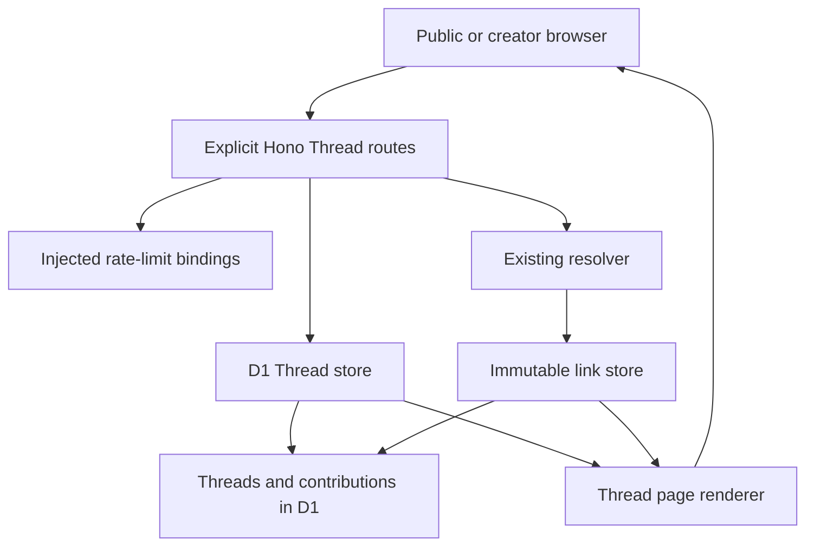
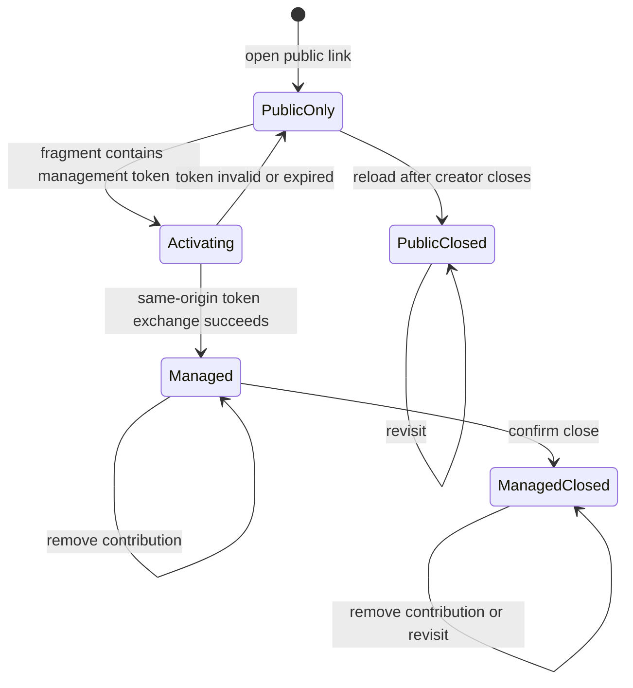

# Private Pass the Aux Threads - Plan

## Goal Capsule

- **Objective:** Let friends create one unlisted cross-provider song list, add freely through a shared link, and keep every contribution useful individually or as part of a provider playlist snapshot.
- **Product authority:** No listen.cx account is required. Receiver-side provider choice remains the default for individual songs. Export authorization is isolated to the participant who requests it.
- **MVP boundary:** Chronological Threads, repeat contribution, creator remove/close controls, per-song handoff, and copy-anytime snapshots.
- **Execution profile:** This plan ships the Thread Core staging slice: creation, sharing, repeat contribution, per-song actions, creator moderation, abuse bounds, and staging proof. Snapshot export remains in its separately gated plan.
- **Authority:** The Product Contract and settled decisions outrank implementation convenience. Repository instructions and current provider-handoff behavior remain binding unless they conflict with that contract.
- **Stop conditions:** Stop before shipping if management authority can enter request URLs or logs, if concurrent acceptance cannot preserve cap/order/idempotency, or if the migration cannot be applied safely before the Worker deploys.
- **Tail ownership:** The autonomous pipeline owns review, tests, commit, branch push, PR creation, CI, staging migration, staging deployment, and live browser proof. Production is excluded.

---

## Product Contract

### Summary

The first Pass the Aux feature is an unlisted chronological Thread. Link holders may add multiple songs, open any song through their preferred provider, and copy the current Thread into a native playlist without turning contribution into an authenticated collaboration product.

### Problem Frame

Song sharing already happens in group chats, but the resulting list is scattered and often tied to the sender's service. Provider-native collaborative playlists remove the scattering only when the whole group uses the same provider. The listen.cx opportunity is to preserve the low-friction link-sharing behavior while producing one portable list.

### Key Decisions

- **The shared link is the collaboration surface.** No participant directory, invitation acceptance, or contributor identity is needed for the first version.
- **Chronology is the only ordering rule.** (session-settled: user-directed — chosen over five fixed musical roles: the MVP should prove that people want to build and copy a Thread before testing editorial rituals.) Songs appear in accepted order.
- **Participants may contribute repeatedly.** (session-settled: user-directed — chosen over one song per browser or creator configuration: open contribution is easier to understand and browser identity is not person identity.) Bounds apply to the Thread and request rate, not a supposed person.
- **The creator receives a private management capability.** (session-settled: user-directed — chosen over removal-only or no creator controls: remove and close are the minimum controls for mistakes and abuse.) Losing it has no account-based recovery in the MVP.
- **Open and closed Threads are exportable.** (session-settled: user-directed — chosen over finish-before-export: copying the current state should not require a completion event.) Closing only stops new contributions.

### Actors

- A1. **Creator:** Creates and shares the Thread, keeps its management capability, and may also participate normally.
- A2. **Participant:** Holds the shared link and may view, add, listen, share, and export without a listen.cx account.

### Requirements

**Creation and access**

- R1. A1 can create an unlisted Thread with a bounded plain-text title and receive a cryptographically unguessable public share capability plus a separate cryptographically unguessable private management capability. Creation has independent rate and resource limits.
- R2. Anyone holding the share capability can view the current chronological song list without authentication, while Thread pages remain non-indexable and absent from public discovery surfaces.
- R3. Unfurl previews reveal the Thread title and bounded public presentation data but never management capabilities or private instrumentation values.

**Contribution**

- R4. While contribution is open, A2 can add a valid Spotify or Apple Music track through one prominent Add a song action.
- R5. A2 may add multiple songs from the same browser, and each accepted contribution appears once in acceptance order with Open in my provider and Copy song link actions.
- R6. Each contribution resolves once into the existing immutable provider-neutral song representation before joining the Thread.
- R7. Contribution enforces a bounded Thread size, bounded inputs, request idempotency, and rate limits without requiring participant identity.
- R8. A failed or invalid submission remains visibly unaccepted, preserves the entered link, and offers retry; an idempotent duplicate request reports the existing accepted song instead of appending again.

**Listening and export**

- R9. Every accepted song remains independently openable through the existing receiver-side provider preference and choice escape hatch.
- R10. Any A2 can request an export of the Thread's current ordered state whether contribution is open or closed when at least one song is eligible for the destination.
- R11. Export authorization and failures remain isolated from creation, contribution, sharing, Thread viewing, and individual song handoff.

**Creator control**

- R12. A1 can remove any contribution through the private management capability. Every management mutation requires an explicit same-origin user action and a non-GET request; navigation, unfurling, prefetching, and cross-origin requests never mutate a Thread.
- R13. A1 can irreversibly close contribution after confirming that Add a song will be disabled while the Thread, individual song actions, and snapshot export remain available. The management surface visibly marks its URL as private, and every Copy or Share Thread action emits only the public capability.
- R14. Invite holders cannot remove songs, close contribution, or derive the management capability.
- R15. Reaching the Thread song cap disables Add a song until A1 removes a contribution and frees capacity while the Thread remains open; a closed Thread never re-enables Add. The MVP has no automatic contribution or view expiry.

**Accessibility**

- R16. Creation, contribution, management, listening, and export remain keyboard- and touch-operable at narrow mobile widths, with chronological position and open/closed state conveyed in text and screen-reader semantics.

### Key Flows

- F1. **Create and share**
  - **Trigger:** A1 wants friends to assemble a playlist across providers.
  - **Actors:** A1.
  - **Steps:** A1 names the Thread, creates it, saves the management capability, and shares the public link.
  - **Outcome:** The group receives one unlisted collaboration surface and the creator retains narrow moderation control.
  - **Covered by:** R1-R3, R14.
- F2. **Add songs**
  - **Trigger:** A2 opens an actively collecting Thread.
  - **Actors:** A2.
  - **Steps:** A2 selects Add a song, submits a supported track link, waits for resolution, sees the accepted song at the end of the list, and may add again or pass the link onward.
  - **Outcome:** The Thread grows without roles, participant accounts, or a one-song limit.
  - **Covered by:** R4-R8.
- F3. **Use the Thread**
  - **Trigger:** A2 wants one song or the whole sequence.
  - **Actors:** A2.
  - **Steps:** A2 either opens one contribution through the existing provider handoff or requests a provider playlist snapshot of the current order.
  - **Outcome:** Individual and sequence-level value coexist without making export mandatory.
  - **Covered by:** R9-R11.
- F4. **Moderate and close**
  - **Trigger:** A1 needs to remove a mistake, stop abuse, or end contribution.
  - **Actors:** A1.
  - **Steps:** A1 uses the private management capability to remove a song or close further additions.
  - **Outcome:** The remaining Thread stays shareable, playable, and exportable.
  - **Covered by:** R12-R15.

### Acceptance Examples

- AE1. **Repeat contribution is ordinary**
  - **Covers:** R4-R6.
  - **Given:** A2 has already added one song to an open Thread.
  - **When:** A2 adds another valid song from the same browser.
  - **Then:** The second song is accepted at the end of the list without identity checks or replacement of the first.
- AE2. **Concurrent additions preserve both songs**
  - **Covers:** R5, R8.
  - **Given:** Two participants view the same open Thread.
  - **When:** They submit different valid songs at nearly the same time.
  - **Then:** Both accepted contributions appear exactly once in a stable order and neither overwrites the other.
- AE3. **A failed contribution stays recoverable**
  - **Covers:** R8.
  - **Given:** A participant submits a link that fails validation or provider resolution.
  - **When:** The submission returns to the Thread.
  - **Then:** No song was appended, the entered link remains available, and the participant sees a retry path rather than an ambiguous success.
- AE4. **Closing changes only contribution**
  - **Covers:** R10, R13-R15.
  - **Given:** A1 closes a Thread containing several songs.
  - **When:** A2 opens the public link.
  - **Then:** A2 cannot add a song but can still open each contribution and export the current sequence.
- AE5. **Management remains private**
  - **Covers:** R3, R12, R14.
  - **Given:** A2 has only the public Thread link.
  - **When:** A2 loads, shares, or unfurls it.
  - **Then:** No remove or close authority, management capability, or recovery path is disclosed.
- AE6. **Sharing from management never leaks authority**
  - **Covers:** R1-R3, R13-R14.
  - **Given:** A1 is viewing the private management surface.
  - **When:** A1 uses Copy or Share Thread.
  - **Then:** The emitted URL is the public Thread capability, never the current management URL, and passive navigation or preview requests cannot mutate the Thread.
- AE7. **A song copy remains a normal listen.cx link**
  - **Covers:** R5, R9.
  - **Given:** A Thread contains an accepted contribution.
  - **When:** A2 copies that song's canonical link and opens it outside the Thread.
  - **Then:** The existing receiver-side preference and `?choose=1` escape hatch behave exactly as they do for a standalone listen.cx link.
- AE8. **Removing at the cap restores contribution only while open**
  - **Covers:** R12-R15.
  - **Given:** An open Thread is at its song cap and Add a song is disabled.
  - **When:** A1 removes one contribution.
  - **Then:** Add a song becomes available again; performing the same removal after irreversible closure leaves Add disabled.

### Success Criteria

- Staging proves one Thread with contributions from at least two browsers, repeat contribution from one browser, and tracks originating from both providers.
- Among the first 10 seeded dogfood Threads, at least five receive a second-browser contribution without facilitator help, and at least 80% of observed participants complete create-to-share or open-to-add without instruction.
- Every accepted staging contribution opens in each receiver provider through an exact counterpart or the existing honest fallback.
- Concurrent and repeated contribution preserve stable chronological order without duplicate request effects.
- A creator can remove and close without exposing management authority to the public link.
- Account-free Thread actions add no provider authorization, provider SDK request, or provider identity persistence until export is chosen.

### Scope Boundaries

**In this MVP**

- One unlisted Thread type, chronological order, multiple contributions per browser, creator remove/close controls, individual handoff, and snapshot export.
- A total song cap, request validation, rate limits, non-indexable bearer access, and privacy-bounded staging instrumentation.

**Deferred for later**

- Contributor names, attribution, accounts, host recovery, invite rotation or revocation, reopening, deletion guarantees, notifications, and granular permissions.
- Public publishing, search, discovery, profiles, follows, comments, reactions, voting, and presence.
- Characterization, visual effects, prompts, embeddings, recommendations, and similarity.

**Outside this MVP**

- Fixed contribution roles, one-song-per-browser enforcement, points, leaderboards, or automatic completion.
- Continuous or in-app playback and continuous synchronization with provider playlists.

### Dependencies and Assumptions

- The current one-song resolver remains the source for accepted core song records. Export eligibility is stored separately with source-provider catalog identity and evidence provenance; optional credential-backed enrichment may add exact destination metadata without mutating or blocking the contribution record.
- The public share link is a bearer capability, not a claim of confidentiality or participant identity.
- Planning will set the initial song cap and rate limits from staging cost and abuse constraints. Threads do not expire automatically in the MVP.
- The management capability has no identity-based recovery and must not enter unfurls, logs, analytics, referrers, or third-party dependencies.
- Snapshot export follows `docs/plans/2026-07-13-004-feat-provider-playlist-export-plan.md` and never changes the Thread contract.

### Sources and Research

- Origin roadmap: `docs/plans/2026-07-13-001-feat-pass-the-aux-roadmap-plan.md`.
- Existing route and resolver behavior: `src/app.ts`, `src/resolve.ts`, `src/db.ts`, and `test/app.test.ts`.
- Cloudflare D1 batch/session behavior: <https://developers.cloudflare.com/d1/worker-api/d1-database/>.
- Cloudflare Workers rate-limit binding behavior: <https://developers.cloudflare.com/workers/runtime-apis/bindings/rate-limit/>.
- Hono CSRF, secure-header, and cookie behavior: <https://hono.dev/docs/middleware/builtin/csrf>, <https://hono.dev/docs/middleware/builtin/secure-headers>, and <https://hono.dev/docs/helpers/cookie>.

---

## Planning Contract

### Delivery Scope

This execution covers Thread Core only. It implements R1-R9 and R12-R16, including the ordered storage seam required by later exports. R10-R11 and every provider authorization or playlist-write behavior remain deferred to `docs/plans/2026-07-13-004-feat-provider-playlist-export-plan.md`; staging Thread dogfood must work without provider credentials.

Product Contract changed during the pre-plan pressure test: R1 and R12-R15 were clarified for bounded creation, explicit non-GET management mutations, public-only sharing, and closed-over-cap precedence; AE6-AE8 were added for management sharing, canonical song copying, and cap recovery. The remaining Product Contract is unchanged.

### Key Technical Decisions

- KTD1. **Thread routes are namespaced and preserve the existing song-link surface.** Public Thread pages use `/t/:threadSlug`, creation uses `/threads/new`, and public JSON mutations use `/api/threads/...`. Management activation, removal, and close use `/t/:threadSlug/manage/...` so the narrowly scoped management cookie is sent. All explicit routes register before the existing `GET /*` converter and song-slug route. The home page keeps the one-song flow and gains a secondary Start a Thread entry point.
- KTD2. **Public and management authority are separate high-entropy capabilities.** (session-settled: user-directed — chosen over accounts or a shared all-powerful link: the MVP needs account-free collaboration with narrow creator control.) The public capability is a random Thread slug. The management token is a separate random value whose digest alone is stored.
- KTD3. **Management activation uses a URL fragment and a path-scoped cookie.** The creator receives `/t/:threadSlug#manage=<token>`; fragments never enter Worker request URLs. Inline client code exchanges the token through a same-origin POST beneath `/t/:threadSlug/manage/`, receives a `Secure`, `HttpOnly`, `SameSite=Strict` cookie scoped to `/t/:threadSlug`, removes the fragment, and then reveals controls. Every management mutation shares that path prefix and also requires an allowed origin and a custom same-origin action header.
- KTD4. **Thread membership is separate from immutable song links.** Each active or removed contribution references the existing `links.slug`, so Open and Copy song link continue through the canonical receiver-side route. A contribution also records the exact source provider, source catalog ID, and storefront known from the submitted URL; later export enrichment remains separate and cannot promote heuristic matches.
- KTD5. **One D1 acceptance statement linearizes ordering, cap, close, and idempotency.** A narrow source-fingerprint preflight may return an already accepted request, conflict, unknown Thread, or exhausted history before provider resolution; every new acceptance still resolves first and atomically rechecks that the Thread is open, counts active contributions below 50, allocates the next monotonically increasing position, and inserts a unique client request key plus input fingerprint. Close, add, and removal are each single atomic D1 mutations; a zero-row acceptance is classified by reading the authoritative state and any existing idempotent result. Reusing a request key for different input is a conflict, not success.
- KTD6. **Removal is soft and close is irreversible.** Removed rows retain order and idempotency history but disappear from public reads and the active cap. Closing sets `closed_at` once. Repeated remove and close operations return the existing state without reopening, renumbering, or duplicating effects.
- KTD7. **Abuse controls combine hard resource bounds with an injected Cloudflare limiter.** Thread titles are trimmed plain text of 1-80 characters, JSON bodies remain byte-bounded, Threads cap at 50 active songs and 500 lifetime contribution records, and staging atomically refuses creation after 10,000 total Threads. Staging uses separate rate-limit bindings for creation and contribution; route logic checks them before D1 creation or provider resolution. Creation uses a hashed network key only as a coarse heuristic, while contribution uses a hash of the Thread capability plus action. D1 limits remain authoritative because deployed counters are location-local and permissive.
- KTD8. **Thread UI follows the existing server-rendered, inline-interaction model.** Thread pages are generated in a dedicated module, use system fonts and escaped content, remain useful without export authorization, and expose textual loading/error/open/full/closed states. All Thread responses are `private, no-store`, non-indexable, and `Referrer-Policy: no-referrer`; bots receive bounded public HTML only.

### Assumptions

- The initial staging limits are 10,000 total Threads, 50 active songs per Thread, 10 creation attempts per minute per hashed network key, and 30 contribution attempts per minute per hashed Thread-action key. The Cloudflare limiter is permissive and location-local, so D1 invariants remain the authoritative protection.
- Management cookies last one year to match the account-free recovery posture. The original fragment-bearing management link can reactivate another browser; there is no identity-based recovery.
- Creation success activates the current browser and separately offers Save private management link with a warning that the saved URL grants moderation authority. Copy/Share Thread always remains the public link.
- The raw management token is allowed only in the one-time successful creation response, the browser fragment, the activation request body, and the path-scoped HttpOnly cookie. Later HTML, JSON, logs, errors, and share actions never return it.
- A contribution that finishes provider resolution after the Thread closes or fills is not accepted. The submitted URL remains in the page and the user sees the authoritative closed/full state.
- Thread Core exposes no export route, provider SDK, OAuth callback, export history, or nonfunctional export control. The later export plan consumes the stable ordered active contribution read.
- The current Worker-runtime test harness is the automated proof surface. Live staging browser checks cover clipboard behavior, fragment scrubbing, confirmation UX, narrow mobile layout, keyboard focus, and native provider handoff because no browser E2E harness exists in the repo.

### High-Level Technical Design





```mermaid
sequenceDiagram
  participant B as Browser
  participant A as Thread route
  participant R as Resolver and LinkStore
  participant T as ThreadStore
  B->>A: submit URL plus request key
  A->>A: validate and rate-limit
  A->>R: resolve once and persist canonical song
  R-->>A: link row and exact source identity
  A->>T: atomic accept after resolution
  T->>T: recheck open, cap, idempotency, next position
  T-->>A: accepted, prior result, full, or closed
  A-->>B: authoritative state; preserve URL on failure
```

### System-Wide Impact

- **Routing:** Explicit Thread routes must precede the wildcard so prepend-domain conversion and existing one-song slugs remain unchanged.
- **Data:** Staging and production receive an additive migration, but only staging is applied in this run. The Worker must never deploy before its target database migration, and no read-replication path is introduced.
- **Security:** The management secret is allowed only in the one-time successful creation response, browser fragment, one activation request body, and a path-scoped HttpOnly cookie. It is excluded from request URLs, HTML after activation, later JSON, logs, analytics, error text, and share actions.
- **Operations:** Rate-limit decisions and product events may log event names and counts only. Raw submitted links, IPs, public capabilities, management tokens, cookie values, and cross-Thread identity are excluded.
- **Product:** Thread Core is staging-dogfoodable without export credentials but is not called the complete public Threads MVP until an export provider clears the separate production gate.

### Risks and Mitigations

- **D1 concurrency semantics:** Multi-statement read-then-write logic can race. Use one conditional acceptance statement, unique constraints for idempotency/order, primary sessions for read-after-write, and concurrent Worker-runtime tests.
- **Capability leakage:** Invocation logs make path/query management tokens unacceptable. Use fragment activation, no-referrer responses, no third-party fonts, same-origin mutations, and tests that public HTML/share actions never contain authority.
- **Provider latency:** Resolution happens before final acceptance, so close or cap may win while a request is in flight. Preserve input and return the authoritative conflict; do not reserve slots or append stale work.
- **Coarse rate limiting:** Location-local eventual counters can permit bursts or affect shared networks. Keep limits generous for dogfood, hash keys, treat 429 as recoverable, and rely on D1 cap/validation as hard bounds.
- **Persistent anonymous growth:** Soft rate limiting cannot cap total storage. Staging creation atomically stops at 10,000 Threads; an operator may raise the configured ceiling only after reviewing D1 size and abuse signals, or explicitly remove disposable seed data.
- **Mutable unfurls:** Cached chat previews may be stale. Keep previews bounded and factual, while live pages remain uncached and authoritative.

---

## Implementation Units

### U1. Thread domain and additive schema

- **Goal:** Establish the persistent Thread model, capability helpers, input validation, and database invariants without altering the existing `links` contract.
- **Requirements:** R1-R3, R6-R8, R14-R16; KTD2, KTD4-KTD7.
- **Dependencies:** None.
- **Files:** `migrations/0002_threads.sql`, `src/thread.ts`, `src/thread.test.ts`, `test/thread-db.test.ts`.
- **Approach:** Add `threads` and `thread_contributions` with foreign keys to `links.slug`, unique public capability and request-key constraints, stable monotonic positions, soft-removal and close timestamps, management-token digest storage, and exact submitted-source identity. Put constants and pure title/token/request-key validation in `src/thread.ts`.
- **Execution note:** Implement the domain behavior test-first and prove the migration against the real Worker D1 harness before building routes.
- **Patterns to follow:** Add a new numbered migration rather than editing `migrations/0001_initial.sql`; follow strict TypeScript and snake_case D1 row conventions from `src/db.ts`.
- **Test scenarios:**
  - Trimmed Unicode titles and punctuation from 1-80 characters are accepted; empty, whitespace-only, overlong, and prohibited control-character input is rejected, and all accepted titles are escaped during HTML rendering.
  - Public and management capabilities are distinct, use at least 128 bits of randomness, and only the management digest is prepared for persistence.
  - The migration creates foreign keys, uniqueness constraints, active-state indexes, and permits repeated references to the same `links.slug` with distinct request keys.
  - Removed contributions retain their stored position and source identity while active reads exclude them.
- **Verification:** The migration applies from a clean local database and domain/helper tests prove every bound and invariant.

### U2. Atomic D1 Thread store

- **Goal:** Provide injected storage operations for create, public/managed reads, atomic acceptance, idempotent removal, and irreversible close.
- **Requirements:** R1-R2, R5-R8, R12-R15; F1-F2, F4; AE1-AE5, AE8; KTD4-KTD6.
- **Dependencies:** U1.
- **Files:** `src/thread-db.ts`, `test/thread-db.test.ts`.
- **Approach:** Mirror the `LinkStore`/`D1LinkStore` dependency pattern. Resolve first, then execute one conditional insert that checks open state, active count, request-key uniqueness, and next position in one atomic statement. Use primary sessions for read-after-write classification. Soft removal and close are idempotent single statements authorized by a verified management digest.
- **Execution note:** Start from failing Worker-runtime concurrency tests; the store contract is the primary correctness boundary.
- **Patterns to follow:** Prepared statements and explicit row mapping from `src/db.ts`; real D1 integration setup from `test/app.test.ts` and `test/apply-migrations.ts`.
- **Test scenarios:**
  - Creating a Thread returns separate public and management capabilities while only the digest is stored.
  - Covers AE1. The same Thread accepts multiple source-provider songs and repeated song references in monotonically increasing order.
  - Covers AE2. Two simultaneous different request keys both commit exactly once in a stable order.
  - Simultaneous adds at 49 active songs accept only one fiftieth item; the other returns full without a row.
  - Simultaneous Thread creation at the configured staging-wide ceiling cannot exceed the ceiling; unavailable creation returns no capability and an operator can raise the non-secret limit deliberately.
  - Add versus close linearizes: either the contribution commits before closure or closure wins and no contribution is appended.
  - Reusing an accepted request key with the same input fingerprint returns the original contribution after an ambiguous client retry, even when the Thread later becomes full; reusing it for different input is rejected as a conflict.
  - Covers AE8. Removing at cap frees capacity only for an open Thread; remaining positions are not renumbered.
  - Repeating remove or close returns the existing result; closing never reopens and active public reads exclude removed rows.
- **Verification:** Real D1 tests prove all state transitions, concurrent boundaries, and idempotent outcomes without mocks.

### U3. Capability security and abuse-control adapters

- **Goal:** Make anonymous mutation safe enough for staging without introducing identity, raw-token logging, or isolate-local counters.
- **Requirements:** R1-R3, R7-R8, R12-R14; AE3, AE5-AE6; KTD2-KTD3, KTD7.
- **Dependencies:** U1.
- **Files:** `src/thread-security.ts`, `src/thread-security.test.ts`, `src/worker.ts`, `wrangler.jsonc`, `worker-configuration.d.ts`, `test/worker.test.ts`.
- **Approach:** Add injected creation/contribution limiter adapters backed by separate Cloudflare rate-limit bindings and a non-secret maximum-Thread configuration value. Hash endpoint-scoped keys before limiter use. Implement management token digest comparison, exact-origin validation, the required custom action header, and cookie options in pure helpers. Keep local/test adapters deterministic.
- **Patterns to follow:** Dependency wiring in `src/worker.ts`, secure cookie handling in `src/app.ts`, generated bindings in `worker-configuration.d.ts`, and environment-specific staging configuration in `wrangler.jsonc`.
- **Test scenarios:**
  - A denied creation or contribution returns a retry interval before D1 creation or provider resolution is called.
  - Raw IPs, public capabilities, management tokens, and cookies are absent from application log payloads and limiter keys.
  - Valid same-origin activation and mutation metadata pass; missing, foreign, opaque, or mismatched origins and missing custom headers fail without mutation.
  - Management digest comparison accepts only the matching token and does not persist or return the token.
  - Production and staging use distinct rate-limit namespace IDs and both bindings typecheck, while test adapters can deterministically exercise allow/deny paths.
- **Verification:** Unit tests prove security helpers, Worker entrypoint tests prove binding injection, and generated binding types match Wrangler configuration.

### U4. Thread HTTP contracts and coexistence with song links

- **Goal:** Add Thread creation, viewing, contribution, management activation, removal, and closure routes while preserving every existing one-song route.
- **Requirements:** R1-R9, R12-R15; F1-F2, F3 per-song branch only, F4 moderation/listening branch only; AE1-AE8; KTD1-KTD7.
- **Dependencies:** U2, U3, U5.
- **Files:** `src/app.ts`, `test/thread-app.test.ts`, `test/app.test.ts`.
- **Approach:** Register `/threads/new`, `/t/:threadSlug`, a public structured read plus creation/contribution mutations under `/api/threads/...`, and management activation/removal/close under `/t/:threadSlug/manage/...` before the wildcard route. Reuse the existing resolver and `LinkStore` for canonical songs, parse exact source identity from the submitted URL, and invoke atomic acceptance only after resolution. Classify malformed, oversized, invalid-track, provider-failure, rate-limited, full, closed, unauthorized, and not-found outcomes without losing entered input on the client.
- **Execution note:** Update route expectations before implementation, then retain the complete existing app suite as regression proof.
- **Patterns to follow:** Bounded streamed JSON parsing, provider-error classification, bot detection, cache headers, and dependency injection already in `src/app.ts`.
- **Test scenarios:**
  - Existing `/`, `/create`, prepend-domain conversion, song slug, preference cookie, `?choose=1`, bot, and native-handoff tests remain unchanged and green.
  - Thread creation trims a valid title, returns public and fragment-bearing management URLs only in the successful creation response, and rate-limited/invalid/oversized/global-ceiling attempts create nothing.
  - Covers AE1 and AE3. Repeated valid contributions append; invalid or provider-failed links append nothing and return recoverable classified errors.
  - A public JSON read exposes the same bounded title, state, order, song metadata, and canonical song URLs as the HTML Thread without management authority or private instrumentation.
  - A denied add never calls the resolver; a close or full state that wins during an in-flight resolution appends nothing and returns authoritative state.
  - Covers AE4. Public closed Threads remain viewable with per-song actions and reject new adds.
  - Covers AE5-AE6. Public requests, bots, invalid activation, GET navigation, prefetch-like requests, and cross-origin mutations expose no controls and cause no mutation; valid fragment exchange sets the narrowly scoped cookie, a reload retains controls, and a management mutation receives that cookie.
  - Covers AE7. Every Open and Copy action uses the existing canonical song short link and preserves receiver preference and `?choose=1` behavior.
  - Unknown Thread slugs use the existing plain 404 convention; all known Thread responses are uncached and non-indexable.
- **Verification:** Worker-runtime route tests cover every response contract and the pre-existing app suite proves no song-link regression.

### U5. Responsive Thread pages and creator controls

- **Goal:** Deliver the create/share/add/listen/manage experience as an accessible narrow-screen interface with explicit recoverable states.
- **Requirements:** R2-R5, R8-R9, R12-R16; F1-F2, F3 per-song branch only, F4 moderation/listening branch only; AE1, AE3-AE8; KTD3, KTD8.
- **Dependencies:** U2, U3.
- **Files:** `src/thread-page.ts`, `src/thread-page.test.ts`, `src/page.ts`.
- **Approach:** Keep Thread HTML separate from the existing song page module. Render public and managed variants from the same Thread URL, with Add a song, Open in my provider, Copy song link, public-only Copy/Share Thread, remove, and confirmed irreversible close. Creation success has a distinct Save private management link action with a moderation-authority warning, activates the current browser, and never substitutes that private URL into general share controls. Inline script activates fragment authority, scrubs it, preserves inputs across errors, updates textual state, and avoids loading third-party resources before referrer protection is active.
- **Patterns to follow:** Escaping, clipboard fallback, large touch targets, focus-visible styling, reduced motion, and `aria-live` feedback from `src/page.ts`.
- **Test scenarios:**
  - Title, artist, and supplied strings are escaped; management tokens never appear in rendered HTML, copy targets, OG tags, or error messages.
  - Public open, public full, public closed, managed open, managed full, and managed closed states render the correct controls and textual semantics at the same URL.
  - Covers AE6. Copy/Share Thread always targets the public `/t/:slug` URL even when the management cookie is present.
  - Creation success exposes both the public Copy/Share action and the distinct warned private-save action; current-browser activation survives reload, and opening the saved link in another browser activates that browser.
  - Covers AE7. Each song row exposes keyboard- and touch-operable Open and Copy actions using the canonical short URL.
  - Covers AE8. Cap and removal states update Add availability correctly; closure remains dominant and the confirmation explains irreversibility.
  - Fragment activation removes the fragment after success; invalid activation shows no controls and keeps the public Thread usable.
  - The existing home page links to `/threads/new`, the title form is reachable and preserves input on failure, and canceling close confirmation sends no request or state change.
  - Markup includes noindex/referrer policy, explicit labels, live status regions, reduced-motion support, and controls at least 48 CSS pixels high.
- **Verification:** Renderer tests prove state-specific semantics and live staging browser checks prove clipboard, focus, confirmation, mobile layout, and fragment activation behavior.

### U6. Staging migration, telemetry, and dogfood proof

- **Goal:** Put the verified Thread Core slice on `staging.listen.cx` without touching production and collect only privacy-bounded dogfood signals.
- **Requirements:** R1-R9, R12-R16; Success Criteria; KTD7-KTD8.
- **Dependencies:** U1-U5.
- **Files:** `src/app.ts`, `src/worker.ts`, `test/thread-app.test.ts`, `wrangler.jsonc`, `docs/plans/2026-07-13-001-feat-pass-the-aux-roadmap-plan.md`.
- **Approach:** Keep Thread routes dark outside the staging environment until a production migration and release gate is approved. Emit structured event names and aggregate outcome fields for Thread creation, first/second/repeat contribution, rate-limit/full/closed outcomes, and per-song actions, never raw inputs or capabilities. Verify the remote database is exactly `listen-cx-staging`, its database ID differs from production, and neither a local simulator nor the production database is targeted. Record a Time Travel bookmark, apply the additive migration to staging before deploying the staging Worker, and verify the prior Worker remains schema-compatible. Seed and exercise mixed-provider Threads from separate browsers.
- **Execution note:** This unit is migration-first and runtime-proof-first; production migration and deployment are explicitly out of scope.
- **Patterns to follow:** Existing staging environment and D1 separation in `wrangler.jsonc`, health endpoint behavior in `src/app.ts`, and Worker deployment scripts in `package.json`.
- **Test scenarios:**
  - Event payloads contain only allowlisted event/outcome/count fields and no raw URL, IP, Thread capability, management token, cookie, or cross-Thread identifier.
  - Health remains successful after the migration and Thread routes fail closed rather than corrupting data when their tables are unavailable.
  - A seeded staging Thread accepts repeat contributions from one browser and another contribution from a second browser, including source links from both providers.
  - Public and managed pages work at narrow mobile width; keyboard navigation, clipboard fallback, fragment activation, removal, close confirmation, and stale-add recovery are exercised.
  - Each accepted contribution opens through both receiver preferences using the existing exact-or-honest-fallback behavior.
  - Bounded invalid creation and contribution bursts from one staging browser reach a recoverable deployed 429; denied requests create no Thread, accept no contribution, and do not invoke provider resolution.
- **Verification:** Review and automated tests pass; staging migration and deployment succeed; `/healthz` is healthy; live browser checks complete the functional Thread Core smoke with no production mutation. The 10-Thread activation and 80% unaided-completion criteria remain a post-deploy dogfood gate and are not simulated or claimed by the pipeline.

---

## Verification Contract

| Gate | Applies to | Proof required |
|---|---|---|
| `pnpm typecheck` | U1-U6 | Strict TypeScript compiles with generated bindings and no errors. |
| `pnpm types:check` | U3, U6 | Checked-in Worker binding declarations match `wrangler.jsonc`. |
| `pnpm test` | U1-U6 | Existing song-link tests plus new pure, D1 concurrency, route, renderer, and entrypoint tests all pass. |
| `pnpm check:startup` | U3, U6 | The Worker stays within startup constraints after the new modules are wired. |
| Code review | U1-U6 | No unresolved correctness, capability-security, migration, or test-coverage finding remains before push. |
| Staging migration and deploy | U6 | The remote staging database identity is verified, a Time Travel bookmark is recorded, migration applies to `listen-cx-staging` before the Worker deploy, previous-Worker compatibility is preserved, and production remains untouched. Migration failure stops before deploy and verifies the migration was not recorded; deploy or smoke failure rolls the Worker back while leaving the additive schema; only demonstrated schema/data corruption permits Time Travel restore, followed by health and Thread-contract verification. |
| Live staging browser proof | U5-U6 | Two-browser contribution, repeat add, mixed-provider input, copy/open, fragment activation/scrub, remove, close, stale error recovery, mobile width, and keyboard focus are observed on `staging.listen.cx`. |
| Native handoff follow-up | U6 | Each row reaches the existing provider handoff; any remaining iOS/macOS app-opening gap is recorded separately rather than misreported as a Thread failure. |

---

## Definition of Done

- U1-U5 satisfy their listed tests and verification outcomes, and U6 completes against the live staging environment.
- A creator can start a Thread, retain management authority without placing it in a request URL, and copy/share only the public link.
- Two browsers can contribute, one can contribute repeatedly, concurrent adds remain ordered and idempotent, and the fiftieth-song boundary cannot be exceeded.
- Every active contribution exposes canonical Open and Copy song actions; invalid, rate-limited, provider-failed, full, and closed submissions preserve the entered URL and leave the current list usable.
- Creator removal is idempotent and frees capacity only while open. Close permanently dominates Add availability; removal remains allowed after closure but never reopens contribution.
- Public, bot, and cross-origin traffic cannot derive authority or mutate management state; management tokens do not appear in paths, queries, logs, analytics, referrers, or public HTML.
- Existing one-song creation, conversion, receiver preference, `?choose=1`, unfurl, and handoff behavior remain regression-tested.
- Staging D1 is migrated before deployment, `https://staging.listen.cx/healthz` is healthy, live browser proof is captured, and production remains unchanged.
- The functional deployment smoke is complete; the first-10-Threads and unaided-participant success metrics remain explicitly pending post-deploy dogfood evidence.
- The final diff contains no abandoned experiments, duplicate route paths, dead export scaffolding, generated secrets, or unnecessary comments.
