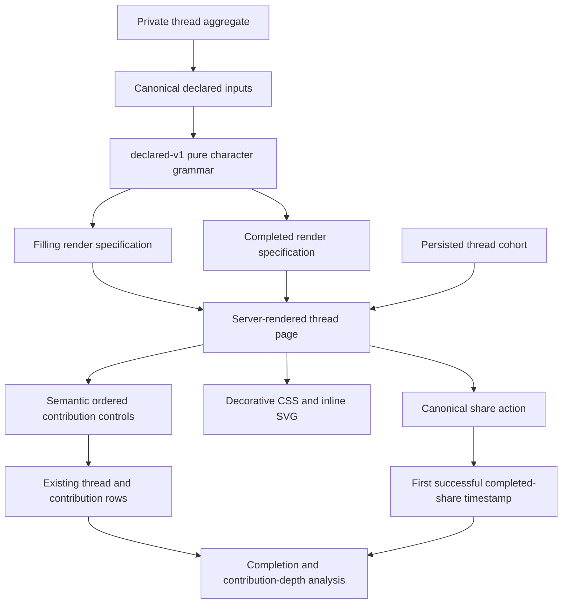
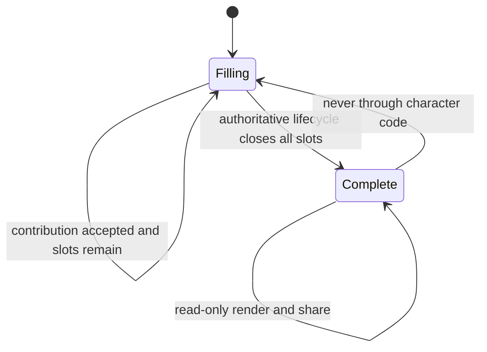

# Declared Thread Character - Plan

## Goal Capsule

- **Objective:** Give an in-progress Pass the Aux thread useful contribution feedback and give a completed thread a distinctive, shareable “thread print” made only from group-declared inputs.
- **Product authority:** R7, R8, AE2, and every scope boundary in `docs/plans/2026-07-13-001-feat-pass-the-aux-roadmap-plan.md` remain authoritative. Product Contract unchanged.
- **Dependency:** The private-thread work supplies a stable thread identifier, title, optional prompt, ordered slot labels, artwork URLs, optional contributor mood cues, lifecycle state, and ordered contributions.
- **Execution profile:** Add a versioned pure character grammar, server-rendered thread states, and one bounded thread-level experiment. Do not add accounts, provider calls, audio analysis, or a general analytics platform.
- **Stop conditions:** Stop if the implementation needs inferred genre or mood, audio/provider metadata beyond the private-thread contract, a per-person identity, or a raster-image service to prove the first experiment.
- **Tail ownership:** Stage the experiment and verify its measurement quality before any production enrollment. Production enrollment is a separate explicit rollout decision.

---

## Product Contract

### Summary

A half-filled thread needs to answer two practical questions: what has the group made so far, and what kind of contribution is still missing. A completed thread needs to feel like something the group made together, not the same track list with confetti on it.

The first character system should therefore have two different jobs. During filling, it is honest progress and sequencing feedback. At completion, the same ingredients resolve into a stable “thread print” that can anchor the finished mix and its share action. Neither state scores the people, judges the songs, or claims to have detected the group’s taste.

### Problem Frame

Consider three concrete states:

- Two of five roles are filled. A generic percentage says the task is 40% done, but “2 of 5 tracks placed — Peak is open” tells the next person what the group needs.
- Five artworks and five role labels form a sequence. Showing them in order makes the handoff legible; averaging them into an abstract aura throws away the group’s actual work.
- A contributor chooses a cue such as “bright.” Presenting “Cue chosen: bright” is honest. Presenting “This is a bright mix” turns a declared input into an authoritative-sounding classification.

### Common theme: make the contribution visible, not valuable

The character should show that each contribution occupies a consequential place in a finite artifact. It should not translate participation into points, ranks, compatibility, quality, rarity, or taste authority. The visual payoff gets richer when the thread is complete because completion creates the shared object; it does not make any contributor a winner.

### Requirements

- R7. A thread has a visual identity derived from the group’s declared prompt, roles, sequencing, artwork, and optional mood signals.
- R8. The identity makes the sequence easier to understand and more desirable to share; it is not a cosmetic score or a claim of objective musical analysis.

### Acceptance Example

- AE2. **Thread visuals reflect group input**
  - **Covers:** R7-R8.
  - **Given:** A completed thread has a prompt, five distinct roles, and contributor-selected mood cues.
  - **When:** Its thread page is rendered.
  - **Then:** Its visual identity reflects those inputs without presenting an automated mood classification as fact.

### Scope Boundaries

**In this plan**

- A versioned, deterministic visual grammar from declared thread data.
- Different in-progress feedback and completed-thread identity.
- Fixed, contrast-tested palette and motif tokens; ordered artwork remains the primary group-created material.
- Static server-rendered HTML/CSS/SVG with optional one-time, non-essential motion.
- A thread-level control/treatment experiment with aggregate thread facts and no visitor identity.

**Deferred for later**

- Native-provider playlist export and connected-provider accounts.
- Public profiles, follow graphs, public discovery, joinability, moderation, and granular permissions.
- Embedding-based thread characterization, similarity, prompts, and recommendation.
- Synchronized playback, comments, reactions, voting, points, and leaderboards.
- A generated raster OG image. V1 uses the thread page as the artifact and existing artwork as the unfurl fallback; a raster pipeline is justified only if page-level character helps and crawler support becomes the limiting factor.

**Outside this product’s identity**

- In-app music playback.
- Making account creation a condition of listening or contributing.
- Treating an automated music characterization as authoritative taste judgment.
- Compatibility percentages, contributor grades, “best pick” badges, streaks, rewards, artificial head starts, or any other generic points mechanic.
- Inferred mood, genre, similarity, cohesion, energy, or quality labels.

### Success Criteria

- A contributor can identify the ordered filled and open roles without relying on color, animation, or artwork.
- The completed page visibly traces its character to prompt, roles, ordered artwork, and cues that the group supplied.
- The same inputs always produce the same `declared-v1` render specification; adding a contribution fills a slot without remapping already-visible tokens.
- Treatment increases successful completed-thread share actions per exposed thread while seven-day completion and contribution depth do not regress beyond their preregistered margins.
- V1 leaves a frozen declared-signal baseline that later embedding work can be compared against rather than merely replacing.

---

## Planning Contract

### Proposal

#### 1. Use a declared-signal grammar, not a taste model

**Background:** The server already produces deterministic HTML around resolved track rows. The private-thread dependency adds the ordered group inputs needed for a visual identity. Fetching images for color extraction would add remote-image failure, CORS, compute, and cache behavior without improving the first causal question.

**Purpose:** Turn declared inputs into a small render specification that can be tested without a browser and rendered without provider calls.

Name the V1 output a **thread print** in internal code and planning language. UI copy can stay literal (“Your finished mix”) if the product does not need to teach the term.

#### 2. Keep filling feedback and finished identity separate

**Background:** Research on goal proximity supports making honest remaining distance visible, but much of it comes from reward programs. Research on self-made objects also finds that the valuation effect depends on successful completion. The implementation should not turn those findings into rewards or overdecorate an unfinished artifact.

**Purpose:** During filling, clarify sequence and the next meaningful role. At completion, allow the assembled work to become the primary visual object and share prompt.

#### 3. Measure the package before decomposing it

**Background:** A 2×2 test could isolate progress framing from finished identity, but it doubles the experimental surface before there is evidence that either matters. The smallest honest first test is a thread-level control/treatment comparison of the whole declared-character package.

**Purpose:** Learn whether the package improves the product outcomes in R8 without visitor tracking. If completion and sharing move in opposite directions, factor the package in a follow-up experiment rather than guessing which mechanic caused it.

### Key Technical Decisions

- KTD1. **Pure, versioned render specification.** `declared-v1` accepts only the private-thread contract and returns semantic display data plus palette/motif tokens. HTML generation stays separate. Versioning freezes the baseline and prevents later style changes from silently rewriting the experiment.
- KTD2. **Stable seed from declared creation data.** Seed the base palette and motif from normalized title, optional prompt, and ordered role labels plus the grammar version. Use FNV-1a 32-bit over UTF-8 bytes with length-prefixed components; this is a decorative selector, not a security primitive. Do not use `Math.random`. Contributions reveal existing slots; they do not reseed the base identity.
- KTD3. **Artwork is composition, not palette input.** Place artwork in slot order with a stable crop and an explicit missing-art placeholder. Do not fetch or sample pixels. Artwork failure must not change the geometry, sequence labels, or palette.
- KTD4. **Mood cues remain attributed declarations.** Preserve the supplied cue label as display data and escape it only at the HTML boundary. A cue may select a local decorative token by stable hash, but the UI labels it “Cue chosen” or “Cues the group chose.” It never converts the cue into a whole-thread assertion.
- KTD5. **Fixed, audited design tokens.** Select from a small curated set of background, foreground, border, and accent combinations whose text contrast is at least 4.5:1 and meaningful non-text boundaries are at least 3:1. Keep labels on fixed-color caption surfaces rather than overlaying them on artwork. Filled/open state is also expressed by text, order, border treatment, and artwork presence.
- KTD6. **No ambient motion.** The default may use one short entrance or slot-settle transition after a user-triggered state change. The static state carries all meaning. `prefers-reduced-motion: reduce` removes transforms and animation rather than making them merely faster.
- KTD7. **Semantic sequence first.** Render the slots as an ordered list with visible ordinal and role label. Decorative SVG is `aria-hidden`; repeated artwork is decorative when adjacent song text already names the track. The character layer cannot reorder the DOM sequence.
- KTD8. **Persist experiment cohort, aggregate thread facts.** Assign `control` or `declared-v1` once per thread and persist it. Store only first human render and first successful completed-share timestamps; derive contribution depth and completion from existing thread/contribution rows. Store no account, IP, user agent, referrer, or viewer identifier.
- KTD9. **Control remains functional.** Control shows the same title, prompt, ordered roles, contribution controls, lifecycle state, and share capability in a plain list. Treatment changes framing and visual identity, not the ability to contribute, play, or share.

### Declared-Signal Character Grammar

The renderer consumes the following contract. It must ignore undeclared or unavailable signals rather than guessing them.

| Signal | Canonical treatment | Visible effect | Explicit non-effect |
|---|---|---|---|
| Stable thread ID | Record identity and experiment join key; never shown as character | Keeps assignment and metrics joined | Does not choose “taste” or score |
| Title | Trim and Unicode-normalize for seed; preserve display text for boundary escaping | Heading and base palette/motif seed | Does not infer occasion |
| Optional prompt | Empty or normalized text for seed; preserve display text for boundary escaping | Prompt line and base palette/motif seed | Does not generate a replacement prompt |
| Ordered role labels | Preserve order and display labels for boundary escaping | Equal-width sequence segments, ordinals, open-role CTA | Does not infer importance from label words |
| Ordered contributions | Join by slot ID, never by array accident | Artwork and song text fill the matching segment | Does not reorder for “flow” |
| Artwork URL | Validate against the private-thread URL contract; render or use placeholder | Ordered crop inside its filled slot | Does not sample colors or call the provider |
| Optional contributor cue | Preserve display label for boundary escaping; hash opaque value to a local token | Cue chip and local pattern/accent on that slot | Does not classify the track or whole thread |
| Lifecycle | `open`, `complete`, or private-thread equivalent | Selects feedback state versus finished identity | Does not auto-complete from render-time counts |

For seed material, apply Unicode NFKC normalization, trim both ends, collapse internal Unicode whitespace to one space, and apply locale-independent lowercase. Length-prefix every component before hashing so different field boundaries cannot form the same seed accidentally. Display strings keep their authored case after trimming and are escaped only in the HTML renderer.

V1 ships four palette tokens and four non-semantic motif tokens. The palette values are fixed rather than synthesized at render time:

| Palette token | Background | Foreground | Accent/focus | Minimum listed contrast |
|---|---|---|---|---|
| `espresso-orange` | `#2B1706` | `#FFF3E8` | `#FF9840` | 8.00:1 |
| `midnight-sky` | `#0D2B45` | `#F7F2EA` | `#75D5FD` | 8.76:1 |
| `forest-sun` | `#153D2E` | `#FFF6E6` | `#F4D35E` | 8.24:1 |
| `plum-rose` | `#45213F` | `#FFF3E8` | `#FF9FB2` | 7.04:1 |

The listed minimum is the lower of foreground/background and accent/background. The motif enumeration is `bands`, `arches`, `steps`, and `rings`. Motifs change only decorative SVG paths or background pattern; slot order, size, text, and state do not depend on motif.

The pure `CharacterSpec` should expose only these decisions:

- `version`: always `declared-v1` for this plan.
- `paletteToken` and `motifToken`: selected from audited enumerations.
- `slots`: ordered records containing ordinal, role label, fill state, display metadata, artwork/placeholder state, optional cue label, and local motif token.
- `progress`: integer filled count and total count; never points or a percentage score.
- `state`: `filling` or `complete`, taken from the authoritative lifecycle after consistency validation.
- `disclosure`: stable copy key identifying the inputs used, not a generated interpretation.

If lifecycle says complete while a slot is empty, render the safe filling presentation and expose a server-side consistency error for the existing logging path. Do not fabricate a completed tile.

### Visual and Language States

#### Filling: contribution feedback

- Lead with literal state: “3 of 5 tracks placed.”
- Show the ordered rail with each ordinal and role label. Filled positions show artwork and song text. Open positions retain the same geometry and say “Open.”
- Make the next action role-specific: “Add a track for Peak,” not “Earn the next spot” or “Help us reach 60%.”
- After a successful contribution, acknowledge placement: “Your track now holds Peak.” Do not say the pick is perfect, rare, adventurous, on-theme, or better than another pick.
- Keep invite sharing available because passing the thread is the core loop, but do not present the unfinished composition as the finished share artifact.

#### Complete: thread identity

- Replace progress solicitation with completion: “All 5 positions are filled.”
- Promote the full ordered artwork sequence into the thread print while retaining the readable ordered track list below it.
- Show title, optional prompt, and the role sequence. Put cue labels under “Cues the group chose.”
- Add one provenance line near the artifact or share action: “Made from this thread’s prompt, roles, artwork, and chosen cues.”
- Use “Share the finished mix” for the completed share action. The action shares the canonical thread URL; it does not generate or upload media in V1.
- Continue to expose every track’s existing provider-neutral handoff. Character is not a playback gate.

#### Forbidden language

Do not ship copy shaped like any of the following:

- “Your taste score is 82.”
- “The group’s vibe is euphoric indie.”
- “Most adventurous pick.”
- “This mix is perfectly cohesive.”
- “You carried the group.”
- “Only one more to unlock your result.”

### High-Level Technical Design

### State Transition Contract

The character renderer is a projection. It does not own lifecycle transitions, accept contributions, or reopen a thread.

### Requirement Traceability

| Origin | Planning decisions | Implementation units | Proof |
|---|---|---|---|
| R7 | KTD1-KTD7, declared-signal grammar | U1, U2 | Determinism and semantic render tests |
| R8 | KTD7-KTD9, visual/language states, experiment | U2, U3, U4 | Route tests plus preregistered completion/share/guardrail analysis |
| AE2 | Cue attribution, ordered prompt/roles/artwork composition, disclosure | U1, U2 | Completed fixture renders every supplied signal and no inferred classification |
| Scope boundaries | Forbidden language and explicit exclusions | U1-U4 | Negative assertions, schema review, staging preservation audit |

### Sequencing

U1 follows the private-thread model contract and can land without routing. U2 consumes U1 and joins the existing server-rendered page path. U3 adds the experiment seam after both control and treatment render paths exist. U4 runs only after all automated checks pass and staging has realistic private-thread data.

---

## Implementation Units

### U1. Define the `declared-v1` character grammar

- **Goal:** Produce a pure, deterministic render specification from the private-thread aggregate.
- **Requirements:** R7, R8, AE2.
- **Dependencies:** Private-thread types and lifecycle contract.
- **Files:** `src/thread-character.ts`, `src/thread-character.test.ts`.
- **Approach:** Define narrow input and output types, versioned normalization, a documented stable hash, audited palette/motif enumerations, ordered slot joining, missing-art behavior, cue attribution, and lifecycle consistency fallback. Keep HTML, D1, fetch, and experiment assignment out of this module.
- **Patterns to follow:** Pure injectable helpers and co-located behavior tests in `src/resolve.ts`, `src/resolve.test.ts`, `src/itunes.ts`, and `src/itunes.test.ts`.
- **Execution note:** Implement the contract test-first; this module becomes the frozen declared-signal baseline.
- **Test scenarios:**
  1. The same title, prompt, ordered roles, contribution rows, cues, and lifecycle produce the same complete `CharacterSpec` across repeated calls.
  2. Insignificant normalization differences select the same palette and motif while the spec preserves display text for escaping by the renderer.
  3. Adding a contribution fills only its matching slot and leaves the base palette, base motif, and previously filled slot tokens unchanged.
  4. Reordering contributions in storage does not reorder the sequence; slot IDs and declared role order remain authoritative.
  5. Missing artwork produces a stable placeholder state without removing the role, ordinal, song title, or cue.
  6. An opaque mood cue changes only that slot’s local decorative token and disclosure label; no whole-thread mood field exists.
  7. Empty cues are omitted without changing unrelated slot tokens.
  8. A complete lifecycle with an empty slot returns the safe filling state plus a consistency diagnostic instead of inventing content.
  9. Covers AE2. A five-role completed fixture with prompt, artwork, and cues exposes each declared input in the spec and exposes no inferred classification or numeric score.
- **Verification:** The pure suite proves stable output, ordered joining, local cue influence, safe missing data, and absence of score/inference fields.

### U2. Render distinct filling and completed thread pages

- **Goal:** Make sequence feedback useful while filling and make the completed thread print the share anchor.
- **Requirements:** R7, R8, AE2.
- **Dependencies:** U1 and the private-thread route/page seam.
- **Files:** `src/thread-page.ts`, `src/thread-page.test.ts`, `src/app.ts`, `test/app.test.ts`.
- **Approach:** Render the treatment from `CharacterSpec` and retain a plain functional control renderer. Use an ordered list for sequence semantics, a separate decorative layer for the thread print, fixed CSS tokens, literal progress copy, attributed cue labels, and existing provider handoff links. Add only one-time optional motion and remove it under reduced motion. Continue using existing HTML escaping and bot handling patterns. Use the first available artwork for existing OG fallback rather than inventing a V1 raster pipeline.
- **Patterns to follow:** `esc`, page-local styles, OG metadata, `aria-hidden` decorative SVG, and reduced-motion CSS in `src/page.ts`; route-contract assertions in `test/app.test.ts`.
- **Execution note:** Start with failing renderer and route tests for the two lifecycle states before adding the visual layer.
- **Test scenarios:**
  1. A two-of-five open thread says “2 of 5 tracks placed,” renders five ordered roles, marks exactly three as open in text, and offers a role-specific contribution action.
  2. A successful contribution acknowledgment names the occupied role and uses no evaluative adjective or score.
  3. A completed five-slot thread removes contribution solicitation, says all positions are filled, exposes the completed share action, and retains the ordered playable track list.
  4. Covers AE2. Completed HTML includes the escaped prompt, all five role labels in order, every available artwork URL, each declared cue under group-attribution copy, and the provenance disclosure.
  5. Empty prompt, missing artwork, and absent cues retain a legible thread print and ordered sequence without empty headings or broken image-dependent layout.
  6. User-controlled title, prompt, role, song, artist, and cue strings are escaped and cannot inject markup or CSS.
  7. Filled/open state remains understandable when palette tokens are removed because ordinal, role text, artwork/placeholder, and state text remain.
  8. Every foreground/background token pair meets 4.5:1 text contrast; meaningful boundaries and focus indicators meet 3:1 against adjacent colors.
  9. `prefers-reduced-motion: reduce` removes all non-essential character animation and transforms; the static content is identical.
  10. Decorative SVG and repeated artwork do not add noisy accessible names; the ordered list and song text carry the information.
  11. Control and treatment expose the same contribution, provider-handoff, and share capabilities.
  12. Bot requests receive complete OG metadata and never cause experiment exposure or share mutations.
  13. A negative copy assertion rejects score, rank, compatibility, detected mood/genre, reward, and “unlock” language from both lifecycle states.
- **Verification:** Server-rendered output passes route tests at narrow and wide inputs, remains keyboard-operable, and communicates the full sequence in a forced-colors/reduced-motion manual staging pass.

### U3. Add the bounded thread-level experiment seam

- **Goal:** Determine whether declared character improves completed sharing or completion without harming contribution depth, without accounts or visitor tracking.
- **Requirements:** R8.
- **Dependencies:** U2 and queryable private-thread/contribution lifecycle data.
- **Files:** `src/thread-experiment.ts`, `src/thread-experiment.test.ts`, `src/thread-store.ts`, `src/thread-store.test.ts`, `src/app.ts`, `test/app.test.ts`, `migrations/0003_thread_character_experiment.sql`.
- **Approach:** Persist a 50/50 `control` or `declared-v1` assignment keyed by thread and experiment name. Record only `first_human_rendered_at` and `first_completed_share_at`. Mark exposure on a successful human thread render, excluding known unfurl bots. After `navigator.share` resolves or clipboard write succeeds, send an idempotent same-origin request that records the first completed share; selection-only clipboard fallback is not counted. Derive seven-day completion and 24-hour contribution depth from the private-thread rows rather than duplicating events.
- **Patterns to follow:** D1 interfaces in `src/db.ts`, migration style in `migrations/0001_initial.sql`, body and route guards in `src/app.ts`, and D1 runtime coverage in `test/app.test.ts`.
- **Execution note:** Characterize existing thread persistence first; the experiment migration must not change immutable song-link rows or the core contribution transaction.
- **Test scenarios:**
  1. A thread receives one stable cohort across repeated reads and worker restarts.
  2. A large deterministic fixture set distributes assignments close enough to 50/50 to catch a broken hash threshold without asserting perfect balance.
  3. A human treatment render sets `first_human_rendered_at` once; reloads are idempotent.
  4. Bot and unfurl requests render the page but do not mark human exposure.
  5. A successful completed-thread share records `first_completed_share_at` once.
  6. Share instrumentation rejects unknown threads, open threads, invalid action kinds, oversized bodies, and cross-origin requests.
  7. Clipboard failure or native-share cancellation does not record a successful share.
  8. Contribution submission and provider handoff behave identically in control and treatment.
  9. The experiment row contains no viewer ID, account ID, IP address, user agent, referrer, track URL, or cue text.
  10. Migration application preserves existing link and private-thread rows and makes assignment/exposure/share reads available through the store.
- **Verification:** D1 and route tests prove stable assignment, idempotent aggregate facts, bot exclusion, success-only share recording, and preservation of the core thread flow.

### U4. Preregister and run the staging gate

- **Goal:** Validate the render contract and instrumentation, then define the exact production decision without overstating staging evidence.
- **Requirements:** R8 and the roadmap success criterion that character improves sharing or return listening without lowering contribution completion.
- **Dependencies:** U1-U3 and realistic staging threads.
- **Files:** `docs/experiments/pass-the-aux-character-v1.md`.
- **Approach:** Record the cohort rule, metric definitions, exclusion rules, analysis window, minimum detectable effect, both guardrail margins, and query shape before looking at treatment outcomes. Run staging until at least 24 human-exposed started threads and at least eight completions exist across both arms. Treat this as a data-quality and severe-harm gate, not a powered causal result. Before production enrollment, calculate the required sample from the observed control rates using 80% power and a two-sided 5% alpha for the primary outcome plus one-sided non-inferiority tests for both guardrails; do not stop early on a promising dashboard.
- **Test expectation:** None — this unit is an experiment protocol. U3 tests the instrumentation it describes.
- **Staging scenarios:**
  1. Every exposed thread has one cohort, and at least 95% of successful completed share actions observed during the scripted pilot produce the aggregate timestamp.
  2. The same treatment thread renders an identical `declared-v1` spec across repeated requests and worker restarts.
  3. A keyboard and screen-reader pass can enumerate title, prompt, ordered roles, fill state, track text, cue attribution, and share action without entering the decorative layer.
  4. Forced-colors and 200% zoom retain role order and action labels; reduced motion produces no animated character elements.
  5. No staging row contains visitor-level identity or declared cue text.
  6. Any treatment decline larger than 10 percentage points in 24-hour normalized contribution depth is a staging stop signal, not proof of harm; investigate copy or rendering before production.
- **Verification:** The preregistration exists before outcome inspection, staging data passes the quality gates, and a production sample-size/decision rule is written without changing production enrollment.

---

## Experiment and Baseline Contract

### Smallest useful experiment

Randomize by thread, not page view or browser. Thread-level assignment matches the shared object, prevents contributors from seeing different identities for the same thread, and requires no account or viewer cookie.

| Measure | Definition | Role in decision |
|---|---|---|
| Exposed started thread | A non-bot request successfully rendered a cohort-assigned thread | Analysis denominator and data-quality check |
| Completed-share outcome | First successful completed share within seven days divided by exposed started threads | Primary outcome; captures both reaching and sharing the finished object |
| Seven-day completion | Thread reaches authoritative complete lifecycle within seven days of first human render | Secondary diagnostic and non-inferiority guardrail; preregister a 5 percentage-point harm margin before production |
| 24-hour contribution depth | Accepted contributions divided by declared slots 24 hours after first human render | Non-inferiority guardrail; preregister a 5 percentage-point harm margin before production |
| Conditional completed share | Completed threads with a successful share within 24 hours of completion | Diagnostic only because conditioning on completion can bias the comparison |
| Time to next accepted contribution | Time from first human render to the next accepted slot contribution | Diagnostic for obvious friction, not a success metric |

The production decision is: ship `declared-v1` only if the primary outcome improves at the preregistered threshold, both non-inferiority confidence intervals exclude harm worse than their guardrail margins, data-quality gates pass, and accessibility checks have no release-blocking defect. Completion remains a separately reported secondary outcome. If sharing improves but completion regresses beyond its margin, do not average the result into a win; split filling feedback from completed identity in the next experiment.

### Declared-signal baseline future intelligence must beat

Freeze these items under the experiment key `thread-character/declared-v1`:

1. The canonical fixture corpus in `src/thread-character.test.ts`: empty/partial/full threads, reordered storage rows, missing artwork, no cues, multiple cues, Unicode text, and the five-role AE2 fixture.
2. The exact grammar version, canonicalization rules, fixed palette/motif token set, and deterministic expected spec for every fixture.
3. The control-versus-`declared-v1` behavioral results for completed-share outcome, completion, contribution-depth guardrail, and diagnostics, including confidence intervals and analysis windows.
4. A blinded human-comparison rubric used before any embedding rollout:
   - Which treatment better reflects the prompt and group-supplied cues?
   - Which makes the declared sequence easier to anticipate?
   - Which would you rather share as this group’s finished artifact?
   - Does either presentation state an inferred musical property as fact?
5. The accessibility results for static, reduced-motion, forced-colors, keyboard, and screen-reader presentations.

Future embedding character does not pass by looking more sophisticated. It must beat `declared-v1` on blinded “reflects our inputs” and “desirable to share” judgments, improve the same behavioral primary outcome, preserve both completion and contribution guardrails, and produce no higher rate of false-objectivity flags. A non-inferior embedding treatment with more complexity fails the value test and should not ship.

---

## Verification Contract

| Gate | Applies to | Required proof |
|---|---|---|
| `pnpm typecheck` | U1-U3 | Zero TypeScript errors across Worker and tests |
| `pnpm test` | U1-U3 | All existing tests plus new grammar, renderer, route, D1, and migration scenarios pass |
| Determinism audit | U1-U3 | Fixture specs remain byte-stable across repeated calls and worker restarts |
| Accessibility token audit | U1-U2 | Every shipped palette meets 4.5:1 text and 3:1 meaningful non-text contrast; no state relies on color |
| Reduced-motion/forced-colors/zoom pass | U2, U4 | Static equivalent, visible focus, readable order, and usable actions at 200% zoom |
| Preservation audit | U1-U4 | No provider call on thread render; no account, score, vote, reaction, ranking, recommendation, inference, or visitor identifier added |
| Experiment read-back | U3-U4 | Cohort, exposure, share success, completion, and contribution-depth definitions reproduce from staging data |

---

## Risks and Dependencies

- **Private-thread schema drift:** `src/thread-store.ts` and migration numbering assume the separately scoped private-thread work uses a dedicated thread store and consumes migration `0002`. Reconcile names and the next migration number when that dependency lands; do not duplicate its domain model.
- **Character changes while filling:** If editable title, prompt, or role labels remain mutable, a legitimate edit reseeds the identity. Contribution-only changes must not. The page should not promise permanent visual stability before completion unless private-thread editing rules guarantee it.
- **Artwork availability:** Remote images can fail after creation. Ordered text, role geometry, and placeholders are the durable identity; V1 must not depend on live pixel extraction.
- **Combined treatment ambiguity:** The first A/B test measures the package. Opposing movements in completion and share require a second factored experiment.
- **Share undercount:** Browser share cancellation and clipboard failure are correctly excluded, while some successful manual URL copies remain invisible. The metric measures observed successful product actions, not all off-platform sharing.
- **Staging representativeness:** The staging sample validates mechanics and catches large regressions. It does not establish a causal product win; production requires a powered preregistered run and separate authorization.
- **Research transportability:** Goal-gradient and IKEA-effect studies were not finite collaborative playlist studies. They support hypotheses, not guaranteed effects. The experiment exists to test those inferences in this product.
- **OG limitation:** Existing artwork in an unfurl will not show the whole thread print. Do not introduce SVG/raster infrastructure until page-level results show that character is useful and unfurl representation is the next bottleneck.

---

## Alternative Approaches Considered

- **Generated palette from artwork pixels:** Rejected for V1. It adds image fetch, decoding, failure, caching, and potentially CORS concerns. Ordered artwork already incorporates the group’s selections, while fixed tokens are easier to make deterministic and accessible.
- **Free-form generative SVG based on prompt words:** Rejected. Word-to-shape semantics would look like interpretation and would be hard to audit for stability, contrast, and accidental claims.
- **Taste-match or cohesion score:** Rejected by R8 and the product identity. Spotify Blend is useful prior art for a recognizable shared cover and share action; its compatibility score is exactly the mechanic this product should not copy.
- **Points for filling roles:** Rejected. Honest finite progress already supplies goal distance. Rewards would compete with contribution quality and violate the roadmap.
- **A 2×2 first experiment:** Deferred. It gives cleaner attribution but costs twice the surface before there is evidence of value. Use it only if the combined package produces mixed outcomes.
- **Generated raster share card in V1:** Deferred. It is a separate image-delivery architecture and not required to test whether the page-level artifact changes completion or sharing intent.

---

## Sources and Research

All sources were retrieved 2026-07-13. “Inference” marks product conclusions that the source does not directly test.

| Claim or decision | Direct source | Evidence and limits | Product inference |
|---|---|---|---|
| Visible distance can increase effort near a finite goal | [Kivetz, Urminsky, and Zheng, “The Goal-Gradient Hypothesis Resurrected”](https://journals.sagepub.com/doi/10.1509/jmkr.43.1.39) | Field and experimental work found acceleration as participants neared rewards, including song-rating effort. The tasks used incentives and are not collaborative playlists. | Show honest “filled of total” progress and the next open role; do not add a reward or claim an effect before testing. |
| Framing a task as already underway can increase persistence | [Nunes and Drèze, “The Endowed Progress Effect”](https://academic.oup.com/jcr/article-abstract/32/4/504/1787425) | Artificial advancement increased completion and reduced completion time; effects depended on how progress was perceived and framed. | Never fake advancement. The group’s real filled slots are sufficient progress feedback. |
| A specific, consequential contribution can improve online contribution, but motivational copy can backfire | [Beenen et al., “Using Social Psychology to Motivate Contributions to Online Communities”](https://academic.oup.com/jcmc/article/10/4/JCMC10411/4614451) | MovieLens experiments found more posting/rating after some uniqueness and specific-goal treatments. The same paper reports disconfirmed predictions and cases where benefit reminders depressed contribution. | Name the open role and show how it changes the artifact; avoid benefit persuasion, pressure copy, and individual scorekeeping. Measure harm. |
| Team effort depends partly on whether a person’s contribution feels indispensable/evaluable | [Torka, Mazei, and Hüffmeier, 2021 preregistered meta-analysis](https://pubmed.ncbi.nlm.nih.gov/34292010/) | The meta-analysis found contribution indispensability, social comparison potential, and evaluation potential moderated team effort. It spans heterogeneous tasks. | Make slots consequential through role and order, but avoid evaluation potential becoming ratings or ranks. |
| Constraints can support creativity, with meaningful moderation and measurement caveats | [Damadzic et al., 2022 constraints-and-creativity meta-analysis](https://onlinelibrary.wiley.com/doi/10.1002/job.2655) | Across 111 studies, constraints had a positive average relationship with creativity, but results varied by design, measurement, and other moderators. | Purposeful finite roles are a plausible contribution prompt, not proof that every role set will work. Role-set choice remains upstream product work. |
| Labor can raise valuation only when the work reaches successful completion | [Norton, Mochon, and Ariely, “The IKEA Effect”](https://www.hbs.edu/ris/download.aspx?name=norton+mochon+ariely.pdf) | Participants valued successfully self-made objects more; the effect dissipated after destruction or failed completion. Individual assembly tasks differ from collaborative music selection. | Keep in-progress feedback practical and reserve the richer identity/share payoff for completion. |
| Recognizable shared cover art and shareable stories are established music-product prior art | [Spotify, “How Spotify’s Newest Personalized Experience, Blend, Creates a Playlist for You and Your Bestie”](https://newsroom.spotify.com/2021-08-31/how-spotifys-newest-personalized-experience-blend-creates-a-playlist-for-you-and-your-bestie/) | Spotify describes custom cover art, taste-match scores, and shareable data stories. This is first-party product description, not causal research. | Borrow recognizability and a direct share action. Explicitly reject Blend’s score and automated taste-comparison framing. |
| Color cannot be the only carrier of state | [W3C WCAG 2.2, Understanding 1.4.1 Use of Color](https://www.w3.org/WAI/WCAG22/Understanding/use-of-color) | W3C requires a visible alternative when color conveys information. | Use ordinal, role text, “Open,” artwork/placeholder, and border/form differences in addition to palette. |
| Meaningful graphical and control boundaries need contrast | [W3C WCAG 2.2, Understanding 1.4.11 Non-text Contrast](https://www.w3.org/WAI/WCAG22/Understanding/non-text-contrast) and [WCAG 2.2 1.4.3](https://www.w3.org/TR/WCAG22/#contrast-minimum) | WCAG specifies 3:1 for required non-text cues and 4.5:1 for normal text, with defined exceptions. | Generate only from audited token combinations; do not calculate arbitrary colors at render time. |
| Users can request less motion, and interaction motion should be disable-able | [W3C Media Queries Level 5, `prefers-reduced-motion`](https://www.w3.org/TR/mediaqueries-5/#prefers-reduced-motion) and [WCAG 2.2 2.3.3](https://www.w3.org/TR/WCAG22/#animation-from-interactions) | The media feature exposes `reduce`; WCAG’s AAA criterion says non-essential interaction animation can be disabled. | Use no ambient motion, keep animation non-essential, and remove it entirely for reduced-motion users. |

---

## Definition of Done

- U1-U4 satisfy their verification outcomes and all feature-bearing units have the specified tests.
- R7, R8, and AE2 are traceable to shipped behavior and regression coverage.
- Filling and complete states are visibly and semantically distinct without points, ranks, or authoritative taste language.
- Every declared input has a deterministic, bounded effect and every absent input has a stable fallback.
- The control remains fully usable and treatment assignment is stable at the thread level.
- Staging instrumentation stores aggregate thread facts only, passes its read-back and accessibility gates, and does not enroll production.
- The `declared-v1` fixtures, grammar version, behavioral metrics, human rubric, and accessibility results are frozen as the baseline future embeddings must beat.
- Typecheck and all tests pass, abandoned experimental code is removed, and unrelated song-link behavior remains unchanged.
