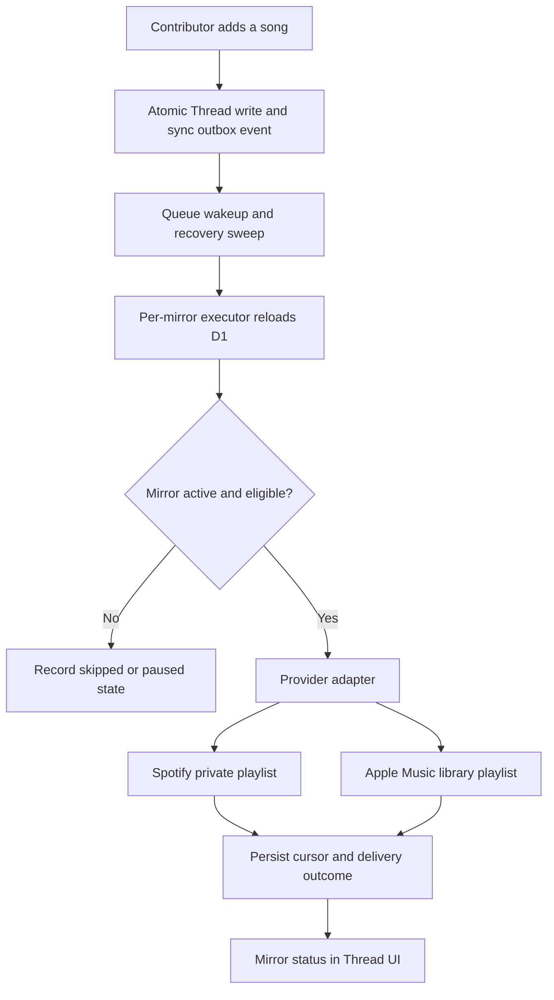

# Provider Playlist Mirrors - Plan

## Goal Capsule

- **Objective:** Let a thread participant sync the thread into a private Apple Music or Spotify playlist that receives newly added Thread songs automatically.
- **Product authority:** Threads remain anonymous, provider-neutral collaboration. Each browser chooses and owns its own provider mirror; a mirror is an outbound projection, never the Thread's source of truth.
- **Execution profile:** Stage durable delivery and Spotify first. Apple Music requires a real MusicKit token-durability spike before unattended delivery is enabled.
- **Stop conditions:** Do not expose a provider publicly until its authorization, write, retry, and disconnect behavior passes staging verification. Do not promise removal, reordering, bidirectional edits, or Apple background sync without proof.

---

## Product Contract

### Summary

Provider playback should stay current without making collaborators create listen.cx accounts or repeatedly export snapshots.

An individual participant may explicitly connect their provider and create one private playlist mirror for a Thread.

When a new song is accepted into that Thread, listen.cx eventually appends the matching provider track to each active mirror.

### Product Contract preservation

Changed: R1-R3 and R7-R9 replace the former independent-snapshot contract after the user explicitly approved continuous, add-only mirroring. R4-R6, R10-R17 remain governing constraints where applicable.

### Problem Frame

Snapshots make a Thread playable once, but immediately become stale as friends keep passing the aux.

The useful next step is not a shared provider playlist or a listen.cx account system: it is an opt-in personal mirror that keeps receiving new songs while the Thread stays lightweight and link-based.

### Key Decisions

- **Mirrors are per participant browser, not per Thread.** A person explicitly connects Apple Music or Spotify from a Thread, receives a private playlist in that provider, and can disconnect without affecting collaborators.
- **V1 is add-only.** (session-settled: user-directed — chosen over full deletion/reordering parity: receiving new songs is the value; later Thread removals or ordering edits need not alter provider playlists.) A later removal affects the Thread only; a closed Thread simply stops receiving additions.
- **The Thread is authoritative.** Provider playlists are derived outbound projections. Manual provider edits are preserved and never imported into or used to mutate the Thread.
- **No ordinary listen.cx account.** A browser-scoped opaque sync identity authorizes mirror controls. Provider credentials are limited to the explicit mirror connection and are never exposed in a Thread URL, page HTML, analytics, or logs.
- **Apple is capability-gated.** (session-settled: user-directed — chosen over deferring Apple outright: an add-only Apple mirror is acceptable for v1.) Apple remains disabled outside staging until a real MusicKit web proof establishes whether an encrypted Music User Token can support the intended background delivery.
- **Spotify remains staging-gated.** Spotify development mode is only appropriate for the allowlisted dogfood cohort; public availability remains blocked on quota, policy, privacy, and legal clearance.

### Actors

- A1. **Participant/mirror owner:** Holds a Thread link and wants new Thread songs in their own provider library.
- A2. **Contributor:** Adds a song through the normal anonymous Thread flow.

### Requirements

**Mirror lifecycle**

- R1. A1 can explicitly choose Apple Music or Spotify and create one private provider playlist mirror from the active Thread songs plus future accepted additions.
- R2. Each active mirror belongs to one browser-scoped sync identity and one provider. It never exposes or changes another participant's provider connection, playlist, or status.
- R3. A1 can view provider-specific mirror state, open the provider playlist, reconnect when required, and stop syncing. Stopping deletes retained credentials and keeps the already-created provider playlist untouched.
- R4. A song is eligible only when listen.cx has an exact destination catalog identifier with evidence provenance. Same-provider source IDs are exact immediately; heuristic URLs and provider search fallbacks are never written.

**Synchronization semantics**

- R5. A newly accepted contribution creates a durable sync event in the same authoritative mutation as the Thread write. Returning the contribution response never waits for a provider write.
- R6. Each active mirror eventually appends eligible new songs in Thread order, preserves intentional repeats where the provider permits them, and records durable per-mirror progress so duplicate delivery does not duplicate a provider write.
- R7. Thread removal, reordering, and provider-side edits do not remove, reorder, or otherwise reconcile already-added mirror songs. Thread closure stops future additions only.
- R8. Provider writes are at-least-once internally. Timeout or ambiguous completion is reconciled before another append is attempted; when the result cannot be proved without risking a duplicate, that mirror pauses as needs-attention rather than guessing.
- R9. Rate limits, temporary provider failures, and worker interruption retry with bounded backoff. Auth denial, revoked credentials, or an expired non-refreshable credential pauses only that mirror and asks A1 to reconnect.

**Authorization and privacy**

- R10. Loading, viewing, contributing to, sharing, managing, closing, opening, or copying a Thread never requests provider authorization or performs a provider write.
- R11. Authorization is initiated only after A1 selects a provider mirror and is bound to a short-lived, single-use, browser-bound intent. Spotify uses a fixed registered callback with PKCE; Apple MusicKit posts its user token to the same-origin intent after user action. Replay, expiry, provider mismatch, browser mismatch, and callback return-target tampering cannot create or alter a mirror.
- R12. Stored provider credentials are encrypted at rest, scoped to the smallest playlist-write permission, inaccessible to page JavaScript, excluded from URLs/logs/analytics, and deleted on disconnect, terminal revocation, or sync-identity expiry.
- R18. All mirror mutations are POST-only, validate same-origin intent, and require an anti-CSRF mechanism in addition to the browser sync identity.
- R13. Spotify mirrors are private and use only playlist-write scopes. Apple mirrors use only documented MusicKit library-playlist permissions and are not enabled for background delivery until the staging spike proves their safe use.

**Availability and honesty**

- R14. The UI describes each mirror as add-only and identifies its provider. Apple explicitly explains that a song already added to Apple Music remains there if later removed from the Thread.
- R15. A mirror is shown as synced, syncing, retrying, reconnect required, stopped, or unavailable. The UI never claims a provider playlist is current after an unconfirmed or failed write.
- R16. Staging proves Spotify with allowlisted users and Apple with a real subscriber before either path is offered more broadly.
- R17. Public Spotify rollout remains blocked until current Spotify quota and cross-service policy requirements are cleared. Apple public rollout remains blocked until the token-durability spike, provider terms review, and operational proof pass.

### Key Flows

- F1. **Start a private mirror**
  - **Trigger:** A1 wants a Thread to keep appearing in their provider library.
  - **Actors:** A1.
  - **Steps:** A1 selects a provider, reviews exact current coverage and add-only behavior, authorizes that provider, and creates a dedicated private playlist mirror.
  - **Outcome:** The mirror receives the current eligible ordered songs and is ready for later additions.
  - **Covered by:** R1-R4, R10-R14.
- F2. **Add a song after mirrors exist**
  - **Trigger:** A2 adds an eligible song.
  - **Actors:** A2, A1.
  - **Steps:** The Thread accepts the contribution, records a durable event, and delivers the eligible provider track to every active affected mirror without delaying A2's response.
  - **Outcome:** A1's playlist eventually gains the song once; the Thread remains usable if delivery is delayed.
  - **Covered by:** R5-R9.
- F3. **Recover or stop a mirror**
  - **Trigger:** A provider rejects authorization, a credential expires, or A1 no longer wants updates.
  - **Actors:** A1.
  - **Steps:** listen.cx pauses only the affected mirror, presents its state, and lets A1 reconnect or stop. Stop deletes credentials and suppresses pending delivery.
  - **Outcome:** The provider playlist remains in A1's library while ordinary Thread use is unchanged.
  - **Covered by:** R2-R3, R9-R12, R15.

### Acceptance Examples

- AE1. **A new song reaches an active Spotify mirror once**
  - **Covers:** R5-R9.
  - **Given:** A1 has a synced Spotify mirror and the worker receives the same committed Thread event more than once.
  - **When:** A2 adds one eligible Spotify track.
  - **Then:** A2 sees the accepted contribution immediately and A1's playlist eventually contains one additional occurrence of that track.
- AE2. **Apple remains honestly add-only**
  - **Covers:** R7, R14-R15.
  - **Given:** A1's Apple Music mirror already received a song.
  - **When:** the Thread manager removes that contribution.
  - **Then:** The Thread no longer shows the song, Apple retains it, and the mirror UI does not claim exact list parity.
- AE3. **A terminal credential failure does not affect the Thread**
  - **Covers:** R9-R12, R15.
  - **Given:** an active mirror's provider credential is revoked.
  - **When:** the next eligible contribution is delivered.
  - **Then:** only that mirror becomes reconnect-required; no provider retry loop continues with the revoked credential and the contribution remains accepted.
- AE4. **Disconnect preserves the user playlist**
  - **Covers:** R3, R12.
  - **Given:** A1 has an active mirror.
  - **When:** A1 stops syncing.
  - **Then:** listen.cx deletes the retained credential, future Thread additions are not delivered, and the existing provider playlist remains available to A1.

### Scope Boundaries

**In this phase**

- Per-browser opt-in mirrors, durable outbound add delivery, secure provider authorization, provider status/reconnect/disconnect controls, and staging proof.

**Deferred for later**

- Removing, reordering, or rebuilding provider playlists; arbitrary existing-playlist selection; provider-side edit reconciliation; multi-browser mirror recovery; export history; and public Spotify release.

**Outside this product's identity**

- Provider-native collaborative editing as the Thread's collaboration model, bidirectional sync, synchronized playback, or requiring provider authorization to contribute or listen.

---

## Planning Contract

### Key Technical Decisions

- KTD1. **Durable outbox plus queue wakeups.** Persist a Thread event transactionally with every accepted contribution, then enqueue a non-secret wakeup after commit. A scheduled recovery sweep re-enqueues stale unpublished events, covering the crash window between D1 commit and Queue publication. A per-mirror serialized executor treats the message only as a wakeup, reloads current D1 state, and advances one contiguous cursor. `waitUntil` remains appropriate for UX notifications but is insufficient for provider writes.
- KTD2. **Dedicated playlists only.** A new private playlist is created for each mirror rather than targeting an arbitrary existing playlist. This gives listen.cx an unambiguous derived destination and avoids silently overwriting a user-curated playlist.
- KTD3. **An expiring browser-scoped sync identity.** A random HttpOnly, Secure, SameSite cookie authorizes mirror management separately from the Thread management capability. Its server record has a bounded inactivity lifetime; expiry pauses mirrors and deletes credentials so a lost browser cannot leave unattended writes running forever. It permits no provider identity to leak to collaborators. (session-settled: user-directed — chosen over listen.cx accounts: ordinary Thread collaboration stays account-free.)
- KTD4. **Bound and rotatable encrypted credential custody.** Spotify refresh tokens are AEAD-encrypted with an envelope version/key ID and associated data bound to mirror ID, provider, credential type, and environment. A multi-key decrypt/active-key encrypt policy supports rotation. Apple token storage is implemented only behind the staging feasibility gate.
- KTD5. **Provider-specific delivery semantics.** Spotify uses current `/items` playlist endpoints, private playlist scopes, snapshots, and reconciliation after ambiguity. Apple uses documented create-and-append library-playlist operations only; deletion/reordering is deliberately absent.

### High-Level Technical Design

### Assumptions

- A dedicated staging Spotify application and Apple MusicKit configuration can be registered with the staging callback origin.
- A destination catalog-ID enrichment path can reach exact-match coverage without treating the current Apple search fallback as writable identity; pre-existing immutable links remain ineligible until append-only evidence rows backfill them.
- Queue and Durable Object bindings are available in the listen.cx Cloudflare account.
- Apple Music User Token longevity and server-side use are not assumed; the Apple spike decides whether background delivery is enabled.

### Risks and dependencies

| Risk or dependency | Mitigation and gate |
| --- | --- |
| Spotify Dev Mode allows only a small allowlisted cohort and is not public infrastructure. | Keep Spotify staging-only; do not show it publicly until quota/policy approval is documented. |
| Spotify's February 2026 migration removed legacy playlist `/tracks` routes. | Use `/items` routes only and characterize 429/`Retry-After` behavior. |
| A provider timeout can mean the playlist changed despite no response. | Store pre-write evidence and reconcile; when duplicates make the result unprovable, pause as needs-attention rather than retrying. |
| Apple documents append but not full playlist mutation or renewable server auth. | Ship the add-only UI wording; make background Apple delivery contingent on the staging spike. |
| Provider credentials are sensitive personal data. | Encrypt at rest, use minimal scopes, bind OAuth state to browser and intent, support deletion, and redact diagnostics. |
| Intentional duplicate songs are ambiguous after an uncertain append. | Treat each contribution occurrence as a distinct delivery; prove reconciliation, then pause instead of guessing when manual edits or duplicates make it inconclusive. |

### Sequencing

Start with durable data and no-op delivery, then establish secure Spotify connectivity and delivery before enabling the Apple capability spike.

The user-facing mirror controls arrive only once statuses are truthful, and staging rollout is last.

---

## Implementation Units

### U1. Durable mirror, identity, and recoverable outbox persistence

- **Goal:** Add the authoritative data model for browser-owned mirrors, encrypted credential envelopes, Thread events, and per-mirror delivery state.
- **Requirements:** R2-R3, R5-R9, R11-R12.
- **Dependencies:** None.
- **Files:** `migrations/0004_thread_playlist_mirrors.sql`, `src/thread-db.ts`, `src/thread-db.test.ts`, `src/thread-sync.ts`, `src/thread-sync.test.ts`.
- **Approach:** Add expiring browser sync identities, one stable mirror row per Thread/provider/identity, immutable outbox events, and idempotent delivery rows. Enforce the one-active-mirror invariant in D1. Extend the contribution transaction so accepting a new contribution persists its event atomically. Track an outbox publication lease for recovery sweeps and a per-mirror cursor/high-water position so delivery always pulls the next contiguous occurrence from D1. Model terminal and retryable outcomes without placing secret material in normal Thread projections.
- **Patterns to follow:** `thread_contributions` atomic acceptance and idempotency in `src/thread-db.ts`; push-subscription child-table lifecycle in `migrations/0003_thread_push_subscriptions.sql`.
- **Test scenarios:**
  - Accepting a new contribution creates exactly one ordered sync event with the accepted contribution.
  - An idempotent contribution retry creates no additional event.
  - Concurrent acceptance preserves Thread order and event order.
  - A removed or closed Thread contribution does not create an add event.
  - A mirror created during an initial backfill receives the pre-existing ordered sequence before a concurrently accepted later contribution.
  - A committed event whose initial Queue send is skipped or whose sent marker is not persisted is recovered and delivered once.
  - Concurrent connection completion cannot create two active mirrors for the same Thread, provider, and browser identity.
  - An expired sync identity pauses its mirrors and deletes credentials.
  - Disconnecting a mirror makes queued delivery ineligible and deletes its encrypted credential payload.
  - A duplicate delivery claim records one completed provider write for one mirror/event pair.
- **Verification:** D1 integration tests prove event atomicity, foreign-key cleanup, identity isolation, and duplicate-safe delivery state.

### U2. Exact destination catalog identity and eligibility projection

- **Goal:** Produce a provider-write projection containing only exact, evidenced catalog IDs in chronological contribution order.
- **Requirements:** R4, R6, R13-R14.
- **Dependencies:** U1.
- **Files:** `src/resolve.ts`, `src/resolve.test.ts`, `src/db.ts`, `src/thread-db.ts`, `src/thread-db.test.ts`, `migrations/0004_thread_playlist_mirrors.sql`.
- **Approach:** Preserve source IDs as same-provider eligibility and introduce separately auditable destination IDs plus match provenance for cross-provider delivery. Keep existing immutable short-link rows intact; an unresolved or heuristic destination stays omitted rather than being searched at write time.
- **Execution note:** Start with characterization coverage around existing cross-provider matching before adding writable identity metadata.
- **Patterns to follow:** Resolver provenance and immutable link creation in `src/resolve.ts` and `src/db.ts`.
- **Test scenarios:**
  - A Spotify-origin song with its source catalog ID is eligible for a Spotify mirror.
  - A verified cross-provider destination ID is eligible for the corresponding mirror.
  - A search-fallback URL or mismatched result is excluded from provider writes.
  - Projection preserves active contribution order and intentional duplicate occurrences.
  - A provider storefront change reduces coverage without rewriting the canonical Thread.
- **Verification:** Resolver and D1 tests show no heuristic destination is sent to an adapter.

### U3. Browser-bound mirror connection and credential lifecycle

- **Goal:** Safely establish, reconnect, and disconnect a provider mirror without introducing a listen.cx account.
- **Requirements:** R1-R3, R10-R13, R15, R18.
- **Dependencies:** U1, U2.
- **Files:** `src/app.ts`, `src/app.test.ts`, `src/thread-security.ts`, `src/thread-security.test.ts`, `src/thread-sync.ts`, `src/thread-sync.test.ts`, `src/worker.ts`, `wrangler.jsonc`, `worker-configuration.d.ts`.
- **Approach:** Create short-lived browser-bound connection intents and an opaque expiring sync-identity cookie. Use provider-specific completion contracts: Spotify validates fixed callback state and PKCE; Apple accepts a MusicKit user-token post only to an unconsumed same-origin intent. Use POST-only, Origin-validated anti-CSRF mutations. Encrypt credentials with a rotatable AEAD envelope, binding associated data to the mirror/provider/token/environment, delete them on stop or identity expiry, and return only non-secret mirror state to the page.
- **Patterns to follow:** Management capability binding in `src/thread-security.ts`; provider-independent route injection in `src/app.ts`; Worker assembly in `src/worker.ts`.
- **Test scenarios:**
  - A normal Thread page load does not create a sync identity, request authorization, or write a provider playlist.
  - An authorization callback with an expired, reused, wrong-browser, or wrong-provider intent cannot create a mirror.
  - A callback-supplied absolute return URL and a cross-origin create, reconnect, or stop request are rejected.
  - Apple token posts with a consumed, expired, or wrong-browser intent are rejected without storing a credential.
  - A successful connection produces a mirror visible only to its originating browser identity.
  - Disconnect removes credentials and prevents future delivery while retaining the provider playlist link.
  - Secret tokens never appear in response bodies, Thread HTML, event payloads, or logged error metadata.
  - Ciphertext tampering, swapping across mirrors, and old-key decryption are rejected or handled by the documented key-rotation policy.
- **Verification:** Route tests exercise the intent lifecycle and security tests prove browser and provider isolation.

### U4. Spotify staging mirror adapter and durable execution

- **Goal:** Deliver current and future eligible Thread songs to a dedicated private Spotify playlist under the staging allowlist.
- **Requirements:** R1, R5-R9, R13, R16-R17.
- **Dependencies:** U1-U3.
- **Files:** `src/spotify-mirror.ts`, `src/spotify-mirror.test.ts`, `src/thread-sync.ts`, `src/thread-sync.test.ts`, `src/worker.ts`, `src/worker.test.ts`, `wrangler.jsonc`, `worker-configuration.d.ts`.
- **Approach:** Use Spotify Authorization Code flow server-side, `playlist-modify-private`, `POST /me/playlists`, and the current playlist `/items` endpoints. Configure a Queue producer/consumer, dead-letter policy, scheduled outbox recovery, and a per-mirror Durable Object. Every queue message carries only a non-secret outbox/mirror pointer; the executor reloads and reauthorizes the current mirror/event/cursor state before any write. Refresh access tokens before use, honor `Retry-After`, and reconcile playlist state before retrying an ambiguous append; pause as needs-attention when duplicates make reconciliation inconclusive.
- **Patterns to follow:** Injectable provider fetch clients in `src/spotify.ts` and `src/itunes.ts`; best-effort request separation in `src/app.ts` but with durable execution rather than `waitUntil` alone.
- **Test scenarios:**
  - Connection creates one private dedicated playlist and appends the ordered initial eligible set in provider batch limits.
  - A later accepted contribution appends once after duplicate queue delivery.
  - A 429 defers delivery using the provider retry delay without failing the Thread request.
  - A transient error retries with bounded backoff; a 401 or `invalid_grant` pauses the mirror and requires reconnection.
  - A request timeout after a possible append reconciles before retrying and does not create duplicate songs.
  - A timeout combined with a duplicate occurrence or manual playlist edit becomes needs-attention rather than an unprovable retry.
  - A stale, deleted, replayed, or tampered Queue payload cannot select a credential, playlist, or track outside its current D1 row.
  - Legacy `/tracks` playlist endpoints are never used.
- **Verification:** Unit tests mock provider responses and integration tests simulate repeated queue messages, concurrent additions, rate limits, and ambiguous writes on staging.

### U5. Apple Music token-durability staging spike

- **Goal:** Prove MusicKit-on-the-Web authorization and the safe server-side lifecycle of a Music User Token before committing to an Apple background adapter.
- **Requirements:** R11-R13, R16-R17.
- **Dependencies:** U1-U3.
- **Files:** `src/apple-music-mirror.ts`, `src/apple-music-mirror.test.ts`, `src/thread-sync.ts`, `src/thread-sync.test.ts`, `src/thread-page.ts`, `src/thread-page.test.ts`, `src/worker.ts`, `wrangler.jsonc`, `worker-configuration.d.ts`.
- **Approach:** Use MusicKit on the Web to request the Music User Token only after participant action, post it to the common intent flow, and prove one real create-and-append operation. Verify encrypted token behavior across cold Worker execution and elapsed time before designing Apple queue delivery; otherwise retain a clearly unavailable staging state rather than faking sync.
- **Patterns to follow:** Common intent and credential boundary from U3; do not apply Spotify OAuth callbacks or refresh-token assumptions to Apple.
- **Test scenarios:**
  - A real staging subscriber can authorize, create a dedicated library playlist, and append an eligible song.
  - A token posted after user action is accepted only by its matching unconsumed browser-bound intent.
  - Missing, expired, or rejected Music User Tokens leave Apple unavailable and surface the staging proof failure without affecting a Thread.
  - The Apple control remains unavailable when the token-durability gate is not satisfied.
  - Adapter tests never invoke undocumented remove, reorder, replace, or delete playlist operations.
- **Verification:** Manual staging matrix records real Safari and Chrome MusicKit authorization, same-origin intent completion, one create-and-append operation, cold-start delivery, and elapsed-time token behavior before an adapter is planned as enabled.

### U6. Conditional Apple Music add-only mirror adapter

- **Goal:** Implement Apple add-only background delivery only after U5 records a passing staging proof.
- **Requirements:** R1, R6-R9, R13-R17.
- **Dependencies:** U1-U3, U5.
- **Files:** `src/apple-music-mirror.ts`, `src/apple-music-mirror.test.ts`, `src/thread-sync.ts`, `src/thread-sync.test.ts`, `src/thread-page.ts`, `src/thread-page.test.ts`, `src/worker.ts`, `wrangler.jsonc`, `worker-configuration.d.ts`.
- **Approach:** Create a dedicated Apple library playlist and append eligible catalog tracks through documented operations only. Reuse the queue wakeup/cursor algorithm, but keep Apple feature-gated and pause on token rejection or ambiguity. Do not add removal, reorder, replace, or delete behavior.
- **Test scenarios:**
  - Later eligible Thread additions append in chronological order while a removal leaves an already-added Apple song intact.
  - Missing, expired, or rejected Music User Tokens pause only the Apple mirror and surface reconnect-required state.
  - The Apple control remains unavailable until U5's documented proof is satisfied.
  - Adapter tests never invoke undocumented remove, reorder, replace, or delete playlist operations.
- **Verification:** A real subscriber completes the full add-only staging mirror path after the U5 gate passes.

### U7. Mirror status and controls on Thread pages

- **Goal:** Let a participant intentionally create, inspect, reconnect, open, and stop only their own provider mirror.
- **Requirements:** R1-R3, R10, R14-R16.
- **Dependencies:** U3-U4.
- **Files:** `src/thread-page.ts`, `src/thread-page.test.ts`, `src/app.ts`, `src/app.test.ts`.
- **Approach:** Add a compact provider choice and mirror status region that is absent or disabled when a provider gate is closed. Explain the dedicated private playlist and add-only behavior before authorization. Render browser-local state only, preserve accessibility announcements through provider-specific completion flows, and retain existing contribution controls unchanged. Apple becomes available only after U6.
- **Patterns to follow:** Notification toggle lifecycle and progressive Thread fragment refresh in `src/thread-page.ts`.
- **Test scenarios:**
  - An unconnected participant sees provider choice but no authorization request until selecting a provider.
  - An active mirror shows the provider playlist link and last confirmed sync state.
  - Apple clearly states that removals do not propagate.
  - Reconnect-required and retrying states are distinguishable and do not block song contribution.
  - A browser without the sync identity cannot see or stop another browser's mirror.
- **Verification:** Page and route tests cover provider gating, state rendering, mobile-safe return flow, and no regression to normal Thread use.

### U8. Staging rollout, observability, and public-release gates

- **Goal:** Make provider delivery safe to dogfood and impossible to accidentally present as publicly ready.
- **Requirements:** R8-R9, R15-R17.
- **Dependencies:** U4, U7; U6 when Apple passes its gate.
- **Files:** `wrangler.jsonc`, `src/worker.ts`, `src/worker.test.ts`, `README.md`.
- **Approach:** Add independent provider feature gates, non-secret structured outcomes, queue-age/failure/reconnect monitoring, and a staging runbook. Record Spotify allowlist/quota status and Apple token-spike evidence separately. Keep all provider mirror flags off in production unless their own explicit gates are met.
- **Patterns to follow:** Existing staging-only Thread configuration in `wrangler.jsonc` and worker binding startup tests.
- **Test scenarios:**
  - Disabled provider flags omit the provider mirror path without affecting Threads.
  - Queue failure, provider rate limit, and terminal auth errors produce distinct non-secret operational events.
  - Staging configuration includes required bindings while production defaults safely disable mirrors.
  - A public Spotify path cannot be enabled solely by deploying the staging adapter.
- **Verification:** Staging dogfood proves real provider behavior; release review has documented quota, policy, privacy, token-lifecycle, and operational evidence for each provider.

---

## Verification Contract

| Gate | Applies to | Done signal |
| --- | --- | --- |
| `pnpm typecheck` | U1-U8 | The Worker, Queue/DO bindings, and provider types compile with no errors. |
| `pnpm test` | U1-U8 | D1, route, adapter, and delivery idempotency tests pass. |
| `pnpm types:check` | U3-U8 | Generated Worker binding types match Wrangler configuration. |
| `pnpm check:startup` | U3-U8 | Worker startup accepts all sync-related bindings. |
| Staging provider matrix | U4-U8 | Allowlisted Spotify and, only after U5, a real Apple subscriber complete the defined provider flows. |
| Failure injection | U1, U4, U6 | Duplicate messages, rate limits, revoked credentials, and ambiguous writes either produce one confirmed playlist occurrence or an honest needs-attention state without blocking Thread use. |

---

## Definition of Done

- A participant can create and stop a browser-scoped, private provider mirror without a listen.cx account.
- A new accepted Thread contribution is durably queued and eventually reaches each eligible active staging mirror without delaying the contribution response.
- Spotify delivery uses the current `/items` API, handles refresh/retry/reconciliation, and remains limited to the approved staging cohort.
- Apple delivery has either passed the real MusicKit staging proof or remains visibly unavailable; no unsupported background promise is shipped.
- Credentials are encrypted, minimally scoped, never exposed through Threads, and deleted on disconnect or terminal revocation.
- UI wording and state are honest about add-only semantics, provider availability, delayed sync, and reconnect requirements.
- All verification gates pass and production mirror flags remain disabled until their provider-specific release gates are documented as met.

---

## Appendix

### Sources and research

- Existing Thread/export contract: `docs/plans/2026-07-13-001-feat-pass-the-aux-roadmap-plan.md` and `docs/plans/2026-07-13-002-feat-private-pass-the-aux-threads-plan.md`.
- Spotify authorization and PKCE: [Authorization](https://developer.spotify.com/documentation/web-api/concepts/authorization) and [PKCE flow](https://developer.spotify.com/documentation/web-api/tutorials/code-pkce-flow).
- Spotify refresh lifecycle: [Refreshing tokens](https://developer.spotify.com/documentation/web-api/tutorials/refreshing-tokens).
- Spotify current playlist model and APIs: [Playlists and snapshots](https://developer.spotify.com/documentation/web-api/concepts/playlists), [Create playlist](https://developer.spotify.com/documentation/web-api/reference/create-playlist), and [Add items](https://developer.spotify.com/documentation/web-api/reference/add-items-to-playlist).
- Spotify 2026 migration and rollout constraints: [February migration guide](https://developer.spotify.com/documentation/web-api/tutorials/february-2026-migration-guide), [Quota modes](https://developer.spotify.com/documentation/web-api/concepts/quota-modes), [Rate limits](https://developer.spotify.com/documentation/web-api/concepts/rate-limits), and [Developer Policy](https://developer.spotify.com/policy).
- Apple user authorization and playlist writes: [User authentication for MusicKit](https://developer.apple.com/documentation/applemusicapi/user-authentication-for-musickit), [Create a library playlist](https://developer.apple.com/documentation/applemusicapi/create-a-new-library-playlist), and [Apple Music playlists API](https://developer.apple.com/documentation/applemusicapi/playlists-api).
