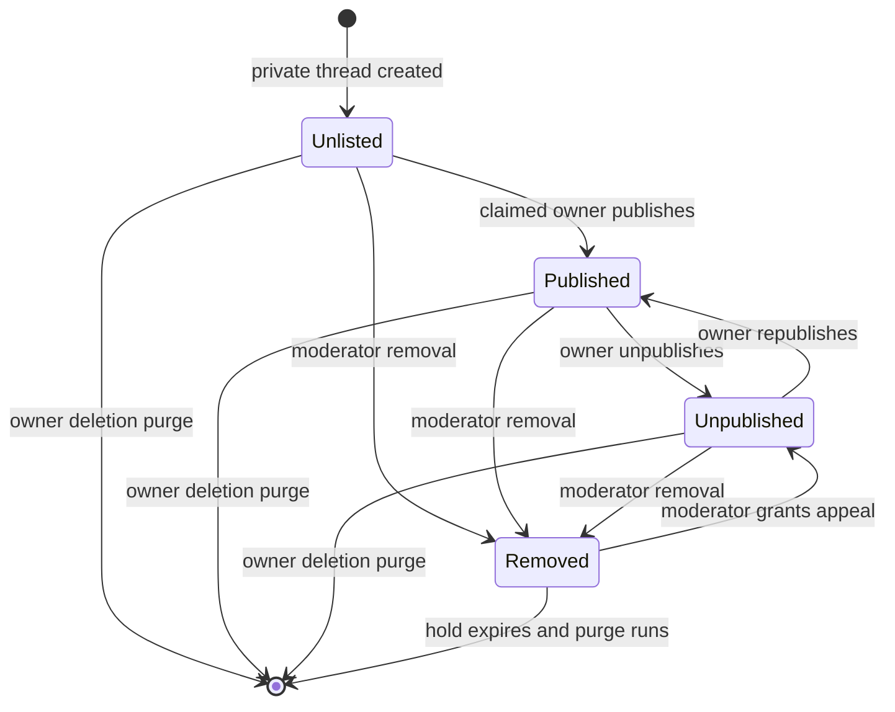
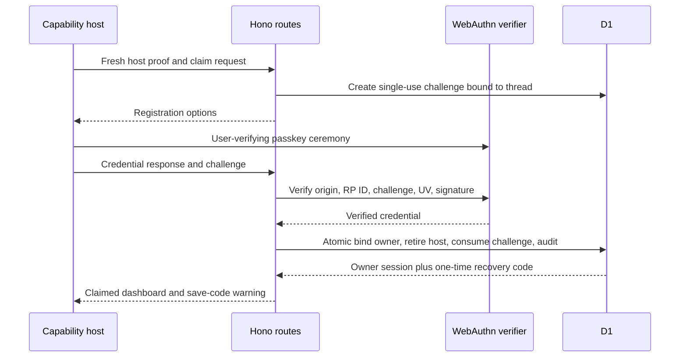
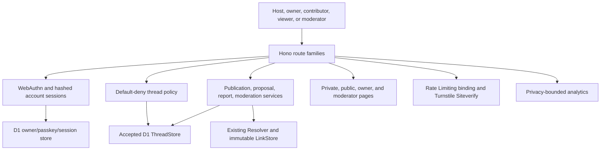
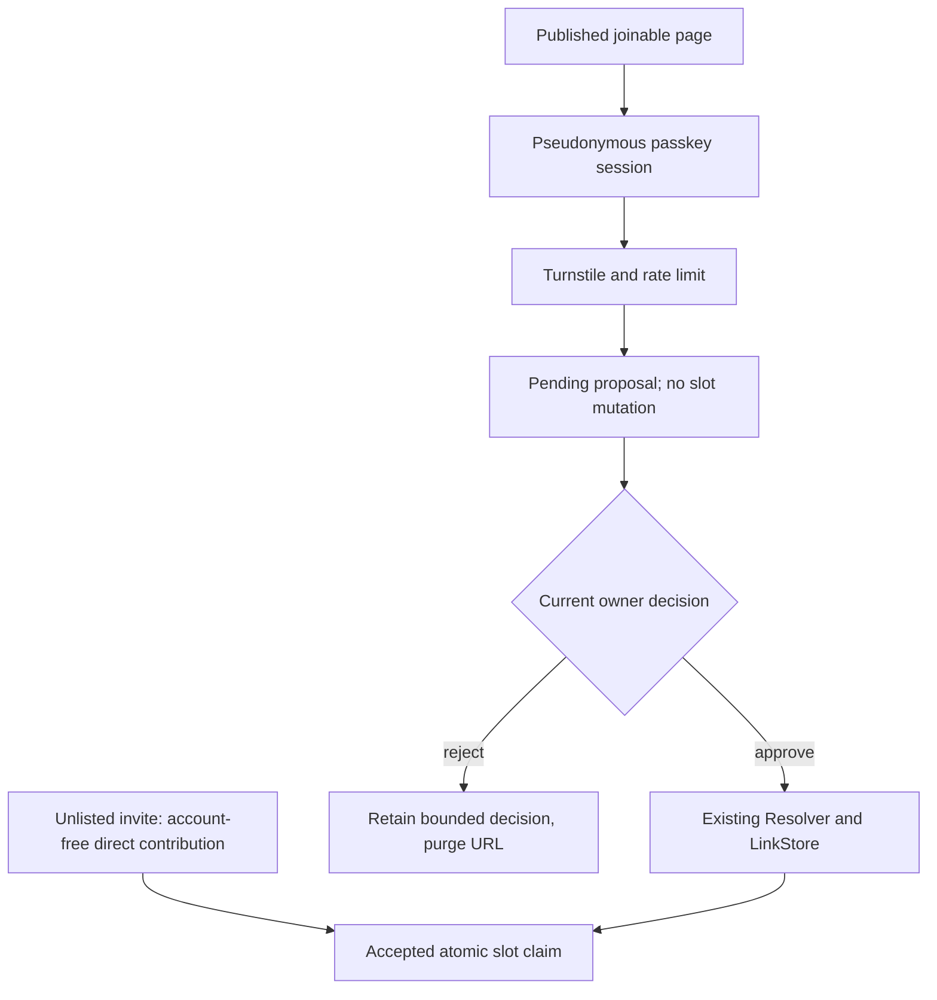
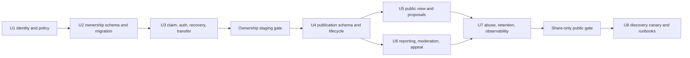

# Pass the Aux Public Ownership and Publishing - Plan

## Goal Capsule

- **Objective:** Let an unlisted capability-managed Pass the Aux thread acquire durable ownership, become safely public, and later opt into discovery without adding account friction to private contribution or listening.
- **Recommendation:** Ship four gates in order: ownership foundation, share-only public publishing, passkey-backed moderated proposals, then opt-in discovery and indexing.
- **Product authority:** Origin R11 and the accepted private-thread capability model are authoritative. A bearer host capability may bootstrap ownership exactly once, but it never becomes or impersonates durable identity.
- **Identity boundary:** Durable identity is an opaque passkey-backed principal with no email, username, public profile, or follow graph. Browser sessions preserve continuity but do not establish identity independently.
- **Recovery boundary:** Owners should add more than one passkey and receive one offline, one-time recovery code. If every passkey and the recovery code are lost, listen.cx does not recover ownership from an invite, thread contents, IP history, provider account, or support judgment.
- **Execution profile:** Deep, security-, privacy-, migration-, and operations-sensitive work spanning WebAuthn, D1 authorization state, publication lifecycle, public contribution proposals, moderation, indexing, and staged rollout.
- **Stop conditions:** Do not expose share-only publishing until claim, recovery, transfer, and moderator removal have passed staging. Do not enable discovery until the moderation queue, legal-policy review, privacy notice, and indexing rollback gates are operational.
- **Tail ownership:** Implementation includes migrations, co-located and Worker-runtime tests, privacy-bounded instrumentation, staging exercises, and runbooks. Deployment, moderator provisioning, legal determinations, and production enablement require separate authorization.

Product Contract preservation: origin R11 is refined rather than changed; origin R1-R6 and the accepted private-thread capability, contribution, and playback contracts remain unchanged.

---

## Product Contract

### Summary

Public threads should be an opt-in extension of a proven private object, not a reinterpretation of an invite token as an account.
An existing host proves authority with the accepted host capability, binds the thread to a passkey-backed opaque principal, and atomically retires the host management secret.
The owner may first publish a completed thread at a stable public URL that is shareable but excluded from search and browse surfaces.
Public joinability arrives as authenticated proposals that the owner approves into open slots; direct account-free contribution remains exclusive to the unlisted invite.
Discovery and search indexing arrive only after public operations demonstrate that reporting, removal, appeal, and rollback work.

### Problem Frame

The accepted private model intentionally provides account-free bearer access: an invite can be forwarded, a host link can be lost, and neither credential says who a person is beyond the thread.
That is appropriate for a seven-day group-chat ritual but insufficient for public publishing, recovery, transfer, search visibility, or platform moderation.
Taking a thread public also changes the privacy contract because title, prompt, artwork, and track metadata can be copied, indexed, reported, or retained outside listen.cx.
The smallest coherent extension must introduce durable authentication and public operations without making private participants create accounts or creating an unnecessary social network.

### Actors

- A1. **Capability host:** Holds the accepted private management capability for an unclaimed thread.
- A2. **Owner:** Controls an opaque passkey principal bound to one or more claimed threads.
- A3. **Unlisted contributor or listener:** Uses the accepted invite, contributor cookie, and provider preference without an account.
- A4. **Public viewer:** Opens and plays a published thread without an account.
- A5. **Public contributor:** Uses a passkey-backed opaque principal to propose one track to a joinable published thread.
- A6. **Moderator:** Uses a separately provisioned passkey principal and stored moderator role to review reports, remove content, and decide appeals.

### Requirements

**Private-model preservation**

- R1. Unclaimed threads retain the accepted invite, host capability, contributor cookie, lifecycle, noindex headers, expiry, and provider-handoff behavior without requiring an account.
- R2. Claiming or publishing never turns the public invite into durable identity or widens its permissions.

**Ownership, authentication, recovery, and transfer**

- R3. A1 may claim an unexpired thread only after a fresh host-capability proof and successful registration or authentication of a user-verifying discoverable passkey.
- R4. A successful claim atomically binds one opaque owner principal, invalidates the host recovery secret and every host session, and records a durable nonsecret ownership event.
- R5. A2 may register multiple passkeys and replace access with a one-time offline recovery code; recovery rotates the code and all account sessions.
- R6. If A2 loses all passkeys and the saved recovery code, ownership is unrecoverable by product support and the thread remains in its last safe publication state.
- R7. A2 may transfer a thread through an expiring two-party flow in which the recipient authenticates with a passkey and the current owner freshly confirms before the owner ID changes.

**Publication and public URL lifecycle**

- R8. Publication state is exactly `unlisted`, `published`, `unpublished`, or `removed`, with server-enforced transitions and no implied ownership from URL possession.
- R9. The first publishing gate permits only claimed, complete, read-only threads and allocates one immutable public slug that survives unpublish, republish, and transfer.
- R10. A4 may view, share, report, and play a published thread without an account, while unlisted and unpublished public URLs reveal no thread metadata.
- R11. Publishing presents an explicit warning that public content may be copied or indexed outside listen.cx and that unpublishing cannot retract third-party copies.
- R12. The public URL is the only canonical URL for the public representation; capability URLs stay noncanonical, noindex, and separate because they carry additional invite authority.

**Joinability and permissions**

- R13. Public joinability is off by default and, when enabled after the publishing gate, accepts one pending or accepted proposal per A5 principal per thread rather than directly filling a slot.
- R14. A2 alone may approve or reject public proposals, remove an accepted contribution, close joinability, publish, or unpublish; each request rechecks current ownership.
- R15. A5 identity is pseudonymous friction rather than proof of a unique person, so rate limits and moderation remain required even when passkey authentication succeeds.
- R16. Private invite holders continue to contribute directly under the accepted account-free rules even when the same thread has a public representation.

**Moderation, privacy, and discovery**

- R17. Any A4 may submit a bounded report without an account; report counts never remove content automatically.
- R18. A6 may remove a thread from every public and invite surface, state a reason to A2, preserve a bounded appeal record, and restore only to `unpublished` after a successful appeal.
- R19. A2 may submit one appeal per removal within 30 days; the appeal does not restore public access while pending.
- R20. Public discovery is a second explicit owner opt-in and remains disabled until share-only publishing, moderation operations, legal-policy review, and privacy gates pass.
- R21. Authentication, moderation, and analytics retain only fields and durations required for access control, recovery, abuse response, and product measurement.
- R22. A2 may request deletion, which disables all routes immediately and purges thread-specific data after the documented appeal and safety hold without deleting shared immutable LinkRows.
- R23. Public publishing, ownership, joinability, and moderation satisfy origin R11 while preserving origin R3-R4 and the accepted private R1-R6 contract.

### Key Flows

- F1. **Migrate a host capability into durable ownership**
  - **Trigger:** A1 opens the saved management link and chooses to claim the thread.
  - **Actors:** A1, A2
  - **Steps:** The server verifies a fresh host proof, issues a one-time WebAuthn challenge, verifies the passkey registration or assertion, creates or selects the opaque principal, binds the thread, and retires host authority in one transaction.
  - **Outcome:** Management continues through passkey sessions; replaying the host secret cannot reclaim or manage the thread.
  - **Covered by:** R2-R4.
- F2. **Recover or transfer ownership without support inference**
  - **Trigger:** A2 loses a passkey or intentionally hands the thread to another principal.
  - **Actors:** A2
  - **Steps:** Recovery consumes the saved code and binds a replacement passkey, or transfer collects recipient passkey acceptance and current-owner fresh confirmation.
  - **Outcome:** Recovery and transfer are explicit authenticated state changes with session rotation and audit evidence.
  - **Covered by:** R5-R7.
- F3. **Publish and unpublish a stable public mix**
  - **Trigger:** A2 chooses to share a claimed complete thread beyond the invite group.
  - **Actors:** A2, A4
  - **Steps:** A2 freshly authenticates, accepts the public-data warning, publishes, shares the new public URL, and may later unpublish without changing the invite or slug.
  - **Outcome:** A4 gets an account-free, provider-neutral public page; capability URLs and authority remain separate.
  - **Covered by:** R8-R12.
- F4. **Join a public thread through an owner-moderated proposal**
  - **Trigger:** A2 enables proposals on a published collecting thread after the joinability gate.
  - **Actors:** A2, A5
  - **Steps:** A5 registers or authenticates a passkey, passes abuse controls, proposes a provider link for an open role, and A2 approves or rejects it.
  - **Outcome:** Only owner approval invokes the existing resolve-and-claim path; public anonymous traffic never directly consumes a slot.
  - **Covered by:** R13-R16.
- F5. **Report, remove, and appeal public content**
  - **Trigger:** A4 reports a published thread or a moderator receives a valid external takedown request.
  - **Actors:** A2, A4, A6
  - **Steps:** The report enters a bounded queue, A6 records a decision, removal suppresses every thread route, A2 sees the reason and may appeal, and a successful appeal restores to unpublished.
  - **Outcome:** Public harm can be stopped reversibly without transferring ownership or exposing credentials.
  - **Covered by:** R17-R19, R21-R22.
- F6. **Opt into discovery after the public pilot**
  - **Trigger:** A2 chooses listing after the discovery gate is enabled.
  - **Actors:** A2, A4, A6
  - **Steps:** The server verifies published state and policy eligibility, marks the thread discoverable, adds it to browse/sitemap output, and removes it from discovery on unpublish or moderation.
  - **Outcome:** Search exposure is explicit, reversible at listen.cx, and operationally supported.
  - **Covered by:** R20-R21.

### Acceptance Examples

- AE1. **Claim consumes capability authority**
  - **Covers:** R2-R4; F1.
  - **Given:** An unclaimed thread has a valid host secret and no owner.
  - **When:** The host completes user-verifying passkey registration and the claim commits.
  - **Then:** The owner can manage through a new account session, the host digest and host sessions are gone, and replaying the saved management URL has no authority.
- AE2. **Recovery is exact and finite**
  - **Covers:** R5-R6; F2.
  - **Given:** An owner has lost every registered passkey but retained the unused recovery code.
  - **When:** They consume it and register a replacement passkey.
  - **Then:** Every prior account session and recovery code is invalid, a replacement code is shown once, and no thread title, invite, or support answer could have produced the same result.
- AE3. **Unpublish does not expose or forget the canonical URL**
  - **Covers:** R8-R12; F3.
  - **Given:** A published thread has a stable public slug.
  - **When:** Its owner unpublishes and later republishes it.
  - **Then:** The public route reveals nothing while unpublished, the invite still follows private rules, and republish restores the same public URL.
- AE4. **A public proposal cannot seize a slot**
  - **Covers:** R13-R16; F4.
  - **Given:** A published joinable thread has an open Peak role.
  - **When:** A public contributor proposes a valid Apple Music track.
  - **Then:** The slot remains empty until the current owner approves, approval resolves and claims once, and a second account from the same abusive source remains subject to rate limits and moderation.
- AE5. **Removal outranks owner and invite access**
  - **Covers:** R17-R19; F5.
  - **Given:** A moderator removes a reported public thread.
  - **When:** the owner, an invite holder, a public viewer, and an unfurl bot request it.
  - **Then:** Every content surface is unavailable, only the authenticated owner sees the reason and appeal control, and no actor can republish until a moderator restores it to unpublished.
- AE6. **Discovery is not implied by publishing**
  - **Covers:** R20-R21; F6.
  - **Given:** Share-only public publishing is enabled but discovery is not.
  - **When:** an owner publishes a thread.
  - **Then:** the public URL works and unfurls, but it remains `noindex`, absent from sitemap and browse output, and cannot become discoverable through a forged request.

### Success Criteria

- Every successful claim has one owner, no residual host authority, and a replay-safe audit event.
- Owners can sign in on supported platform passkeys, add a second passkey, recover with the saved code, and complete a two-party transfer in staging.
- Existing invite creation, account-free contribution, bot unfurl, provider preference, and role playback tests remain green before and after claim support lands.
- Share-only public pages can be published, unpublicized, removed, and restored without leaking capability URLs or changing their public slug.
- Every public proposal, report, moderation action, recovery, transfer, and rate-limit outcome is observable without recording titles, prompts, provider URLs, credentials, challenges, cookies, raw IP addresses, or free-text report bodies in application logs.
- No discovery surface is enabled until the release gates in the Verification Contract pass.

### Scope Boundaries

#### In scope

- Opaque passkey principals, multiple passkeys, saved recovery codes, account sessions, claim, transfer, and explicit no-support-recovery behavior.
- A stable public URL, four publication states, share-only publication, public viewer playback, public proposals, owner approval, reports, moderator removal, appeals, deletion, and gated discovery.
- Private account-free invite contribution and listening preserved exactly.

#### Deferred to Follow-Up Work

- Email confirmation, magic-link sign-in, issued recovery links, external identity providers, and automated moderation classifiers.
- Multiple owners, delegated curators, per-slot ACLs, invitation rotation, block lists, trust scores, and contributor reputation.
- Rich public search, ranking, recommendation, feeds, comments, reactions, notifications, or native playlist export.
- Separate moderation service, case-management vendor, or Cloudflare Access-backed staff console if operator count outgrows the stored-role model.

#### Outside this product's identity

- Public profiles, handles, bios, avatars, follow graphs, direct messages, social graphs, or public attribution of contributors.
- Identity proofing, uniqueness claims, age verification, or treating a passkey account as a verified person.
- Making an account a condition of opening or contributing through an unlisted invite.
- Pretending `noindex`, unpublish, or deletion can retract copies already made by people, crawlers, messaging services, or music providers.

### Smallest Reversible Assumptions

- Public joinability means owner-moderated proposals, not anonymous direct writes. This is reversible because it adds a proposal seam without changing private slot claims.
- Passkey-only principals are acceptable for the first public cohort because the product does not need names or email delivery. Email can be added later as a separately consented recovery/contact method.
- There is one owner per thread and no delegated role below owner. Transfer covers the legitimate handoff case without a general ACL system.
- A moderator principal is provisioned out of band into a D1 role table after passkey enrollment. No public route can grant moderator status.
- Publication and discovery are separate: `published` means publicly addressable, while `discoverable_at` remains null until the owner opts in after the platform gate.

---

## Planning Contract

### Decisive Phase Order

1. **Phase A — ownership foundation:** Implement U1-U3 behind `AUX_OWNERSHIP_ENABLED` in staging. Existing unclaimed capability management continues unchanged.
2. **Phase B1 — share-only publishing and moderation:** Implement U4-U7 behind `AUX_PUBLIC_PUBLISHING_ENABLED`; keep all public pages `noindex`, exclude them from browse and sitemap output, and initially restrict publish to completed threads.
3. **Phase B2 — joinability and discovery canary:** Enable proposal mode first, then enable `AUX_DISCOVERY_ENABLED` only for explicit owner opt-in after the moderation and legal-policy gates pass.

Do not ship these as one phase.
Ownership must be proven independently before public state depends on it, and share-only publication creates a reversible operational rehearsal before search engines amplify exposure.

### Key Technical Decisions

- KTD1. **Use an opaque passkey principal as the only durable user identity.** `principals.id` is random and not public. WebAuthn user handles contain random bytes rather than email or username, registration requests discoverable credentials with user verification, and authentication is scoped to the environment's RP ID.
- KTD2. **Use a maintained verifier rather than implementing WebAuthn cryptography.** Add `@simplewebauthn/server` after a Worker startup and bundle smoke test. Serve a small first-party native-WebAuthn client module from listen.cx; do not load a browser bundle from a CDN.
- KTD3. **Isolate staging and production passkeys.** Staging uses RP ID and expected origin `staging.listen.cx`; production uses `listen.cx`. A staging credential cannot authenticate production even though both environments share source code.
- KTD4. **Consume the host root during claim.** Claim requires a host proof issued within five minutes plus a single-use WebAuthn challenge. One D1 transaction binds `owner_id`, nulls the host-secret digest, deletes thread host sessions, consumes the challenge, and appends the claim event.
- KTD5. **Recovery codes are exceptional one-time authenticators, not identity.** Issue one 128-bit printable code, store only a salted hash, throttle attempts, show it once, and rotate it plus all sessions after use. Encourage a second passkey before relying on recovery.
- KTD6. **Support no manual ownership override.** Support, moderators, and provider metadata cannot bind or transfer ownership. Losing all authenticators leaves the thread in its last safe state; platform moderation may suppress it but cannot assign it.
- KTD7. **Require fresh passkey user verification for authority changes.** Claim, publish, transfer initiation/confirmation, recovery-code rotation, passkey removal, deletion, and appeal submission require an assertion no older than five minutes. Ordinary management may use a hashed 30-day HttpOnly session.
- KTD8. **Make transfer a two-party state machine.** A freshly authenticated owner creates a hashed 256-bit token valid for 24 hours. The recipient registers or authenticates a passkey, then the current owner freshly confirms; the final transaction rechecks ownership and moves the thread once.
- KTD9. **Keep publication state separate from thread lifecycle.** `collecting|complete|closed|expired` still controls contributions and playback. `unlisted|published|unpublished|removed` controls exposure. Join mode is `closed|proposals`, and discovery is a nullable opt-in timestamp.
- KTD10. **Keep capability and public URLs distinct.** `/aux/:invite` remains the authority-bearing private route. `/mix/:publicSlug` is a 12-character, non-reused public identifier and the self-canonical public representation. Never redirect the invite to the public URL because the invite can retain direct contribution authority.
- KTD11. **Allocate the public slug once.** The first successful publish allocates it in the same transaction as state change. Unpublish, transfer, removal, and republish never change or reuse it.
- KTD12. **Publish completed threads before collecting ones.** Phase B1 allows only complete read-only threads. Phase B2 may publish collecting threads only with proposal mode; the owner approval path reuses private prevalidation, Resolver, LinkStore, and atomic slot claim.
- KTD13. **Treat public passkey accounts as Sybil friction.** A5 can create multiple passkey principals, so one-proposal constraints are reinforced with Turnstile, per-source and per-thread rate limits, owner approval, and moderator response. No requirement claims one account equals one person.
- KTD14. **Default deny every permission on every request.** Authorization loads current thread ownership, publication state, role, lifecycle, and moderation state server-side. Session possession alone never authorizes a thread the principal no longer owns.
- KTD15. **Separate owner moderation from platform moderation.** Owners approve/reject proposals and remove tracks. Moderators may remove the whole thread, decide appeal, or restore to unpublished, but cannot edit music, transfer ownership, view authenticators, or obtain recovery codes.
- KTD16. **Do not automate removal from report volume.** Reports create cases. A moderator records the policy category, scope, reason shown to the owner, and decision. Removal suppresses public, invite, playback, management-content, OG, and proposal routes immediately.
- KTD17. **Make public exposure explicit and bounded.** Share-only publication uses `X-Robots-Tag: noindex, nofollow`, omits sitemap/browse links, and shows a copying/indexing warning before publish. Discovery removes noindex only after explicit owner opt-in and the platform gate.
- KTD18. **Prefer immediate revocability over public caching.** Public thread HTML uses revalidation and no edge object cache until an unpublish/remove purge test exists. Artwork remains provider-hosted and may have independent caching outside listen.cx.
- KTD19. **Collect abuse keys without retaining raw network identity.** The Worker passes a request source key to the Cloudflare Rate Limiting binding but does not write raw IPs to D1 or application logs. Turnstile tokens are verified server-side and never persisted.
- KTD20. **Keep analytics and audit distinct.** Analytics use allowlisted outcome fields and nonsecret thread IDs. Ownership and moderation audit rows include the acting principal ID and reason code because authorization and appeal require them; free text stays in dedicated bounded records and never enters logs.
- KTD21. **Define deletion as a terminal purge process, not a fifth publication state.** Delete disables all routes immediately, starts a 30-day hold, then purges thread-specific title, prompt, slots, ownership, proposals, and reports. Shared immutable LinkRows remain because other objects may reference them.

### Permission Matrix

| Action | Capability host | Invite holder | Public viewer | Passkey contributor | Owner | Moderator |
|---|---:|---:|---:|---:|---:|---:|
| View/play unlisted thread | Yes | Yes | No | No | Yes | Only through case scope |
| Directly fill private open slot | Through ordinary invite | Yes, accepted private limits | No | No | Through ordinary invite | No |
| Claim unowned thread | Yes, fresh host proof | No | No | No | No-op if already owner | No |
| View/play published thread | Yes | Yes | Yes | Yes | Yes | Yes |
| Propose to public open slot | No special grant | No special grant | No | Yes, one pending/accepted | Yes, through proposal path | No |
| Approve/reject proposal | No | No | No | No | Yes | No |
| Publish/unpublish or set join mode | No after claim | No | No | No | Yes, fresh assertion | No |
| Transfer or delete | No after claim | No | No | No | Yes, fresh assertion | No |
| Report published content | Yes | Yes | Yes | Yes | Yes | Yes |
| Remove/restoratively decide appeal | No | No | No | No | No | Yes, fresh assertion |
| Assign owner or moderator | No | No | No | No | No | No public route; moderator role is operator-provisioned |

### Publication Lifecycle

- `unlisted`: Capability routes follow accepted private rules; no public slug need exist; public metadata is not served or indexed.
- `published`: The public URL returns 200 and self-canonical metadata. Discovery remains false unless separately enabled and owner-opted-in.
- `unpublished`: The stable public route returns a generic 404 plus `noindex`; the invite continues under private rules.
- `removed`: Every thread content route returns a generic unavailable response without metadata. The owner dashboard exposes only case reason and appeal controls; successful appeal restores to unpublished.
- Deletion disables every route immediately and enters the purge queue; it is not reversible publication state.

### Ownership, Recovery, and Transfer Protocol

- Passkey authentication uses discoverable credentials and a random non-PII user handle, so an owner can sign in without a username.
- Auth challenges expire after five minutes, are scoped to purpose and account/thread, and are consumed conditionally once.
- Account sessions are random, hashed in D1, `HttpOnly`, `Secure`, `SameSite=Strict`, 30 days maximum, and rotated after authentication or recovery.
- A principal may hold multiple passkeys. Removing the last passkey is rejected unless a replacement passkey has just been verified.
- Saved recovery consumes one 128-bit code, requires Turnstile after risk thresholds, creates a replacement passkey, revokes sessions, and issues a new code once.
- Recovery has no email alert in this phase. The dashboard shows the last recovery event, which is a known weaker detection boundary than an externally delivered notification.
- Transfer states are `offered`, `recipient_accepted`, `completed`, `cancelled`, and `expired`. No state grants recipient management until the owner-confirmed completion transaction.

### Moderation, Appeal, and Privacy Contract

- Reports accept category `privacy_or_harassment`, `copyright`, `spam_or_abuse`, or `other`, plus at most 500 characters of optional detail. They require server-validated Turnstile and route/source limits but no account.
- Report submission never exposes whether another report exists and never changes publication state.
- Moderator roles are stored against passkey principals and provisioned through an operator-only D1 procedure. Tests seed them directly; there is no bootstrap or self-elevation web route.
- A moderator removal stores policy category, bounded owner-facing reason, action scope, actor principal, and timestamps. It does not expose reporter identity or report text to the owner.
- One authenticated appeal of at most 1,000 characters is accepted within 30 days. A moderator other than the original actor should decide it when staffing permits; this separation is a discovery gate rather than a promise the first closed pilot can always meet.
- The product contract is not a legal conclusion. Before public production launch, counsel or a qualified operator must decide the applicable notice-and-action, copyright-agent, privacy-notice, child-safety, and jurisdictional obligations.
- Published title, prompt, artwork URL, and resolved track metadata are public by owner choice. Contributor principal IDs, credential data, recovery events, proposal rejection reasons, reports, and moderator identities are never public.
- Passkey storage is limited to opaque account ID, credential ID, public key, signature counter, transports needed for UX, backup flags, created/last-used/revoked timestamps, and no attestation certificate unless a later security requirement justifies it.
- Auth challenges are purged after 24 hours; expired sessions and transfer tokens after 30 days; rejected proposals after 30 days; report detail and appeals 90 days after case closure; ownership/moderation reason-code audit 365 days.
- Claimed active threads persist until owner deletion because claim and publish are explicit retention choices. Accounts with no threads, proposals, or login for 365 days enter a 30-day deletion warning surface and purge without requiring email delivery.
- Removed threads remain frozen for the 30-day appeal window, then thread-specific content is purged. A minimal nonpublic tombstone of the public-slug digest, policy reason code, and action timestamps may remain for 365 days to prevent accidental slug reuse and measure repeat abuse.
- Search removal is best effort. Unpublish/remove emit noindex or 404/410 behavior and remove browse/sitemap entries, but the UI never promises deletion from third-party caches or copies.

### Data Model and Migration

`migrations/0003_thread_ownership.sql` extends the accepted `0002` schema without backfilling identity:

- `principals`: random opaque ID, status, created, last-authenticated, recovery, and deletion timestamps.
- `principal_passkeys`: credential ID primary key, principal ID, public key, counter, transports, backup flags, and lifecycle timestamps.
- `principal_sessions`: hashed session ID, principal ID, created, last-used, expiry, and revocation timestamps.
- `auth_challenges`: hashed challenge or random challenge ID, purpose, optional principal/thread binding, expiry, consumed timestamp, and expected-origin/RP environment marker.
- `recovery_codes`: principal ID, salted code hash, created, consumed, and replaced timestamps.
- `thread_ownership_transfers`: thread, sender owner, optional recipient owner, token digest, state, expiry, accepted, confirmed, and completed timestamps.
- `thread_ownership_audit`: thread, actor principal where applicable, `claimed|recovered|transfer_offered|transfer_completed|passkey_changed|deleted` event, and timestamps.
- `threads.owner_id` becomes nullable foreign-key ownership. Existing `host_secret_digest` remains for unclaimed rows and is nulled only by atomic claim.

`migrations/0004_public_threads.sql` adds public state and operations:

- `threads.publication_state`, unique nullable `public_slug`, `join_mode`, `discoverable_at`, public-consent version, and published/unpublished/removed/deletion timestamps.
- `public_contribution_proposals`: thread, role, proposer principal ID, provider URL only until resolution/decision, state, decision owner, optional accepted LinkRow slug, and bounded timestamps. A partial unique index enforces one pending/accepted proposal per principal per thread.
- `thread_reports`: thread, category, optional bounded detail, state, and lifecycle timestamps; no raw source address.
- `thread_moderation_actions`: thread, report where applicable, moderator principal, action, policy category, owner-facing reason, and timestamps.
- `thread_appeals`: moderation action, owner principal, bounded text, state, deciding moderator, and timestamps.
- `moderator_roles`: principal ID, role, provisioned/revoked timestamps, and operator reason.
- Partial indexes support publication lookup, open moderation queue, appeal deadline, proposal review, and retention sweeps.

No migration assigns owners, creates public slugs, extends private expiry, or changes existing capability hashes.
Claiming is opt-in per thread.
The migrations do not mutate or delete `links`; accepted proposals attach an existing immutable LinkRow through the same resolution path as private contribution.

### Route Contract

| Method and path | Authority | Outcome |
|---|---|---|
| `POST /aux/:invite/ownership/challenge` | Fresh host session/secret or existing owner session | Issue a five-minute claim/add-passkey challenge |
| `POST /aux/:invite/ownership/claim` | Host proof + verified passkey response | Atomically claim and retire host authority |
| `POST /account/auth/challenge` | None, rate-limited | Issue discoverable passkey authentication options |
| `POST /account/auth/session` | Verified passkey assertion | Rotate and set account session |
| `POST /account/recovery` | Recovery code + new verified passkey | Recover, revoke sessions, rotate recovery code |
| `POST /aux/:invite/ownership/transfers` | Owner + fresh assertion | Create/cancel an expiring transfer offer |
| `POST /ownership-transfers/:token/accept` | Recipient passkey | Bind recipient and mark accepted, no management yet |
| `POST /aux/:invite/ownership/transfers/:id/confirm` | Current owner + fresh assertion | Atomically complete transfer |
| `POST /aux/:invite/publication` | Owner + fresh assertion | Publish, allocate slug once, or republish |
| `POST /aux/:invite/publication/unpublish` | Owner + fresh assertion | Change published to unpublished and disable discovery |
| `POST /aux/:invite/publication/join-mode` | Owner | Set closed/proposals subject to phase and lifecycle |
| `GET /mix/:publicSlug` | None | Render published public representation or safe unavailable response |
| `GET /mix/:publicSlug/play/:position` | None | Reuse provider choice/handoff for a published filled role |
| `POST /mix/:publicSlug/proposals` | Passkey contributor + Turnstile | Create one bounded pending proposal; no resolver call |
| `POST /aux/:invite/manage/proposals/:id/approve` | Current owner | Resolve once and atomically claim role or return typed conflict |
| `POST /aux/:invite/manage/proposals/:id/reject` | Current owner | Reject without retaining provider URL past the retention window |
| `POST /mix/:publicSlug/reports` | None + Turnstile | Create bounded report without changing visibility |
| `GET /internal/moderation` | Passkey moderator | Render queue and case detail without credential secrets |
| `POST /internal/moderation/threads/:id/remove` | Moderator + fresh assertion | Suppress all thread content routes and record reason |
| `POST /aux/:invite/appeals` | Current owner + fresh assertion | Submit one bounded appeal within deadline |
| `POST /internal/moderation/appeals/:id/decide` | Moderator + fresh assertion | Deny or restore to unpublished |
| `POST /aux/:invite/delete` | Current owner + fresh assertion | Disable immediately and enqueue terminal purge |

All mutations enforce bounded bodies, accepted content types, same-origin checks, single-use challenges where relevant, and current authorization.
Unknown credentials, owners, invites, public slugs, and transfer tokens use non-enumerating responses.

### High-Level Technical Design

### Abuse Controls and Observability

- Add Cloudflare Rate Limiting bindings for auth challenge/session, recovery, transfer acceptance, proposal, report, and moderator mutation families. Use different namespaces and conservative limits; exact thresholds are staging-tuned rather than embedded as universal product facts.
- Validate Turnstile server-side for account creation without an existing session, recovery after risk thresholds, public proposals, and anonymous reports. Bind expected hostname and action; reject expired or replayed tokens.
- Do not send raw IP to Turnstile because `remoteip` is optional. Use the request source only as the ephemeral Rate Limiting key and discard it before application event construction.
- Keep provider URL allowlists, body limits, Resolver error typing, one-contribution private rules, and D1 conditional claims from the accepted plan.
- Public proposal creation stores a validated provider URL but does not call provider APIs. Only owner approval can amplify into resolution, and one approval is idempotent.
- Analytics events: `ownership_claim_started|completed|failed`, `passkey_registered|authenticated|failed`, `recovery_started|completed|failed`, `transfer_state_changed`, `thread_published|unpublished|removed|restored|deleted`, `proposal_created|approved|rejected|failed`, `report_created|triaged`, `appeal_created|decided`, `rate_limited`, and `discovery_changed`.
- Analytics fields: event name, nonsecret internal thread ID where applicable, environment, publication/lifecycle state, role, provider category only after parsing, outcome/reason code, timing bucket, and count bucket. Exclude account ID, credential ID, challenge, recovery/transfer value, invite/public slug, cookie, title, prompt, provider URL, report/appeal text, moderator ID, raw IP, referrer, and user agent.
- Audit tables retain principal IDs only where a later authorization, removal explanation, recovery banner, or appeal needs them. Audit rows never include secrets or provider URLs.
- Alerts: repeated auth/recovery failures, abnormal proposal/report rate limiting, untriaged safety/privacy/copyright cases, failed removal propagation, retention sweep failures, and any route serving content for `removed` state.

### Alternatives and Counterevidence

- **One combined ownership-and-discovery release:** Fewer flags and migrations, but it couples authentication bugs, content exposure, crawler amplification, and moderation readiness. Rejected because the rollback surface is unnecessarily broad.
- **Keep the host capability as permanent owner authentication:** Lowest implementation cost and preserves accountlessness. Rejected because it cannot distinguish loss from transfer, recover safely, target session revocation, or support durable moderation decisions; the W3C capability guidance explicitly describes exposure and compromise limitations.
- **Email magic-link identity and recovery:** OWASP describes random, expiring, single-use URL tokens as a simple reset mechanism. Counterevidence is that NIST does not accept email as an out-of-band authenticator, mailbox compromise becomes the recovery root, and listen.cx would add delivery infrastructure and personal-data retention. Deferred rather than prohibited.
- **OAuth through Spotify, Apple, Google, or GitHub:** It would outsource recovery and improve cross-device sign-in. Rejected for the first phase because it introduces external identity correlation, provider policy/dependency, and unnecessary profile fields; it also risks implying that a music-provider account controls a provider-neutral thread.
- **Passkeys without recovery codes:** Stronger against a stolen saved code and simpler server state. Counterevidence is real device loss and cross-ecosystem recovery friction. The chosen bounded recovery code follows authoritative saved-code guidance but is explicitly a weaker, exceptional path.
- **Anonymous direct public contribution:** Preserves the private low-friction loop. Rejected because a public link plus Resolver-backed writes has a larger spam and cost surface; proposals preserve anonymous private contribution while making public approval reversible.
- **Redirect private invites to the public canonical URL:** W3C capability guidance describes a public canonical transition and even a permanent redirect after publication. Rejected here because the invite retains more authority than the public view and must keep account-free private contribution semantics; a redirect would conflate those contracts.
- **Make every published page immediately indexable:** Simpler meaning for “public.” Rejected because Google notes that noindex works only after crawler access and public copies cannot be recalled; share-only publication is the smallest operational rehearsal before search amplification.
- **Automatic removal after N reports:** Cheap moderation. Rejected because coordinated reports could censor content and report volume is not an adjudication signal; the plan requires a reasoned moderator action and an appeal record.

### Sequencing and Dependencies

---

## Implementation Units

### U1. Define opaque identity and default-deny policy

- **Goal:** Establish ownership, actor, publication, join, and moderation contracts before persistence or routes widen authority.
- **Requirements:** R1-R23; A1-A6; F1-F6; AE1-AE6.
- **Dependencies:** Accepted private-thread U1-U7 and origin R11.
- **Files:** Create `src/owner-auth.ts`, `src/owner-auth.test.ts`, `src/thread-policy.ts`, and `src/thread-policy.test.ts`; modify `package.json` and `pnpm-lock.yaml` after Worker compatibility proof.
- **Approach:** Define opaque principal, passkey credential, session, recovery, transfer, publication, join, proposal, report, moderation, appeal, and deletion types. Implement one policy function that accepts current persisted facts and returns explicit action authorization or a safe denial. Add `@simplewebauthn/server` only if `pnpm check:startup` and a Worker import smoke pass.
- **Execution note:** Write the permission-matrix and state-transition tests before route implementation.
- **Patterns to follow:** Accepted capability hashing and typed outcomes in `src/thread-capability.ts` and `src/thread-service.ts`; existing pure provider-target extraction in `src/handoff.ts`.
- **Test scenarios:**
  1. Every matrix cell in this plan maps to an allow or deny result, and unknown actions or roles deny by default.
  2. A valid session for owner A cannot manage owner B's thread, and transfer changes authorization immediately without session recreation.
  3. Invite, contributor, account, and moderator credentials never inherit one another's permissions.
  4. Publication transitions accept only the lifecycle edges in this plan; removal outranks every view, play, proposal, management, and OG action.
  5. Discoverability is allowed only for published state, platform discovery enabled, owner opt-in, and no active moderation block.
  6. WebAuthn configuration requires the environment-specific origin/RP ID, discoverable credential, and user verification; user handles are nonempty random bytes without title, email, or username.
- **Verification:** Policy tests exhaustively cover the matrix and transitions, the authentication library loads in the Worker startup check, and no browser/CDN runtime dependency is introduced.

### U2. Persist owner identity and consume host authority atomically

- **Goal:** Add ownership, passkeys, sessions, recovery, transfer, and audit storage without changing existing unclaimed rows.
- **Requirements:** R1-R7, R21-R23; F1-F2; AE1-AE2.
- **Dependencies:** U1 and accepted private migration `migrations/0002_pass_the_aux_threads.sql`.
- **Files:** Create `migrations/0003_thread_ownership.sql`; modify `src/thread-store.ts` and `src/thread-store.test.ts`; create `src/principal-store.ts` and `src/principal-store.test.ts`; modify `test/apply-migrations.ts` and `test/worker.test.ts`.
- **Approach:** Implement the 0003 model and primary-session D1 operations for challenge consumption, credential/session lifecycle, recovery rotation, claim, and transfer. Make claim and transfer conditional on current owner/host state so duplicate, replayed, and racing requests yield typed non-authoritative outcomes.
- **Execution note:** Start with migration-preservation and two-contender claim tests against real D1.
- **Patterns to follow:** Accepted `D1ThreadStore`, conditional slot-claim transaction, digest-only store boundary, and `test/apply-migrations.ts` migration harness.
- **Test scenarios:**
  1. `0001+0002+0003` apply fresh, and 0003 applies over populated unclaimed private threads without assigning owners, changing hashes, changing expiries, or mutating LinkRows.
  2. Covers AE1. Successful claim binds exactly one owner, consumes one challenge, nulls the host digest, removes all thread host sessions, and appends one audit event atomically.
  3. Concurrent claim attempts yield one winner; the loser cannot create a second owner or leave residual credentials/session authority.
  4. Failed passkey verification, expired challenge, stale host proof, D1 failure, or duplicate credential leaves host management fully intact.
  5. Recovery code values are never stored, one code succeeds once, replay fails, all sessions revoke, and a new code hash replaces the old one.
  6. Transfer requires offered then recipient-accepted then owner-confirmed state; expiry, cancellation, stale ownership, token replay, or recipient self-confirmation cannot transfer.
  7. Removing a passkey cannot leave an account with no passkey unless recovery is actively replacing it.
- **Verification:** Real D1 tests prove migration preservation, atomic claim/transfer, replay denial, digest-only storage, and unchanged private slot/link behavior.

### U3. Add passkey claim, sign-in, recovery, and transfer surfaces

- **Goal:** Let capability hosts migrate to durable ownership and manage authenticators without email, profile, or support overrides.
- **Requirements:** R2-R7; F1-F2; AE1-AE2.
- **Dependencies:** U1-U2.
- **Files:** Create `src/passkey-client.ts`, `src/passkey-client.test.ts`, `src/owner-page.ts`, and `src/owner-page.test.ts`; modify `src/thread-routes.ts`, `src/thread-page.ts`, `src/worker.ts`, `test/app.test.ts`, and `test/worker.test.ts`.
- **Approach:** Serve first-party passkey client code, implement single-use registration/authentication challenges, set hashed scoped sessions, and add owner dashboard controls for passkeys, recovery code, and two-party transfer. Fresh-host proof is mandatory for initial claim; a normal host cookie older than five minutes must re-exchange the saved fragment secret.
- **Execution note:** Prove origin/RP/challenge/UV rejection and old-host denial before UI happy paths.
- **Patterns to follow:** Accepted fragment-to-session exchange, secure cookie attributes, same-origin mutation checks, generic credential denials, and first-party CSP.
- **Test scenarios:**
  1. Registration/authentication accepts valid fixture ceremonies and rejects wrong challenge, origin, RP ID, user verification flag, signature, credential owner, expired challenge, and replay.
  2. Covers AE1. End-to-end route claim produces one owner session and one recovery code response, then old host fragment/session requests cannot manage, publish, or reclaim.
  3. Discoverable sign-in succeeds without username/email input and returns the correct opaque account through the WebAuthn user handle.
  4. Session cookies are Secure, HttpOnly, SameSite=Strict, rotated on auth/recovery, hashed in D1, and never exposed to page script.
  5. Covers AE2. Recovery consumes the saved code only after verifying a replacement passkey, revokes old sessions, returns a replacement code once, and shows a recovery event on next dashboard view.
  6. Two-party transfer routes allow recipient acceptance without management, require fresh current-owner confirmation, and deny both parties correctly after completion.
  7. Private invite and unclaimed host flows are byte/semantic-equivalent apart from the optional Claim ownership control.
  8. Passkey-unavailable or cancelled browser ceremonies leave capability management usable and explain the no-recovery boundary without claiming success.
- **Verification:** Worker route tests prove authentication contracts and preservation; staging later proves native passkey UI, fragment exchange, and cross-device behavior.

### U4. Add publication state, stable public slug, and deletion lifecycle

- **Goal:** Persist the four-state public lifecycle and stable canonical URL independently from private lifecycle and identity.
- **Requirements:** R8-R12, R18, R20-R23; F3, F5-F6; AE3, AE5-AE6.
- **Dependencies:** U1-U3.
- **Files:** Create `migrations/0004_public_threads.sql`, `src/public-thread.ts`, and `src/public-thread.test.ts`; modify `src/thread-store.ts`, `src/thread-store.test.ts`, `test/apply-migrations.ts`, and `test/worker.test.ts`.
- **Approach:** Add publication, proposal, moderation, appeal, and role tables. Allocate a non-reused 12-character public slug on first publish. Implement conditional transitions that require current owner, fresh-auth marker where specified, eligible private lifecycle, and no removal/deletion state.
- **Execution note:** Add migration and lifecycle tests before page routes.
- **Patterns to follow:** Existing nanoid alphabet collision retries, D1 primary sessions, accepted lifecycle transitions, and immutable LinkRows.
- **Test scenarios:**
  1. 0004 applies fresh and over owned/unowned private fixtures; all start unlisted with null public slug and unchanged invite/view expiry.
  2. First publish of a complete claimed thread allocates one slug; retries, unpublish, republish, and transfer retain it.
  3. Unclaimed, collecting during B1, expired, removed, deleting, or other-owner publish requests deny without allocating a slug.
  4. Covers AE3. Published to unpublished to published returns to the same canonical URL, and invite state is unchanged.
  5. Covers AE5. Moderator removal from any publication state blocks all content and owner publication; successful appeal returns only to unpublished.
  6. Discoverable timestamp is cleared atomically on unpublish/remove and cannot be set unless all discovery predicates pass.
  7. Delete marks immediate denial and retention deadline without deleting any LinkRow; purge deletes thread-specific rows in dependency-safe order and leaves the public slug non-reusable through its tombstone window.
- **Verification:** Migration and store tests prove lifecycle invariants, slug stability/non-reuse, removal precedence, purge boundaries, and private preservation.

### U5. Render public pages and owner-moderated proposals

- **Goal:** Provide account-free public listening and gated public contribution without exposing the invite or allowing direct public slot claims.
- **Requirements:** R9-R16, R20, R23; F3-F4, F6; AE3-AE4, AE6.
- **Dependencies:** U3-U4 and accepted private resolver/handoff units.
- **Files:** Create `src/public-thread-page.ts` and `src/public-thread-page.test.ts`; modify `src/thread-routes.ts`, `src/thread-page.ts`, `src/thread-service.ts`, `src/thread-service.test.ts`, `src/app.ts`, `test/app.test.ts`, and `test/worker.test.ts`.
- **Approach:** Add self-canonical public rendering, noindex share-only headers, public provider handoff, public proposal creation, and owner proposal review. Store validated provider URLs only in pending proposals. Approval rechecks owner, thread/role, idempotency, and state before invoking the existing Resolver and atomic claim.
- **Execution note:** Characterize private invite and role playback first, then add public route cases and approval races.
- **Patterns to follow:** Accepted `threadPage`, `choicePage`, `handoffPage`, bot handling, provider URL parsing, Resolver/LinkStore orchestration, and slot-conflict outcomes.
- **Test scenarios:**
  1. Published share-only GET returns public title/prompt/ordered roles, OG tags, self-canonical public URL, no invite/owner/account identifiers, noindex/nofollow, and no third-party script/font.
  2. Published role playback reuses preference, choose override, exact counterpart, and search fallback without provider APIs on read.
  3. Unlisted/unpublished unknown public routes return generic 404 with no metadata; removed/deleting routes return the documented generic unavailable response; bots receive no hidden metadata.
  4. Covers AE6. Share-only publication is absent from sitemap/browse output and remains noindex even if a client forges discoverability fields.
  5. Proposal creation requires passkey session, current published/proposal mode, open role, valid provider URL, Turnstile, and rate-limit success; it never calls Resolver or fills a slot.
  6. Covers AE4. Owner approval calls Resolver at most once, attaches the winner through the atomic slot claim, returns typed conflict when stale, and cannot be replayed into another role.
  7. A proposer cannot hold two pending/accepted proposals in one thread; a new passkey principal is still subject to source/thread limits and owner review.
  8. Invite contribution remains direct and account-free for the same published thread, and it can win a race against proposal approval without overwrite.
  9. Reject and retention sweep purge the pending provider URL while preserving nonsecret decision counts.
- **Verification:** Co-located page/service tests and Worker routes prove public/private separation, proposal moderation, Resolver amplification bounds, canonical/index headers, and handoff parity.

### U6. Add reporting, moderator removal, and owner appeal

- **Goal:** Make every public thread reportable and reversibly suppressible without giving moderators ownership powers.
- **Requirements:** R17-R19, R21-R22; F5; AE5.
- **Dependencies:** U3-U5.
- **Files:** Create `src/moderation.ts`, `src/moderation.test.ts`, `src/moderation-page.ts`, and `src/moderation-page.test.ts`; modify `src/thread-routes.ts`, `src/thread-policy.ts`, `src/thread-policy.test.ts`, `test/app.test.ts`, and `test/worker.test.ts`; create `docs/runbooks/pass-the-aux-moderation.md`.
- **Approach:** Add bounded anonymous reports, stored moderator-role checks, case queue, fresh-auth removal/appeal decisions, owner reason surface, and one appeal. The runbook defines provisioning, triage categories, emergency removal, reason-writing, restoration, retention, and escalation to legal review.
- **Execution note:** Test negative privilege boundaries and route suppression before queue UI.
- **Patterns to follow:** Default-deny policy, same-origin mutation, safe escaping, typed outcomes, and privacy allowlists.
- **Test scenarios:**
  1. Report accepts only defined categories and bounded optional text after Turnstile/rate limits, reveals no duplicate/case status, and never auto-removes.
  2. Ordinary owner/account/moderator-with-revoked-role cannot open moderator routes; a seeded active role can view only case data needed for review.
  3. Moderator cannot transfer ownership, register/remove owner passkeys, approve proposals as owner, or read credential/recovery/session secrets.
  4. Covers AE5. Removal atomically changes state and every public, invite, play, contribution, manage-content, OG, and proposal route stops serving thread metadata.
  5. Owner dashboard exposes bounded category/reason and appeal deadline but not reporter identifiers, raw source, or other reports.
  6. One timely appeal succeeds; duplicate/late/other-owner appeal fails; removal remains enforced while pending.
  7. Appeal grant requires moderator fresh auth, records the deciding principal, and restores only to unpublished with discovery/joinability disabled.
  8. Report/appeal text is escaped, excluded from events/logs, and removed by retention sweep.
- **Verification:** Authorization and Worker tests prove moderator least privilege, complete route suppression, appeal invariants, and no secret/report-text logging; the runbook covers every operator action exercised in staging.

### U7. Add abuse controls, retention sweeps, and privacy-bounded observability

- **Goal:** Bound automated abuse and provide operational signals without turning network or credential data into analytics identity.
- **Requirements:** R15, R17-R22; F4-F6; AE4-AE6.
- **Dependencies:** U3-U6.
- **Files:** Create `src/abuse-controls.ts`, `src/abuse-controls.test.ts`, `src/public-thread-events.ts`, `src/public-thread-events.test.ts`, `src/retention.ts`, and `src/retention.test.ts`; modify `src/thread-routes.ts`, `src/worker.ts`, `wrangler.jsonc`, `worker-configuration.d.ts` through the type-generation workflow, `test/app.test.ts`, and `test/worker.test.ts`.
- **Approach:** Add separate Rate Limiting bindings, server-side Turnstile validation abstraction, event allowlists, alerts, and idempotent retention sweeps. Feature flags default false in production. Test keys and Turnstile fixtures stay environment-scoped and out of source.
- **Execution note:** Treat privacy and route suppression as testable contracts, including failure behavior when Turnstile or rate limiting is unavailable.
- **Patterns to follow:** Accepted `thread-events.ts` allowlist and staging/production configuration separation; current Worker observability and generated binding types.
- **Test scenarios:**
  1. Each sensitive route uses the correct limiter namespace/key and returns a typed denial without performing D1/provider mutations when limited.
  2. Turnstile success requires server verification, expected hostname/action, unexpired single-use response, and fail-closed behavior for proposal/report/account-creation mutations.
  3. The Siteverify request omits raw IP and logs neither request nor response token; test secret behavior is impossible in production configuration.
  4. Every event serializes only its allowlist and rejects/omits account/credential/challenge/session/recovery/transfer/invite/public slug, title, prompt, URL, report text, moderator ID, raw IP, referrer, and user agent.
  5. Retention sweeps are idempotent, preserve open appeals, purge each expired category at its stated boundary, and never delete shared LinkRows.
  6. Failed sweep, removal propagation, or stale moderation case emits an alert-safe reason code without the affected content.
  7. Production/default flags leave ownership/public/discovery routes at safe not-found surfaces; staging may enable each gate independently.
- **Verification:** Type generation, typecheck, unit/Worker tests, and representative staging logs prove binding correctness, fail-closed controls, privacy allowlists, and retention boundaries.

### U8. Gate share-only publishing, joinability, and discovery

- **Goal:** Prove ownership and moderation in real browsers before increasing public reach, and document reversible release decisions.
- **Requirements:** R1-R23; F1-F6; AE1-AE6.
- **Dependencies:** U1-U7 and the accepted private-thread staging gate.
- **Files:** Create `docs/runbooks/pass-the-aux-public-rollout.md`; modify `wrangler.jsonc`, `src/worker.ts`, `src/public-thread-events.ts`, `src/public-thread-events.test.ts`, and `test/worker.test.ts`.
- **Approach:** Keep three independent production-off flags. Record the staging matrix and explicit gate owner in the runbook. Discovery output consists only of owner-opted-in eligible public URLs; unpublish/remove/delete synchronously removes browse/sitemap membership and restores noindex/unavailable behavior.
- **Execution note:** Exercise ownership loss, moderator emergency removal, and crawler rollback rather than treating happy-path publication as launch proof.
- **Patterns to follow:** Accepted private dogfood protocol, environment separation, privacy event review, and provider device matrix.
- **Test scenarios:**
  1. Ownership can enable while public/discovery remain unavailable; public can enable while discovery remains noindex and absent from browse/sitemap.
  2. Discovery flag plus owner opt-in exposes only published, nonremoved, nondeleting eligible rows with self-canonical URLs.
  3. Unpublish/remove/delete immediately removes discovery output and changes route headers/status; republish does not restore discovery without a new owner opt-in.
  4. Disabled or rolled-back flags do not break private invite, owner management of already claimed threads, public removal enforcement, or appeal access.
  5. Synthetic report/removal/appeal and retention incidents produce the runbook's expected alerts and operator actions.
- **Verification:** The staged protocol below is recorded with pass/fail evidence; no flag advances on unit tests alone.

---

## Verification Contract

| Gate | Applies to | Required outcome |
|---|---|---|
| `pnpm types:check` and `pnpm typecheck` | U1-U8 | Generated bindings match configuration and TypeScript reports zero errors |
| `pnpm check:startup` | U1, U3, U7-U8 | WebAuthn dependency and Worker bundle load within platform startup limits |
| `pnpm test` | U1-U8 | Existing and new co-located, D1, route, and Worker-entrypoint tests pass |
| Migration preservation | U2, U4 | `0001-0004` apply fresh and over populated private fixtures without identity backfill, capability changes, expiry changes, or LinkRow mutation |
| Authentication proof | U1-U3 | Origin/RP/challenge/UV/signature/replay failures deny; claim consumes host authority; recovery and transfer rotate/recheck authority |
| Authorization proof | U1, U3-U6 | Every permission-matrix cell and removal override is exercised at unit and route level |
| Privacy proof | U3, U6-U7 | Raw credentials, challenges, tokens, cookies, URLs, IPs, and report text are absent from D1 columns not explicitly required and from all logs/events |
| Private preservation | U1-U8 | Account-free private creation/contribution/listening, host management until claim, unfurl, expiry, concurrency, and handoff behavior remain green |
| Public/canonical proof | U4-U5, U8 | Stable slug, self-canonical public page, noindex share-only behavior, sitemap eligibility, and unpublish/remove/delete rollback are asserted |
| Moderation rehearsal | U6-U8 | Report, urgent removal, owner reason, appeal, restoration-to-unpublished, role revocation, and retention sweep are exercised end to end |
| Staging browser/device proof | U3, U5-U8 | Native passkey ceremonies, saved-code recovery, transfer, provider handoff, and feature-flag rollback work on the documented matrix |
| Pre-commit review | All | Run the repository-required non-trivial review first, fix important findings, then rerun typecheck and tests before any commit |

### Staging Experiment and Release Gates

**Gate A — ownership foundation**

- Dependency: the accepted private-thread staging cohort has produced real host recovery links and no unresolved capability leakage.
- Exercise at least 12 claim/sign-in sessions across Safari/iCloud Keychain, Chrome/Google Password Manager, and one Windows Hello, Android, or roaming-security-key path, with at least two mobile-to-desktop or desktop-to-mobile sign-ins.
- Complete: claim, old-host replay denial, sign out/in, second-passkey registration/removal, saved-code recovery, transfer offer/accept/confirm, cancelled/expired transfer, and account/session revocation.
- Gate passes only if every successful claim retires host authority, no credential/token leaks appear in logs or D1, recovery/transfer authorization has no bypass, and private behavior is unchanged.
- If passkey completion is materially worse than the private host flow or a target platform cannot recover, keep capability management and revise ownership UX; do not compensate by treating the invite as identity.

**Gate B1 — share-only public publishing**

- Publish at least 10 completed claimed staging threads for at least 14 days with discovery disabled and noindex asserted by direct response inspection.
- Rehearse two synthetic report cases in each category, one urgent removal, one denied appeal, one granted appeal, moderator-role revocation, owner deletion, and retention sweep.
- Gate passes only if every case is triaged through the runbook, removal suppresses every route immediately, appeals never self-restore, public URLs never expose invite/owner IDs, and public playback works through both providers on the accepted device matrix.
- A named operator must own the queue during the pilot. Any safety/privacy/copyright report older than 48 hours, any unknown removal propagation, or any missing legal-policy owner blocks production publishing.

**Gate B2 — proposal joinability**

- Enable proposals only for a bounded owner-selected staging cohort. Exercise at least 30 proposals including valid, invalid, duplicate, limited, stale-role, owner-rejected, owner-approved, Resolver-failed, and private-invite race cases.
- Gate passes only if proposal creation produces zero provider calls, owner approval is the only public-to-slot path, one proposal cannot overwrite a private contribution, Turnstile/rate limits fail closed, and report volume remains operable.

**Gate C — discovery and indexing canary**

- Prerequisites: B1 and B2 have run for at least 30 days, the moderation queue has no overdue safety/privacy/copyright case, retention sweeps have no failures, the public privacy/copying notice is approved, and applicable legal/takedown obligations have a named owner.
- Allow at most 20 explicitly opted-in threads into staging browse/sitemap output for 14 days before production discovery.
- Verify crawler-visible 200/self-canonical/indexable output, then unpublish/remove one fixture and observe browse/sitemap removal plus 404/410 or noindex behavior. Do not claim third-party deindexing is instantaneous.
- Production discovery begins as a small canary and rolls back independently of public sharing. Any served removed content, unexplained route leak, unowned listing, moderation backlog breach, or inability to disable indexing stops the canary.

### Operational Readiness

- Ownership implementation is ready to begin after the accepted private schema/routes exist.
- Share-only publishing is implementation-ready but release-blocked on Gate A and a staffed moderation rehearsal.
- Public joinability is implementation-ready under the proposal assumption but release-blocked on B1 evidence.
- Discovery is design-ready and dependency-ordered, but production release is intentionally blocked on real moderation, privacy, legal-policy, and crawler rollback evidence.
- Native provider handoff remains an inherited unresolved live dependency; public rollout cannot reclassify it as solved through unit tests.

---

## Risks and Dependencies

| Risk | Impact | Mitigation and decision |
|---|---|---|
| Host capability stolen before claim | Attacker could bind durable ownership | Require fresh host proof, conspicuous one-way warning, rate limits, and atomic claim; no support override can adjudicate competing stories |
| Passkey ecosystem loss or migration failure | Owner loses access | Encourage multiple passkeys, issue one offline recovery code, exercise cross-device staging, and state exact no-support boundary |
| Recovery code theft | Weaker path bypasses passkey | 128-bit one-time code, salted hash, throttling/Turnstile, new passkey verification, session/code rotation, recovery banner; no claim of phishing resistance |
| Stolen transfer link | Recipient could accept offer | Link alone grants no management; current owner must freshly confirm after recipient passkey acceptance |
| Public account Sybil creation | Proposal/report spam despite passkeys | Treat accounts as pseudonymous friction; Turnstile, per-source/thread limits, owner approval, moderator tools, no uniqueness claim |
| Public title/prompt exposes personal data | Search/copy/privacy harm | Explicit publish warning, share-only noindex gate, owner unpublish/delete, anonymous report, urgent platform removal, bounded retention |
| Noindex misunderstood as confidentiality | Crawlers or third parties copy content | Public UI says public means public; noindex is discovery control only; never redirect private capabilities or expose them canonically |
| Moderator role bootstrap or compromise | Unauthorized removals or case access | Passkey principal plus stored role, no public grant route, fresh auth for actions, append-only audit, role-revocation rehearsal |
| Removal misses an alternate route or cache | Harmful content remains reachable | Central policy middleware, no edge HTML cache initially, exhaustive route matrix, alert on removed-state content, staging emergency rehearsal |
| Legal obligations exceed product workflow | Launch exposure | Qualified review and named policy owner are hard discovery/public-production gates; product code does not claim compliance |
| Audit retention becomes personal-data overcollection | Privacy and breach impact | Purpose-specific tables, no raw IP/credentials, fixed sweeps, public privacy notice, data-minimization review before launch |
| `@simplewebauthn/server` Worker incompatibility/regression | Auth cannot deploy | Pin reviewed version, startup/bundle smoke before schema/routes, primary standard as source of truth, stop rather than implement crypto ad hoc |
| Public joinability weakens finite-thread character | Spam or low-quality slots | Proposals never direct-fill, owner approval stays editorial, five-slot/lifecycle contracts remain, discovery follows product evidence |

---

## Sources and Research

All external sources were retrieved 2026-07-13.
“Observed” is a direct source claim, “Inference” is this plan's product or implementation interpretation, and “Counterevidence” identifies evidence supporting a different choice.

- [W3C Web Authentication Level 3](https://www.w3.org/TR/webauthn-3/) — **Observed:** WebAuthn defines scoped public-key credentials; RP ID constrains credential use; discoverable credentials can identify an account without a username; user handles must not contain PII and are recommended to be random; user verification is an explicit ceremony requirement. **Inference:** an opaque passkey principal fits durable ownership without profiles or email. **Counterevidence:** the standard defines authentication, not account recovery or product ownership semantics.
- [FIDO Alliance: Synced Passkey Deployment, Emerging Practices](https://fidoalliance.org/wp-content/uploads/2024/05/Synced-Passkey-Deployment_-Emerging-Practices-for-Consumer-Use-Cases_2024-May-31.pdf) — **Observed:** synced passkeys improve multi-device availability, while recovery that is weaker than passkey protection can undermine the intended security. **Inference:** support multiple passkeys and stage cross-ecosystem recovery; make the saved-code exception explicit rather than silently falling back to email.
- [FIDO Alliance: Recommended Account Recovery Practices](https://fidoalliance.org/wp-content/uploads/2019/02/FIDO_Account_Recovery_Best_Practices-1.pdf) — **Observed:** registering multiple authenticators reduces recovery need and a separately kept roaming authenticator can serve as backup. **Inference:** the owner dashboard should encourage a second passkey before public publishing.
- [NIST SP 800-63B-4: Authenticator Event Management](https://pages.nist.gov/800-63-4/sp800-63b/events/) — **Observed:** saved recovery codes should contain at least 64 random bits, be stored hashed, be throttled, be invalidated after use, and be replaced. NIST also describes recovery as a higher-risk event normally accompanied by notification. **Inference:** use 128 bits, one-time rotation, session revocation, and a visible recovery audit. **Counterevidence:** without email or another contact listen.cx cannot provide an external recovery notification, so this plan does not claim NIST assurance-level compliance.
- [NIST SP 800-63B-4: Authenticators](https://pages.nist.gov/800-63-4/sp800-63b/authenticators/) — **Observed:** email is not accepted as an out-of-band authenticator in the guideline, while look-up/recovery secrets require hashing and throttling. **Inference:** email magic links should not be the first durable authentication root for this pseudonymous low-risk product. **Counterevidence:** NIST's federal assurance model is stricter than listen.cx's consumer music-sharing risk model.
- [OWASP Forgot Password Cheat Sheet](https://cheatsheetseries.owasp.org/cheatsheets/Forgot_Password_Cheat_Sheet.html) — **Observed:** random URL reset tokens are a simple pattern when they are secure, single-use, expiring, referrer-protected, and rate-limited. **Counterevidence:** magic-link ownership would be operationally simpler than passkey recovery, so it remains a valid later alternative if users reject saved codes and consent to email storage.
- [OWASP Authentication Cheat Sheet](https://cheatsheetseries.owasp.org/cheatsheets/Authentication_Cheat_Sheet.html) — **Observed:** high-risk events and sensitive actions should trigger reauthentication and session rotation. **Inference:** claim, transfer, recovery, publish, deletion, and moderation require fresh assertions rather than a long-lived session alone.
- [OWASP Authorization Cheat Sheet](https://cheatsheetseries.owasp.org/cheatsheets/Authorization_Cheat_Sheet.html) — **Observed:** authorization should deny by default and validate permission on every request. **Inference:** central policy evaluation must load current owner/state/role rather than trusting UI or session claims.
- [W3C TAG: Good Practices for Capability URLs](https://www.w3.org/TR/capability-urls/) — **Observed:** capability URLs are exposed easily, cannot distinguish legitimate from illegitimate possession, need revocation/expiry protections, and may coexist with a public canonical URL. The guidance discusses redirecting a capability URL when a resource becomes public. **Inference:** consume the higher-authority host secret during claim and create a separate limited public URL. **Counterevidence:** this plan rejects redirecting the invite because it still carries account-free contribution authority.
- [SimpleWebAuthn server documentation](https://simplewebauthn.dev/docs/packages/server) and [JSR package record](https://jsr.io/%40simplewebauthn/server/doc) — **Observed:** the maintained library exposes registration/authentication option and verification helpers and documents Cloudflare Workers support; the retrieved current package line is 13.3.x. **Inference:** use a reviewed verifier dependency after Worker smoke instead of implementing CBOR/COSE/signature validation locally.
- [Cloudflare Turnstile server-side validation](https://developers.cloudflare.com/turnstile/get-started/server-side-validation/) — **Observed:** server-side Siteverify is mandatory; tokens are single-use and expire after five minutes; `remoteip` is optional. **Inference:** validate proposals/reports/account creation server-side without forwarding or storing raw IP.
- [Cloudflare Workers Rate Limiting binding](https://developers.cloudflare.com/workers/runtime-apis/bindings/rate-limit/) — **Observed:** Workers can apply route- and resource-specific limits after a request reaches Worker code; current Wrangler requirements are satisfied by the repository's 4.110.x line. **Inference:** use separate limiter namespaces at abuse-sensitive route boundaries and emit only safe rate-limited outcome codes.
- [Google Search Central: robots meta and X-Robots-Tag](https://developers.google.com/search/docs/crawling-indexing/robots-meta-tag) — **Observed:** `noindex` can exclude a page only when the crawler can access and read the rule, and it does not control every non-search crawler. **Inference:** share-only publication can use noindex as a discovery gate but must be described as public, not private.
- [Google Search Central: canonical URLs](https://developers.google.com/search/docs/crawling-indexing/consolidate-duplicate-urls) — **Observed:** canonical annotations help consolidate duplicate public URLs but are not an access-control mechanism. **Inference:** self-canonicalize `/mix/:publicSlug` and keep capability pages noindex/noncanonical.
- [GDPR Article 5](https://eur-lex.europa.eu/legal-content/EN/TXT/?uri=CELEX:32016R0679) — **Observed:** the regulation states data-minimization and storage-limitation principles. **Inference:** purpose-specific fields and fixed retention sweeps are prudent even before jurisdictional applicability is determined.
- [EU Digital Services Act, Articles 16, 17, and 20](https://eur-lex.europa.eu/eli/reg/2022/2065/oj/eng) — **Observed:** the regulation contains notice-and-action, statement-of-reasons, and internal complaint concepts for covered services, with scope and exceptions requiring legal analysis. **Inference:** reasoned removal and appeal are the right product primitives. **Counterevidence:** this plan does not determine whether listen.cx is covered or which obligations apply.
- [U.S. Copyright Office DMCA Designated Agent FAQ](https://www.copyright.gov/dmca-directory/faq.html) — **Observed:** a qualifying service provider seeking section 512 safe-harbor protection must designate and maintain an agent. **Inference:** public UGC launch needs a named legal-policy decision; a generic report form is not a substitute for that determination.
- Repository anchors: origin R11 in `docs/plans/2026-07-13-001-feat-pass-the-aux-roadmap-plan.md`; accepted private capability, schema, route, abuse, and staging contracts in the queue's `private-threads.md`; current immutable LinkStore in `src/db.ts`; Hono routing/cookies/bot handling in `src/app.ts`; page escaping in `src/page.ts`; D1 migration harness in `test/apply-migrations.ts`; route tests in `test/app.test.ts`; and environment separation in `wrangler.jsonc`.

---

## Definition of Done

- Origin R11 and plan R1-R23, F1-F6, and AE1-AE6 trace to implemented U-IDs and passing named tests.
- A fresh and populated D1 accept `0003` and `0004`; no legacy thread gains an owner/public slug or changes invite, capability, expiry, slot, or LinkRow behavior.
- Claim, recovery, transfer, publish, unpublish, join mode, proposal approval, report, removal, appeal, discovery, deletion, and purge enforce current default-deny authorization under races and replay.
- Old host authority is irreversibly retired after claim, while unclaimed threads remain capability-managed and account-free.
- Every public URL is stable, self-canonical, capability-free, and either correctly public or safely unavailable for its state; share-only output remains noindex and absent from discovery.
- Private invite contribution/listening and public view/listening require no account; public proposal and durable management use pseudonymous passkey principals without public profiles.
- Moderators can suppress and restore-to-unpublished but cannot own, transfer, edit, or authenticate as a user; owner appeal and retention boundaries are operationally rehearsed.
- Secrets, passkey challenges, raw IPs, provider URLs, and moderation free text stay out of analytics/application logs; stored sensitive fields have documented purpose and purge behavior.
- `pnpm types:check`, `pnpm check:startup`, `pnpm typecheck`, `pnpm test`, the required non-trivial review, and applicable staging gates pass before each feature flag advances.
- Production ownership, publishing, joinability, and discovery remain independently disabled until their named gate passes; native provider handoff gaps remain explicit.
- No email identity, password, social login, public profile/follow graph, anonymous public direct write, automated removal, comments/reactions, provider export, or recommendation system enters the implementation.
- Experimental schema variants, unused auth code, test credentials, leaked tokens, debug logs, and abandoned public routes are removed before the work is considered complete.
