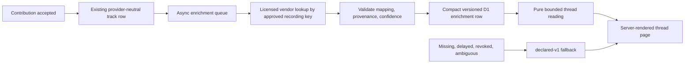

# Embedding-Based Music Intelligence - Decision Plan

## Goal Capsule

- **Decision:** **DEFER / NO-GO for product implementation now.** There is no verified lawful, dependable, provider-independent audio signal available to listen.cx today. The smallest reversible next step is a contract-first vendor inquiry, led by Gracenote Global Music Data, followed only if successful by a license-cleared offline evaluation.
- **Allowed research:** **GO** for `EBI-U1`, a paper RFI and rights/coverage review. **Conditional GO** for an offline spike only after the acquisition and model-license gates are evidenced in writing.
- **Product authority:** Roadmap R12 remains unchanged: the signal must be provider-independent, the output must be an interpretive reading rather than an authoritative judgment, and it must demonstrably outperform the frozen `thread-character/declared-v1` baseline.
- **Why implementation is blocked:** Spotify expressly prohibits analyzing Spotify Content for any purpose and separately prohibits ingesting it into an ML/AI model. Apple's currently accessible preview assets are promotional, stream-only content that may not be downloaded, saved, or cached; MusicKit adds restrictions against analyzing Apple-provided services/data except where expressly allowed and against downloading, uploading, or modifying MusicKit Content. Open model weights do not create rights to the catalog audio they would require. [S1-S7]
- **Non-goals:** No points, contributor ranking, compatibility score, taste score, similarity feature, recommendation feature, or inferred personal profile. None is necessary to test thread characterization.

**Evidence labels used below**

- **Direct fact** means the cited primary/official source states it.
- **Inference** means this plan's bounded product or technical conclusion from direct facts.
- **Unknown** means a contract, measurement, or product choice is still missing.

---

## Product Contract

### Executive Recommendation

| Decision surface | Recommendation | Reason |
|---|---|---|
| Analyze Spotify audio, previews, audio features, metadata, or artwork | **NO-GO** | Spotify's policy says not to analyze Spotify Content or the Spotify Service for any purpose and not to ingest Spotify Content into an ML/AI model. This applies to inference, not merely training. [S1-S3] |
| Use Spotify Audio Features/Audio Analysis | **NO-GO** | New Web API use cases lost access to Audio Features and Audio Analysis in November 2024, and the content-analysis prohibition is independently decisive. [S3-S4] |
| Download or cache Apple/iTunes 30-second previews for inference | **NO-GO** | The Search API terms permit promo use only and explicitly require previews to be streamed, not downloaded, saved, or cached. [S5] |
| Analyze MusicKit content or use its artwork/metadata as a detached model input | **NO-GO absent specific written permission** | The current Apple agreement restricts scraping/mining/caching/analyzing/indexing Apple data except what Apple expressly provides for the permitted service, and limits MusicKit Content to documented playback/playlist contexts. [S6-S7] |
| Run an open embedding model on provider content | **NO-GO** | Model availability does not cure input-rights restrictions. Several leading music checkpoints are also non-commercial or have incomplete checkpoint provenance. [S15-S20] |
| Embed title/artist text or provider artwork | **NO-GO as R12's music signal** | Provider-origin inputs retain their provider restrictions; independently sourced title/artist text is a weak cultural/name prior, and artwork reflects packaging rather than musical makeup. At most these can be a negative control in an offline evaluation. |
| Use ISRC as the intelligence signal | **NO-GO; mapping aid only** | ISRC identifies a recording, not its musical properties. It can join a lawfully licensed enrichment catalog, but it does not supply embeddings, mood, instrumentation, or an acoustic fingerprint. [S8-S12] |
| Contract for precomputed recording-level enrichment | **VENDOR INQUIRY: GO** | Gracenote publicly documents over 100 million tracks, recording-level mood/tempo/style, standardized IDs, and audio-derived Sonic descriptors. That is the strongest provider-independent acquisition hypothesis, but commercial rights, lookup coverage, pricing, retention, and permitted UI use are unknown until contracted. [S21-S24] |
| MusiMap / Cyanite as alternatives | **VENDOR INQUIRY: GO, secondary** | MusiMap advertises 1M+ expert-annotated tracks and music descriptors; Cyanite offers rich audio analysis but its public integration primarily expects customer-supplied audio and its Spotify analysis is permission-gated. Neither public source proves that listen.cx can lawfully cover arbitrary provider tracks. [S25-S29] |
| Build product code | **DEFER** | The acquisition, baseline advantage, cost, and deletion gates are not passed. A build plan would imply certainty the evidence does not support. |

### Frozen Baseline: `thread-character/declared-v1`

All candidate paths are compared to the accepted baseline, not to an empty page. The baseline already provides:

1. A deterministic, versioned thread print from title, prompt, ordered role labels, ordered artwork, optional contributor cues, and lifecycle.
2. Literal filling feedback and a finished identity without inferred genre, mood, cohesion, energy, similarity, or quality.
3. Stable fixtures for empty, partial, complete, reordered, missing-artwork, Unicode, no-cue, and multi-cue threads.
4. A blinded rubric covering reflection of prompt/cues, sequence anticipation, share desirability, and false-objectivity.
5. A thread-level behavioral contract: completed-share outcome is primary; completion and contribution depth are non-inferiority guardrails.

An embedding treatment is additive to the same `declared-v1` composition. It does not replace the ordered artwork or declared cues, and it does not get credit merely for appearing more technical.

### Source Feasibility Matrix

| Candidate | Direct facts about availability and rights | Reliability / coverage | Advantage over `declared-v1` | Decision |
|---|---|---|---|---|
| `declared-v1` | Uses only group-declared thread inputs under the accepted plan; no provider/model calls | Deterministic for every valid thread; missing artwork has a stable fallback | Frozen baseline. It explains the group's declared intent but does not claim to hear the music | **SHIP/EVALUATE FIRST; BASELINE** |
| Spotify Web API Audio Features / Audio Analysis | New use cases lost endpoint access in 2024. Spotify also prohibits any analysis of Spotify Content/Service and any ML/AI ingestion. [S1-S4] | Not available to a new credential-free product; dependence would be provider-specific even if access existed | Could expose tempo/energy-like features, but cannot lawfully or dependably support this product | **NO-GO** |
| Spotify preview/audio or oEmbed metadata/artwork | Spotify Content is defined broadly as material made available through Spotify. Preview URLs are deprecated/restricted; content may not be downloaded. Spotify prohibits analysis and ML/AI ingestion. [S1-S4] | Current resolver has no credentialed Spotify audio; preview coverage is not dependable | Audio could be informative; metadata/artwork are weaker. Rights are decisive | **NO-GO** |
| Apple Music API catalog attributes | Songs can expose genre, duration, ISRC, artwork, and preview assets. [S6] | Requires a developer-token integration and still depends on Apple catalog/storefront availability | Genre/duration can add a small prior but are one provider's editorial/catalog data, not a provider-independent acoustic signal | **NO-GO for R12; mapping only if separately permitted** |
| iTunes Search API previews and artwork | A preview URL may reference a 30-second file, but promo terms require streaming only, no download/save/cache, proximity/attribution, and no independent entertainment use. [S5] | Apple-only, storefront-dependent, excerpt may not represent the track | A preview model could hear audio, but it fails acquisition rights and provider independence | **NO-GO** |
| ISRC plus MusicBrainz | Spotify and Apple catalog objects may expose ISRC. MusicBrainz core data is CC0, its public API is rate-limited to about one request/second, and commercial API use requires a plan/contact. ISRC identifies a distinct recording, not musical content. [S8-S12] | Useful exact join when correct, but coverage and version correctness must be measured; it is not an acoustic fingerprint | Enables a vendor join; supplies no character signal itself | **GO only as a licensed mapping layer** |
| Gracenote Global Music Data | Official materials describe 100M+ tracks, standardized IDs, recording-level mood/tempo/style, and Sonic Style derived from recording audio using ML. [S21-S24] | Public pages claim global catalog scale; listen.cx-specific provider-ID/ISRC hit rate, version matching, latency, and SLA are unknown | Strongest chance of adding real recording-level information without listen.cx obtaining audio | **PRIORITY VENDOR INQUIRY** |
| MusiMap | Official site advertises 1M+ expert-annotated tracks, 2K+ concepts, and structured mood/genre/musical attributes. [S25] | Much smaller advertised catalog than Gracenote; API lookup, geographic coverage, freshness, and contract rights unknown | Human/musicologist annotation could be interpretable and less model-opaque | **SECONDARY VENDOR INQUIRY** |
| Cyanite | Official docs expose mood, genre, energy, instruments, captions, BPM/key, and segment analysis; normal API flow uploads customer audio. Typical marketing latency is seconds to under 30 seconds. Spotify analysis became feature-permission-gated in 2025. [S26-S29] | Rich analysis, but public evidence does not show a lawfully pre-enriched arbitrary commercial catalog or a right for listen.cx to submit provider audio | Technically compelling if the vendor can prove an independent licensed catalog or a written Spotify exception | **INQUIRY ONLY; DO NOT UPLOAD PROVIDER AUDIO** |
| LAION-CLAP | Official repo provides audio/text embeddings and music checkpoints. Code repo is CC0, while the authors say most training datasets have copyright restrictions and the full training data cannot be released. [S15-S16] | General audio/music embedding, not proven on listen.cx threads; checkpoint-specific commercial warranty/provenance is unclear | Could generate flexible interpretive text similarities, but it needs lawful audio and product-specific calibration | **TECHNICAL SPIKE ONLY AFTER RIGHTS REVIEW** |
| Microsoft CLAP | Official repo is MIT-licensed and provides downloadable weights for audio/text embeddings; published work reports broad audio-task evaluation. The public repo page does not separately establish a commercial license and full provenance for every checkpoint. [S17-S18] | General audio representation, not a dedicated music-thread character model | Plausible zero-shot control; lawful input and checkpoint diligence remain blockers | **TECHNICAL SPIKE ONLY AFTER RIGHTS REVIEW** |
| MERT v1 | Original paper/repo describe a music-specific representation model; the official 330M model card is CC-BY-NC-4.0 and reports 160K hours of training data. [S19] | Strong MIR candidate, but 330M parameters and non-commercial weights are incompatible with direct commercial use | Likely stronger acoustic representation than general CLAP on some MIR tasks | **NO-GO for product; research comparison only** |
| MuQ / MuQ-MuLan | Official repo describes music and music-text embeddings; released weights are CC-BY-NC-4.0 and the open model was trained on Million Song Dataset data. [S20] | Current music-specific candidate, but explicitly non-commercial | Useful research comparator, no deployable advantage under its current license | **NO-GO for product; research comparison only** |
| Text embedding of independently sourced title/artist/genre | MusicBrainz core metadata can be used under CC0. Cloudflare offers text embedding models, but no music-audio embedding model was found in the current Workers AI catalog. [S10-S12, S32] | High coverage only if mapping works; vulnerable to artist/popularity/name priors and remixes with similar titles | May appear semantically fluent without hearing the recording; cannot satisfy “musical makeup” alone | **NEGATIVE CONTROL, not R12 signal** |
| Artwork embedding | Provider artwork has display/use restrictions; MusicBrainz itself does not supply cover art as core data. [S2, S5, S10] | Artwork can be missing, reissued, shared across editions, or culturally stylized | Likely measures packaging and era/genre cues, not the sequence's sound | **NO-GO as music signal; visual baseline already uses artwork literally** |
| User-uploaded audio | Open models/vendors can process an uploaded file, but a provider link does not grant the contributor rights to upload that recording | Adds a high-friction rights attestation and conflicts with the account-free, open-the-song product thesis | Would provide the needed input but at unacceptable product and legal cost | **NO-GO for this product shape** |

### Decisive Provider and Policy Findings

### Spotify

- **Direct fact:** Spotify Developer Terms version 10, effective 2025-05-15, prohibit “using the Spotify Platform or any Spotify Content to train a machine learning or AI model or otherwise ingesting Spotify Content into a machine learning or AI model.” Spotify defines Spotify Content broadly as content, data, information, or material made available through Spotify. [S1]
- **Direct fact:** The current Developer Policy separately says not to analyze Spotify Content or the Spotify Service “for any purpose,” then repeats the ML/AI prohibition. [S2]
- **Direct fact:** As of the 2024 platform change, new applications cannot use Audio Features, Audio Analysis, related/recommendation endpoints, or multi-get preview URLs; the 2026 access update says Development Mode is for non-commercial experimentation and should not underpin a business. [S3-S4]
- **Inference:** Computing an embedding at inference time from Spotify audio, preview bytes, metadata, or artwork would be both analysis and model ingestion. The prohibition is not limited to model training.
- **Unknown:** Whether a vendor has a direct written Spotify license/exception that permits it to provide derived descriptors to listen.cx. A vendor's feature flag is not evidence of that permission.

### Apple

- **Direct fact:** Apple Music song objects can include genre, duration, ISRC, artwork, and preview assets. [S6]
- **Direct fact:** iTunes Search API promo terms require song previews to be streamed only and not downloaded, saved, cached, or synchronized; use must promote the underlying content and not have independent entertainment value. [S5]
- **Direct fact:** The current Apple Developer Program License Agreement restricts scraping, mining, retrieving, caching, analyzing, or indexing Apple/licensor data except data expressly made available for the relevant service; it also prohibits downloading/uploading/modifying MusicKit Content and says artwork/music text may not be used separately from playback or playlist management. [S7]
- **Inference:** listen.cx should not fetch preview bytes into an embedding service or use MusicKit artwork/catalog text as detached model input without a specific written grant covering that use.
- **Unknown:** Whether Apple would grant a commercial catalog/enrichment permission. The public documentation does not grant it.

### Recording identity

- **Direct fact:** Spotify's track object and Apple's song object can include ISRC. [S6, S8]
- **Direct fact:** IFPI describes ISRC as identifying a recording; distinct edits, remixes, and remasters may receive different ISRCs. [S9]
- **Direct fact:** MusicBrainz core data is CC0, but its public service is rate-limited and its FAQ directs commercial users to commercial plans. [S10-S12]
- **Inference:** ISRC is the best common join key available in principle, but listen.cx's credential-free resolver does not currently obtain one consistently. A vendor should do the mapping from its licensed identity graph or provide a licensed ID crosswalk. Title/artist/duration fallback must be scored and auditable, not silently treated as exact.

### Requirements

- **EBI-R1 — Provider independence.** A recording receives the same signal regardless of whether the incoming link was Spotify or Apple Music. Provider origin may be observed for coverage auditing but may not alter the character output.
- **EBI-R2 — Rights before bytes.** No provider audio, preview, metadata, or artwork enters an embedding model unless a written agreement expressly permits commercial analysis, model inference, derived-data storage, and user-facing display. Spotify-origin content is excluded unless Spotify itself gives a written exception.
- **EBI-R3 — Recording identity.** Every signal is joined to a recording/version with a documented mapping method and confidence. Exact vendor ID/ISRC is distinct from fuzzy title/artist/duration matching; ambiguous matches fall back.
- **EBI-R4 — Coverage and reliability.** The chosen source must cover at least 95% of the representative cross-provider evaluation corpus, with less than 1% confirmed wrong-version matches and a stable ambiguity response rather than a guessed result.
- **EBI-R5 — Interpretive language.** UI uses qualified wording such as “This sequence reads as…” or “Across these tracks, the arc leans…”. It never says a track/group “is” a mood/genre, and never infers personality, compatibility, quality, or intent.
- **EBI-R6 — Baseline advantage.** The treatment must pass the blinded offline contract and then improve the same thread-level behavioral primary outcome over `declared-v1`, while preserving completion and contribution-depth guardrails and not increasing false-objectivity.
- **EBI-R7 — Provenance and deletion.** Every stored result records source contract/version, recording key, mapping method/confidence, model/taxonomy version, acquisition time, rights-expiry/deletion policy, and output confidence. Raw audio is never stored by listen.cx.
- **EBI-R8 — Failure fallback.** Missing, delayed, low-confidence, revoked, or deleted signals render exactly `declared-v1`. Character enrichment never blocks contribution, completion, listening, or sharing.
- **EBI-R9 — Runtime and cache isolation.** Resolution/enrichment happens once outside render. A thread render makes no provider or inference call. Cache keys include recording identity, source, taxonomy/model version, and mapping version.
- **EBI-R10 — Bounded scope.** V0 may add only a short thread-level interpretive reading and/or sequence arc. Similarity, recommendation, public discovery, ranking, and participant scoring require separate product justification and are not implied by stored vectors.
- **EBI-R11 — Data minimization.** Do not send prompt, cue, participant, thread, IP, cookie, or visitor data to a music vendor. Vendor lookup receives only the minimum licensed recording identifier.
- **EBI-R12 — Change control.** Vendor taxonomy/model changes are versioned, shadow-evaluated against the frozen corpus, and never silently rewrite completed-thread character.

### Dependency-Ordered Decision Units

| ID | Unit | Readiness | Exit evidence |
|---|---|---|---|
| `EBI-U0` | Lock provider/model feasibility decision | **Complete** | This plan and evidence report identify the current policy, licensing, model, runtime, and baseline constraints |
| `EBI-U1` | Contract-first enrichment vendor RFI | **Ready; no product code** | At least one vendor returns written answers/documents satisfying the acquisition, mapping, display, retention, deletion, SLA, and price questions below |
| `EBI-U2` | License-cleared offline signal spike | **Blocked by U1** | A frozen corpus can be processed without provider audio acquisition; candidate outputs, mapping errors, coverage, latency, and cost are reproducible |
| `EBI-U3` | Blinded baseline-beating evaluation | **Blocked by U2** | The candidate passes every offline human-fit and false-objectivity threshold below |
| `EBI-U4` | Conditional architecture and threat/data review | **Blocked by U3** | A new implementation plan names exact schema, queue, deletion, observability, and tests; counsel/product approve the data flow |
| `EBI-U5` | Staging then powered production experiment | **Blocked by U4 and `declared-v1` results** | Staging proves mechanics; production treatment improves the preregistered completed-share primary outcome and preserves both guardrails |

There are deliberately no implementation U-IDs yet. `EBI-U4` is the point at which implementation can responsibly be planned.

### `EBI-U1` Vendor Inquiry Contract

Start with Gracenote; ask MusiMap in parallel only if procurement bandwidth allows. Ask Cyanite only about a precomputed, independently licensed catalog or a documented provider exception—never about uploading provider preview/audio.

The vendor must answer in writing:

1. **Audio rights:** What exact licenses permit analysis of the commercial recordings? Does the service ever obtain audio from Spotify/Apple APIs, preview URLs, scraping, or customer uploads? If Spotify-derived, provide the direct permission covering analysis and downstream derived data.
2. **Customer rights:** May listen.cx commercially store the returned descriptors or embeddings, aggregate them into thread-level output, display paraphrased interpretive readings, cache them, and retain them after the API response? May the vendor use queries or results for model training, and can that be disabled?
3. **Identity graph:** Can the service look up by ISRC, Apple catalog ID, Spotify track ID/URL, and title/artist/duration? Which inputs can be supplied without transferring provider content? How are clean/explicit, live, remaster, sped-up, and regional variants distinguished?
4. **Coverage evidence:** Hit rate by provider origin, country/storefront, release age, language, and long-tail popularity; freshness SLA for new releases; explicit “not found” and ambiguity behavior.
5. **Quality and change control:** Taxonomy/model documentation, confidence/ambiguity fields, validation data, known demographic/geographic bias, version pinning, reproducibility, and notice period for model/taxonomy changes.
6. **Operations:** p50/p95/p99 lookup latency, rate limits, batch API, uptime/SLA, incident history, retry/idempotency semantics, and data export.
7. **Privacy/deletion:** Data residency, subprocessors, DPA, input/output retention, deletion endpoint and SLA, backup deletion, termination export/deletion, and handling of rights-holder takedowns.
8. **Economics:** Quotes at 10K, 100K, and 1M unique recordings; recurring dataset/API minimums; per-lookup, export, storage, and overage fees; startup/pilot terms.
9. **Liability:** Warranties for data/model rights, IP claims process, indemnity, audit rights, and the remedy if a source license or provider permission is revoked.

**U1 pass condition:** all nine areas are answered; counsel confirms EBI-R2; a 500-recording, no-audio pilot is contractually allowed; and the expected spend is explicitly approved. Marketing pages and sales assurances alone fail the gate.

### `EBI-U2` Acquisition and Technical Spike

The first spike is offline and dataset-sized, not a Worker integration.

- Freeze 500 recording/version rows sampled before results: equal Spotify/Apple inbound origin; at least five storefronts; release-decade and language diversity; head/mid/long-tail strata; live/remaster/clean/explicit/remix cases; and 50 intentionally difficult near-duplicate pairs.
- The vendor receives only a licensed lookup key. listen.cx does not fetch, upload, proxy, or retain provider audio/previews.
- Record exact/fuzzy/not-found/ambiguous status, wrong-version adjudication, descriptor confidence, p50/p95/p99 latency, retries, price, and deletion read-back.
- If an open model is compared, run it only on a separate, license-cleared research corpus and do not infer that its technical result establishes commercial-catalog feasibility. MTG-Jamendo is explicitly non-commercial absent authorization; FMA tracks carry per-track Creative Commons licenses that must be filtered individually. [S30-S31]
- Include a metadata-only text embedding as a negative control. If it performs like the audio-derived source, the purported musical benefit may be name/popularity leakage rather than acoustic understanding.

**U2 pass condition:** EBI-R4 is met; repeat runs under a pinned version are identical within a declared numeric tolerance; the vendor successfully deletes the pilot inputs/results on request; and no provider-origin subgroup has a coverage gap greater than 10 percentage points without a documented fallback decision.

### `EBI-U3` Blinded Human-Fit Contract

### Corpus and presentations

- Use 80 five-track threads: 40 naturally authored by a group with a prompt/roles/cues and 40 preregistered fixtures covering difficult musical arcs, languages, storefronts, and version variants.
- Obtain at least five independent judgments per thread. For natural threads, include up to two group members and analyze them separately from independent listeners.
- Judges listen through their own lawful provider handoff. The study does not download, restream, or record provider audio.
- Compare two visually matched cards in randomized, blinded order:
  - **A:** frozen `thread-character/declared-v1`.
  - **B:** the same `declared-v1` card plus one short, qualified, vendor-derived thread reading.
- Include the metadata-only negative control on a preregistered subset to detect artist/title/artwork leakage. Candidate/vendor names and confidence scores are hidden from judges.

### Exact rubric

After hearing the ordered sequence, ask:

1. “Which card better fits what you heard across the sequence?” (`A`, `B`, `tie`)
2. “Which card better reflects the prompt and cues the group supplied?” (`A`, `B`, `tie`)
3. “Which card makes the order of the tracks easier to anticipate?” (`A`, `B`, `tie`)
4. “Which finished artifact would you rather share with this group?” (`A`, `B`, `tie`)
5. For each card: “Does any sentence present an inferred musical property as objective fact?” (`yes/no`, highlight phrase)
6. For each card: “Does any sentence feel inaccurate, judgmental, culturally reductive, or like a claim about the people rather than the music?” (`none/inaccurate/judgmental/culturally reductive/people claim`, optional note)
7. “How confident are you that your preference came from the sound rather than artist recognition or cover/title cues?” (`1-5`)

### Preregistered pass/fail

- **Musical-fit superiority:** B wins question 1 on at least 60% of non-tie thread judgments and the thread-cluster bootstrap 95% lower bound is above 50%.
- **Share advantage:** B wins question 4 more often than A and the thread-cluster bootstrap 95% lower bound is above 50% after ties are excluded.
- **Declared-input preservation:** B is non-inferior to A on questions 2 and 3 with a preregistered 5 percentage-point margin.
- **False-objectivity:** B's question-5 rate is no more than 2 percentage points above A, no severe people/quality claim survives review, and every highlighted phrase is adjudicated before continuation.
- **Leakage check:** B must beat the metadata-only control on question 1. If it does not, there is no demonstrated value from musical makeup.
- **Subgroup floor:** No preregistered language, provider-origin, release-era, or long-tail stratum may reverse to a statistically credible A preference; report uncertainty rather than averaging it away.
- **Complexity rule:** Non-inferiority or a visually richer result is a failure. R12 requires a demonstrated advantage.

The offline gate establishes only human fit. A later powered thread-level experiment must still improve the frozen `declared-v1` completed-share primary outcome, with seven-day completion and 24-hour contribution depth inside their existing non-inferiority margins. Do not ship from offline preference alone.

### False-Objectivity and Copy Contract

Permitted shape:

- “This sequence reads as a gradual lift from spare to dense.”
- “Across these tracks, the arc leans warm and rhythmic, with an abrupt final turn.”
- “An interpretive reading based on recording-level music descriptors.”

Forbidden shape:

- “This is an uplifting indie mix.”
- “The group has adventurous taste.”
- “These tracks are 87% compatible.”
- “Most cohesive pick,” “best transition,” “weakest song,” or any participant attribution.
- Generated occasion, personality, demographic, or recommendation claims.

The output grammar must select from a small reviewed vocabulary, surface ambiguity, and prefer no sentence over a confident but unsupported sentence. A generative model may not freely caption the thread in V0.

### Provenance, Retention, and Deletion Gate

Every candidate result must carry:

- `signal_contract_id` and contract/version effective date.
- `source_name`, `source_recording_id`, and licensed lookup key type.
- `mapping_method` (`exact_vendor`, `exact_isrc`, `fuzzy_metadata`) and confidence/version adjudication.
- `taxonomy_version`, `model_version`, model/checkpoint license identifier, and inference policy.
- Descriptor values, source confidence/ambiguity, acquisition timestamp, and last validation timestamp.
- Rights-expiry/termination behavior, deletion due date, deletion timestamp, and takedown reason where applicable.
- Derived thread-reading grammar version and the exact contributing recording-result versions.

Rules:

1. listen.cx stores no raw or preview audio and no provider artwork/text embeddings.
2. Vendor data is retained only for the term and uses the contract permits; expiry or rights revocation makes it unavailable immediately and queues deletion.
3. A recording mapping correction invalidates every derived thread reading that used the wrong version; affected pages fall back to `declared-v1` until recomputed.
4. Vendor termination must support an enumerated export/delete workflow and deletion read-back, including backups under a documented SLA.
5. A model/taxonomy upgrade writes a new version. It does not overwrite completed-thread output or the frozen evaluation corpus.

### Conditional Cloudflare Architecture and Cost Notes

These are constraints for `EBI-U4`, not authorization to build.

- **Inference location:** Not inside the request Worker. Workers currently have 128 MB memory and a 10 MB compressed paid bundle limit. A 330M-parameter MERT checkpoint alone is far larger than that even at reduced precision, before runtime/audio-decoder memory. Workers AI's current catalog exposes text embeddings and speech/audio utilities but no listed CLAP/MERT/MuQ-style music embedding endpoint. [S19, S32-S33]
- **Latency:** Contribution and render do not wait for enrichment. Target async enrichment p95 under 30 seconds and p99 under two minutes; render adds at most one indexed D1 read and must remain fully useful while pending.
- **Storage:** Store the smallest licensed descriptors needed for the bounded reading, not a vector by default. A 768-dimension float32 vector is about 3 KiB; one million raw vectors are about 3.1 GB before indexes/metadata, within but materially consuming a paid D1 database's current 10 GB limit. [S34]
- **Vectorize:** Do not add it for characterization. There is no similarity query in scope. If a separately approved use ever needs it, current limits allow up to 1,536 float32 dimensions and pricing is dimension/query based. [S35-S36]
- **Cache:** Key by `(source, source_recording_id, mapping_version, taxonomy_version, model_version)`. Cache exact hits for the permitted contract term; negative/ambiguous results for at most 24 hours so new-release coverage can recover. Render never refreshes inline.
- **Budget:** Cap U2/U3 vendor spend at $250 total and 10,000 recording lookups without explicit approval. Before U4, obtain quotes at 10K/100K/1M unique recordings and set a product-approved maximum per newly enriched recording. Cloudflare storage is not expected to dominate; vendor license/API minimums and catalog rights are the unknown costs.
- **No hidden expansion:** Storing a vector does not authorize nearest-neighbor search, recommendations, public discovery, or profiling.

### Conditional Observability

If and only if U1-U3 pass, the implementation plan must expose aggregate, non-personal metrics:

- Enrichment coverage by inbound provider, storefront, release era, language, and mapping method.
- Exact/ambiguous/not-found/wrong-version rates and mapping corrections.
- Vendor p50/p95/p99 latency, timeout/error/retry rates, queue age, and deletion SLA/read-back failures.
- Cache hit rate, new-recording cost, monthly vendor cost, and D1 bytes/result.
- Result confidence/ambiguity distribution and `declared-v1` fallback rate/reason.
- Grammar/model/taxonomy version distribution and shadow-drift failures.
- Offline false-objectivity and subgroup metrics; later, only the same aggregate thread experiment facts already allowed by the baseline.

Do not log provider URLs, titles, prompts, cues, participant identifiers, visitor identifiers, raw vendor payloads, or generated text beyond a stable copy key.

### Reopen Conditions

An implementation plan may be written only when all are true:

1. A signed agreement or counsel-approved license expressly permits the complete acquisition/inference/storage/display/deletion flow and does not rely on Spotify or Apple content contrary to their current terms.
2. A provider-independent identity crosswalk covers at least 95% of the representative corpus with under 1% wrong-version matches and explicit ambiguity.
3. Every deployed checkpoint/taxonomy has a commercial license and documented training/input provenance acceptable to counsel; no CC-BY-NC weight is deployed.
4. U2 passes reproducibility, coverage, deletion, latency, and subgroup checks within the approved cost cap.
5. U3 beats `thread-character/declared-v1` on musical fit and share preference, preserves prompt/cue and sequence utility, beats the metadata-only control, and does not increase false-objectivity beyond the gate.
6. The conditional architecture preserves zero provider/vendor calls on render and an exact `declared-v1` fallback.
7. A production experiment is separately preregistered and authorized; it retains the baseline's completed-share primary outcome and both guardrails.

If any condition fails, retain `declared-v1` and revisit only when a provider changes policy, a vendor supplies a contract-backed catalog, or a commercially licensed model plus lawful catalog input becomes available.

### Risks, Counterevidence, and Unknowns

- **Vendor marketing is not a rights grant.** Gracenote's catalog scale and descriptors make it the best lead, not a passed gate. Public pricing, customer display rights, provider-ID lookup terms, and deletion terms were not found.
- **Cyanite's technical capability is not lawful input.** Its docs show rich analysis and even a Spotify permission flag, but Spotify's public policy still prohibits analysis/ML ingestion. Only a direct contractual exception would resolve that conflict.
- **ISRC is imperfect operationally.** The standard distinguishes recordings, but catalog data can be missing, duplicated, or assigned inconsistently. Remaster/live/clean/explicit correctness needs human adjudication.
- **Preview bias is scientific as well as legal.** A 30-second excerpt can miss intros, peaks, transitions, vocals, or key changes. Full-track vendor descriptors are preferable, but their segment policy must be disclosed.
- **Mood and vibe are interpretive.** Audio embeddings encode training labels and dataset cultures; a confidence score is not objective truth. The false-objectivity and subgroup gates are release blockers.
- **Open checkpoints carry separate risks.** Code licenses do not necessarily establish checkpoint licenses or training-data warranties. MERT and MuQ are explicitly non-commercial; LAION-CLAP acknowledges copyright-restricted training sources.
- **The behavioral advantage is unknown.** Better MIR benchmarks do not establish that a character sentence makes a friend-created thread more shareable. Only the baseline-controlled evaluation can answer that.
- **Business model is unknown.** A recurring enrichment catalog may not be economical for a free, accountless product. Vendor quotes are required before architecture.

### Sources

All sources were retrieved **2026-07-13 America/Los_Angeles (2026-07-14 UTC)**. Provider access/policy/licensing sources are official provider documents; model sources are original papers, official repositories, or official model cards. Vendor claims are explicitly treated as vendor claims, not independent validation.

- **S1 — Spotify Developer Terms, v10, effective 2025-05-15:** <https://developer.spotify.com/terms> — definitions, Section IV ML/AI ingestion prohibition, storage/transfer limits.
- **S2 — Spotify Developer Policy:** <https://developer.spotify.com/policy> — “do not analyze” and ML/AI ingestion prohibitions; content attribution/display constraints.
- **S3 — Spotify, “Introducing some changes to our Web API,” 2024-11-27:** <https://developer.spotify.com/blog/2024-11-27-changes-to-the-web-api> — new-use-case removal of Audio Features, Audio Analysis, recommendations, and preview URLs.
- **S4 — Spotify, “Update on Developer Access and Platform Security,” 2026-02-06:** <https://developer.spotify.com/blog/2026-02-06-update-on-developer-access-and-platform-security> — Development Mode is non-commercial/personal experimentation and not a business foundation.
- **S5 — Apple iTunes Search API Overview and terms:** <https://developer.apple.com/library/archive/documentation/AudioVideo/Conceptual/iTuneSearchAPI/> — promotional purpose, stream-only preview, no download/save/cache; response documentation at <https://developer.apple.com/library/archive/documentation/AudioVideo/Conceptual/iTuneSearchAPI/UnderstandingSearchResults.html> identifies the 30-second preview URL.
- **S6 — Apple Music API Songs.Attributes:** <https://developer.apple.com/documentation/applemusicapi/songs/attributes-data.dictionary> — genre, duration, artwork, ISRC, and previews.
- **S7 — Apple Developer Program License Agreement:** <https://developer.apple.com/support/terms/apple-developer-program-license-agreement/> — Apple-service analysis/mining/cache limits and MusicKit Content restrictions.
- **S8 — Spotify Web API Get Track:** <https://developer.spotify.com/documentation/web-api/reference/get-track> — `external_ids.isrc` and current policy notes.
- **S9 — IFPI International Standard Recording Code Handbook, 4th ed.:** <https://isrc.ifpi.org/images/downloads/ISRC_Handbook.pdf> — recording identity and distinct-version allocation.
- **S10 — MusicBrainz Data License:** <https://musicbrainz.org/doc/About/Data_License> — core CC0 and supplementary/live-feed terms.
- **S11 — MusicBrainz API and rate limiting:** <https://musicbrainz.org/doc/MusicBrainz_API> and <https://musicbrainz.org/doc/MusicBrainz_API/Rate_Limiting> — API structure and one-request/second public limit.
- **S12 — MusicBrainz API FAQ:** <https://musicbrainz.org/doc/MusicBrainz_API/FAQ> — commercial-use plan/contact requirement.
- **S15 — LAION-CLAP official repository:** <https://github.com/LAION-AI/CLAP> — music/audio-text checkpoints, CC0 repository license, training-data copyright disclosure.
- **S16 — LAION-CLAP original paper:** <https://arxiv.org/abs/2211.06687> — large-scale contrastive language-audio training.
- **S17 — Microsoft CLAP official repository:** <https://github.com/microsoft/CLAP> — MIT repository, downloadable 2022/2023 weights, audio/text embedding API.
- **S18 — Microsoft CLAP original paper:** <https://arxiv.org/abs/2206.04769> — 128K audio-text pairs and downstream evaluation.
- **S19 — MERT original paper and official model card:** <https://arxiv.org/abs/2306.00107> and <https://huggingface.co/m-a-p/MERT-v1-330M> — 330M model, 160K hours, CC-BY-NC-4.0.
- **S20 — MuQ official repository and paper:** <https://github.com/tencent-ailab/muq> and <https://arxiv.org/abs/2501.01108> — music/music-text models, Million Song Dataset note, CC-BY-NC-4.0 weights.
- **S21 — Gracenote Audio Data:** <https://gracenote.com/products/audio-data/> — vendor claim of 100M+ tracks, mood, tempo, genre, MusicID.
- **S22 — Nielsen Global Music Data:** <https://www.nielsen.com/solutions/content-metadata/global-music-data/> — recording descriptors, standardized IDs, global/editorial coverage claims.
- **S23 — Gracenote GMD API v3 developer guide:** <https://documentation.gracenote.com/gmd-api-v3-downloads/gmd-api-v3-dev-guide.pdf> — Sonic Mood, Sonic Style, and Tempo descriptor semantics.
- **S24 — Gracenote Music Recognition:** <https://www.nielsen.com/solutions/content-metadata/music-recognition/> — proprietary audio fingerprints and catalog recognition claims.
- **S25 — MusiMap official product site:** <https://www.musimap.com/> — vendor claims of 1M+ expert-annotated tracks, 2K+ concepts, descriptors and fingerprinting.
- **S26 — Cyanite API classifier documentation:** <https://api-docs.cyanite.ai/docs/audio-analysis-v6-classifier/> — mood, genre, BPM/key and segment outputs.
- **S27 — Cyanite API query builder / V7 fields:** <https://api-docs.cyanite.ai/docs/library-track-query-builder> — energy, emotion, instruments, captions, movement, character, BPM/key.
- **S28 — Cyanite API upload documentation:** <https://api-docs.cyanite.ai/docs/upload-library-tracks/> — customer MP3 upload workflow.
- **S29 — Cyanite API 2025-03-18 changelog and FAQ:** <https://api-docs.cyanite.ai/blog/2025/03/18/2025-03-18-changelog-/> and <https://cyanite.ai/faq/> — Spotify analysis feature permission; vendor latency/scale/pricing claims.
- **S30 — MTG-Jamendo official dataset:** <https://mtg.github.io/mtg-jamendo-dataset/> — 55K tracks/tags, per-track CC licenses, and explicit non-commercial research limitation absent authorization.
- **S31 — FMA original paper:** <https://arxiv.org/abs/1612.01840> — 106,574 Creative Commons-licensed tracks with per-track license metadata.
- **S32 — Cloudflare Workers AI model catalog:** <https://developers.cloudflare.com/workers-ai/models/> — current hosted-model catalog; no CLAP/MERT/MuQ music embedding entry was found on retrieval.
- **S33 — Cloudflare Workers limits:** <https://developers.cloudflare.com/workers/platform/limits/> — 128 MB isolate memory, paid bundle and CPU limits.
- **S34 — Cloudflare D1 limits:** <https://developers.cloudflare.com/d1/platform/limits/> — current 10 GB paid database limit and 2 MB row/BLOB limit.
- **S35 — Cloudflare Vectorize limits:** <https://developers.cloudflare.com/vectorize/platform/limits/> — 1,536 dimensions maximum and float32 precision.
- **S36 — Cloudflare Workers/Vectorize pricing:** <https://developers.cloudflare.com/workers/platform/pricing/> — current stored/queried dimension pricing.

### Definition of Done for This Decision

- The current provider policy, audio/preview access, mapping, vendor, open-model, Cloudflare, and data-rights surfaces are evidenced and distinguished as fact, inference, or unknown.
- `thread-character/declared-v1` remains the frozen baseline and exact advantage contract.
- No implementation-ready claim is made without lawful catalog input.
- The next action is bounded to a vendor RFI; offline evaluation and all code remain gated.
- Exact rights, provenance, deletion, human-fit, false-objectivity, fallback, runtime, cost, observability, and reopen conditions are defined.
- No recommendation, similarity, ranking, participant score, or public-discovery scope has been introduced.
